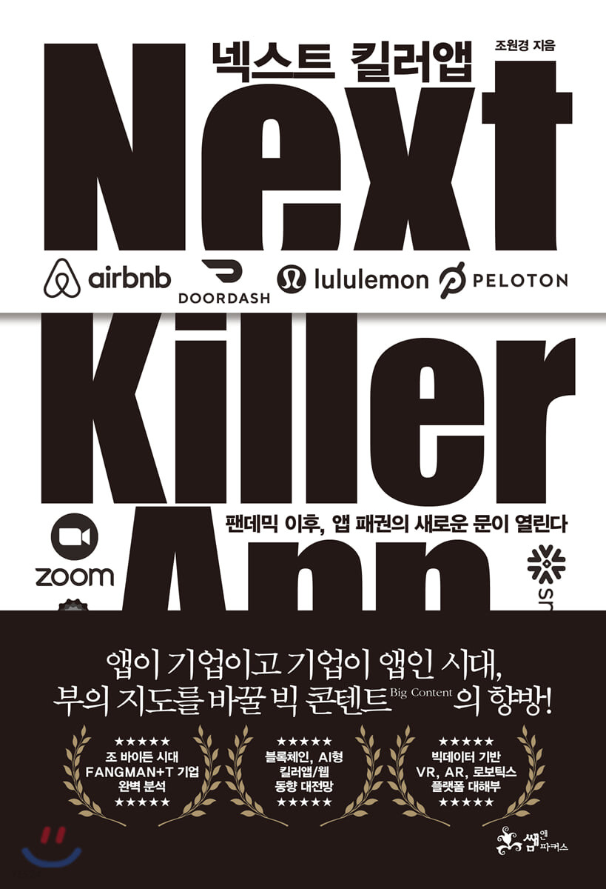

 

이 책은 킬러앱을 중심으로 인터넷/모바일 기술이 어떻게 발전해 왔는지, 그리고 다가올 블록체인/5G/IoT 시대에는 어떤 킬러앱이 탄생할 지를 예측해 보는 비즈니스 트렌드 분야의 책이다.
킬러앱은 '관련 기술의 성공을 확신할 수 있을 정도의 가치와 인기를 담보하는 애플리케이션'을 뜻한다. 즉, 킬러앱은 그 자체로 너무 매력적이어서 그 앱이 동작하는 기계를 사고 싶어질 정도의 수준인 소프트웨어를 말한다.

먼저 킬러앱이 IT 생태계에 미친 중요성을 부각하기 위해 인터넷과 모바일 시대의 킬러앱을 되짚어본다.
'비지칼크'라는 스프레드 시트 기능을 가진 사무용 프로그램과 '워드 스타'라는 문서 편집 프로그램이 초기 컴퓨터 판매량에 얼마나 지대한 영향을 끼쳤는지를 소개한다.
이 킬러앱들은 금세 금융/회계업 종사자들과 대학/법률사무소 사람들에게 없어서는 안 될 도구로 자리잡았다. 
이메일, 파워포인트, 웹브라우저, MS 윈도우 또한 사람들에게 컴퓨터를 갖고 싶단 욕망을 주입했다. 컴퓨터는 킬러앱들의 비호아래 자란 것이다.

애플과 구글의 성공 가도 속 킬러앱들을 조명하기도 한다.
스티브 잡스와 워즈니악의 초기 애플 PC 성공 신화에는 앞서 소개한 '비지칼크'와의 공생이 일조했다는 이야기나,
잡스의 경영철학, 구글의 탄생 비화, 애플과 구글의 비즈니스 전략 등을 소개하는 부분은 흥미롭다.
또한 앱스토어라는 킬러앱의 출몰이 IT 생태계에 끼친 어마무시한 파장도 언급이 되는데, 아마 여기까지 책을 읽은 사람의 머릿속에는 킬러앱의 중요성이 충분히 각인되었을 것이다.

블록체인 파트에 이르러서는 댑(dApp, decentralized Application)이 중심 화두가 된다. 
댑은 탈중앙화와 App을 합성한 용어로, 블록체인이 녹아든 킬러앱이라고 보면 될 것이다.
많은 사람들이 블록체인의 효용성에 대해서 반신반의하고 있는 와중에 댑이 출연하여 사람들의 신뢰를 얻으면은 블록체인의 성장세가 가속화 될 것이라는 전망이다.
작가를 비롯한 블록체인 전문가들은 페이스북과 같은 결제와 메시지 기능을 탑재한 애플리케이션이 댑으로 발전할 것으로 여기고 있다.
SNS의 개인정보 유출 문제가 여러차례 대두되었고 블록체인은 보안상의 해결책이 되어주기 때문이다. 
페이스북은 '리브라'라는 암호화폐 발행에 적극적인 기업이라는 사실도 페이스북과 댑의 귀추를 주목하게 만든다.

블록체인 파트는 댑 외에도 재미있는 부분이 많았다. 
블록체인의 거래 당사자가 많아질수록 블록체인의 핵심 기술인 분산원장 기술이 발목을 잡는다는 것이다.
모든 거래 장부가 일치하고 합의를 봐야 거래를 진행할 수 있는데, 수많은 곳에 흩어져 있는 거래 장부를 빠른 시간에 일치시키는 것에 어려움을 겪고 있다고 한다.
그래서 누구나 거래 당사자로 참여할 수 있는 퍼블릭 블록체인 보다는 프라이빗 블록체인 형태로 기업 내 인프라 강화 수단, 혹은 기업 간 거래 수단으로 발전되고 있다는 사실이 흥미로웠다.

투기로 악용되고 있는 암호화폐에 관해서는, 암호화폐의 내재 가치를 만들 필요가 있다고 말한다. 
거래소에 되파는 것 말고는 할 게 없는 작금의 코인은 내재 가치가 없는 코인이다. 
거대 플랫폼을 소유한 기업이 플랫폼 내 서비스 생태계에 암호화폐를 발행하여 작은 경제 시스템을 구성하는 식으로 운용되면은 암호화폐도 긍정적으로 쓰일 수 있다는 말이다.
사용자가 만든 콘텐츠를 바탕으로 천문학적 매출을 올리는 디지털 기반의 플랫폼을 보유한 기업들이 있다.
이러한 기업들이 블록체인 기반의 토큰을 발행해서 플랫폼에 기여한 사용자에게 토큰을 주는 방식으로 내재 가치를 만들면 어떨까?
실현 가능성이 높은 방안인지는 모르겠으나 상상력을 자극하는 주제이기는 하다.

지금까지 이 책의 내용을 요약 정리해보았다. 
그래서 이 책 추천하냐고? 추천하지 않는다!
위에 서술한 내용의 두 배 분량으로 책을 읽으며 답답했던 부분들을 열거할 자신이 있다.
차라리 원서로 읽는 게 나을 정도로 이상하게 번역된 전공 서적을 읽을 때 느끼는 짜증과 책을 덮을까 하는 회의감을 여러 차례 느꼈다.
블록체인 파트는 작가의 전문 분야여서 그런지 몰라도 글에 틀이 잡혀있는 느낌이었다면, 다른 파트는 엉망이었다는 소감을 밝히고 싶다.

IT 관련 서적을 찾는 분들께는 <IT 좀 아는 사람>이란 책을 추천한다.
번역되서 들여온 책이기 때문에 2021년에 출간된 책임에도 내용은 1~2년 뒤쳐진다는 게 그 책의 유일한 단점이라고 생각한다.

<!-- 글의 흐름이 뒤죽박죽이고 어떤 강한 논지를 바탕으로 내용이 전개된다기보다는, 그냥 정보를 짜집기해서 모아놓은 것 같다는 느낌이 들 때가 잦았다.
특히 글 중간 중간에 '커피를 마시며...에 대해 생각해본다'와 같은 표현은  -->

