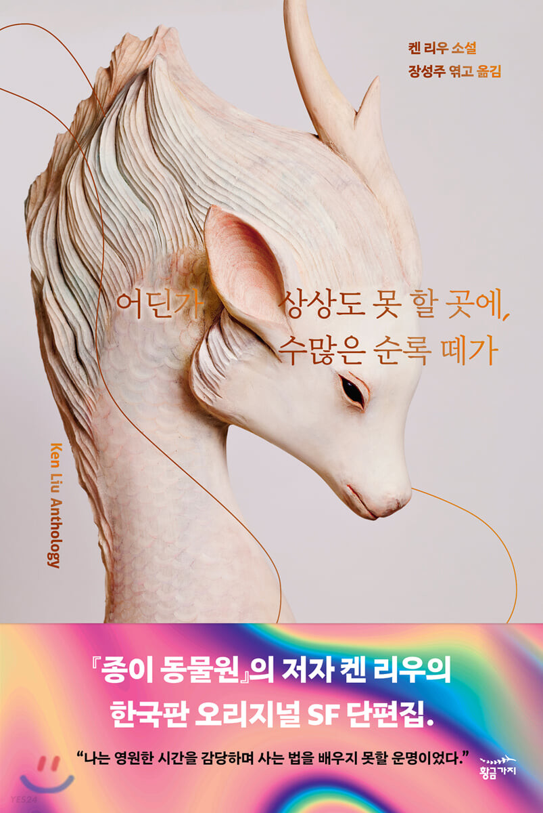

SF계의 양대 거장(?) 켄 리우와 테드 창의 이력은 흥미롭다.
둘 다 중국계 미국인이고 마이크로소프트에 근무했던 개발자 출신의 작가라는 게 흥미롭다.
더욱이 켄 리우는 다년간 변호사로 활동하기도 했는데, 그는 변호사-프로그래머-소설가라는 세 직업이 '현대의 기호를 다루는' 공통점을 갖는다고 말한다.
프로그래밍 언어와 말이라는 기호로 각각 프로그램을 만들고 이야기를 엮는다는 것이다.
이쯤되면 코딩과 작문이 '기호를 쌓아 의미있는 결과물을 내놓는' 것 말고도 어떤 연관성을 갖는지 두고두고 지켜봐야하는 게 아닐까.

켄 리우라는 작가에 대한 설명은 테드 창과의 비교를 통할 수 있을 것이다.
테드 창의 글이 이성을 자극하고 지적 호기심을 유발한다면, 켄 리우의 이야기는 감성을 자극하는 편이다.
테드 창의 글을 읽고 나서는 경외감과 신비로움에 휩싸였다면, 켄 리우의 이야기는 대체로 깊은 울림을 안겨주었던 것 같다.

> 내가 보기에 우리 인간이라는 종은 기본적으로 이야기를 통해 세계를 이해하도록 진화했다.
> 나는 법학 교육을 받고 변호사로 일해 온 까닭에 사실과 숫자가 인간을 설득하지 못하는 것을 이제껏 눈앞에서 생생하게 지켜보았다.
> 그것은 오로지 이야기만이 할 수 있는 일이다.

켄 리우는 이야기에 동양적 색채를 멋드러지게 입힐 줄 아는 작가이기도 하다.
세련된 동양 고전 시가 느낌의 <송사와 원숭이 왕>과
한자의 음운을 적절히 풀이하여 이야기를 전개해나가는 <파자점술사>를 보고있자면 한자 문화권에 속한 것이 특혜가 될 수도 있음을 깨닫는다.
이 지극히 동양적인 두 단편은 영단어 regular를 다양한 상황 속에 변주하여 활용하는, 한 편의 할리우드 액션 스릴러 영화같은 단편 <레귤러>와 완벽한 대비조화를 이룬다. 

> 이것이야말로 정상적인(regular) 세상의 모습이다. 명쾌함도, 구원도 없다.

> 이건 '의'라는 한자일세. 전에는 '옳음'을 뜻하는 글자였는데, 지금은 무슨 무슨 '주의'를 뜻하는 낱말에도 쓰이지. 공산주의, 민족주의, 제국주의, 자본주의, 자유주의 같은. 이 한자는 자네도 아는 위쪽의 '양'과 아래쪽에 있는 '자신'을 뜻하는 한자가 합쳐져서 만들어졌네. 사람이 제물로 바칠 양을 들고 있는 모습이지. 이 한자 속의 사람은 진실과 정의가 자신에게 있다고, 따라서 세상을 구할 마법이 자신에게 있다고 믿고 있어. 우습지, 안 그런가?

<!-- 
우리 삶에서 가장 중요한 사건들은 적잖은 경우에 우연과 돌발의 결과이다.
누구와 결혼하는지, 어떤 직업에 종사하는지, 어떤 책과 시에서 오래가는 즐거움을 얻는지 같은 것들 말이다.
그러나 삶을 무작위적인 사건의 연속으로 이해할 수는 없기에 우리는 그것들 하나로 엮어 이야기를 짓고,
그 이야기에 플롯을 부여하고, 스스로가 이야기 속 인물이 되어 따라갈 성장 곡선을 창조한다.
우리는 저마다 각자가 만든 장대한 판타지의 주인공이다.
 -->

켄 리우의 이번 책 역시 전체적으로 재밌게 읽긴 하였으나 단편 하나하나의 임팩트가 부족하다는 인상을 받았다.
하루이틀 전에 읽은 이 책의 내용보다 수개월 전에 읽은 단편 <종이 동물원>, <천생 연분>, <즐거운 사냥을 하길>,<파자점술사>, <레귤러>, <송사와 원숭이 왕>, <역사에 종지부를 찍은 사람들>의 내용이 더 선명하게 느껴지는 것은 '책을 집중해서 읽지 않았음'을 시인하는 꼴일까 아니면 내 착각일까.

<매듭 묶기>에서 고대 결승문자를 전승해온 매듭법 무형문화재 소에보라는 인물이 현대 단백질 접힘 문제 해결의 실마리가 된다는 아이디어가 재밌었다. 2020년 우리 현실에서는 Alphafold라는 AI가 소에보를 대신해서 단백질 접힘 구조를 풀고 있다고 한다.

고작 3 페이지 남짓하는 <내 어머니의 기억>이 주는 여운은 상당했고,
이민자들의 나라라고 불리는 미국을 우아함과 거만함이 공존하는 달로 은유하여 표현한 <달을 향하여>가 기억에 남았다.
제천대성이 등장하여 '이야기'에 대한 격언을 던져주는 게 마치 이솝우화 같았고 은유적 표현을 통해 아메리칸 드림의 실체를 명확하게 드러낸 문장들이 인상적이었다.

> 달 사람들은 지구에서 온 사람이 자기네 세상에 작정하고 눌러앉는 걸 좋아하지 않았어.
> 자기네 집의 옥 마루를 번적거리게 닦고 비단옷을 세탁하는 일을 기꺼이 떠맡는다고 해도 말이야.
> 그런 일은 달 사람이라면 아무도 안 하려고 하는데도.
> 달 사람들은 자기네가 보기에 어떤 식오로든 가치가 있는 사람만 지구에서 달로 초대하려고 했단다.

그리고 개인적으로 그렇게 재밌진 않았지만 이 책의 정수라고 할 수 있는 싱귤래리티 3부작.
거대 인공지능에 인간의 의식을 업로드하는, 트랜스휴먼이라는 키워드로 통칭할만한 이야기를 다룬다.
이야기 속 특이점이 도래한 시대에서 많은 사람들이 거리낌없이 신체의 속박에서 벗어나고 거대 정신에 속하려 든다.
이 과정에서 몸이 먼저냐 정신이 먼저냐와 같은 유물론/유심론적 대립 등이 주를 이룬다.
플라톤, 데카르트로 위시되는 철학 사상들을 주욱 정립하고 다시 읽으면 재밌지 않을까?

> 최근 몇 년 동안 내가 천착한 중요한 주제 하나는 격렬한 변화 앞에서 인간으로 남고자 부단히 애쓰는 우리 자신의 모습이었다.
> 현대성은 전통을 전복하고 세상의 크기를 인지하는 인간의 감각을 뒤덮었으며, 이로써 몇 세대가 흘러도 또렷이 파악하기 힘들 만큼 커다란 영향력으로 우리 삶을 바꾸어 놓았다.

> 그러한 까닭에 나는 이야기에서 의식 업로드나 싱귤래리티, 포스트 휴머니즘 같은 소재를 많이 다룬다.
> 그러나 핵심만 놓고 보면 이러한 이야기들은 모두 같은 질문을 던진다.
> 지난날의 지혜가 설득력을 잃은 것처럼 느껴지는 시대에 인간으로 산다는 것은 무엇을 의미하는가?

켄 리우의 이번 작이 다소 아쉽게 느껴지는 건 전작인 <종이동물원>이 내게 너무 완벽했기 때문이다.
그러니 다음 작 <은낭전>도 빼먹지않고 챙겨보도록 하자.

<!-- 
독자들은 제가 책에 쓴 단어 하나하나를 저마다 다른 방식으로 해석할 겁니다.
왜냐면 독자 한 명 한 명이 자기만의 이야기보따리와 자기만의 해석 틀, 자기만의 상처, 가지만의 정서적 공명점을 지닌채로 책을 펼친 다음, 제가 쓴 글을 읽고 완전히 다른 세상을 쌓아올릴 테니까요.
이로써 완성된 결과물은 사실 절반만 제 것이고, 절반은 독자의 것입니다.
-->

