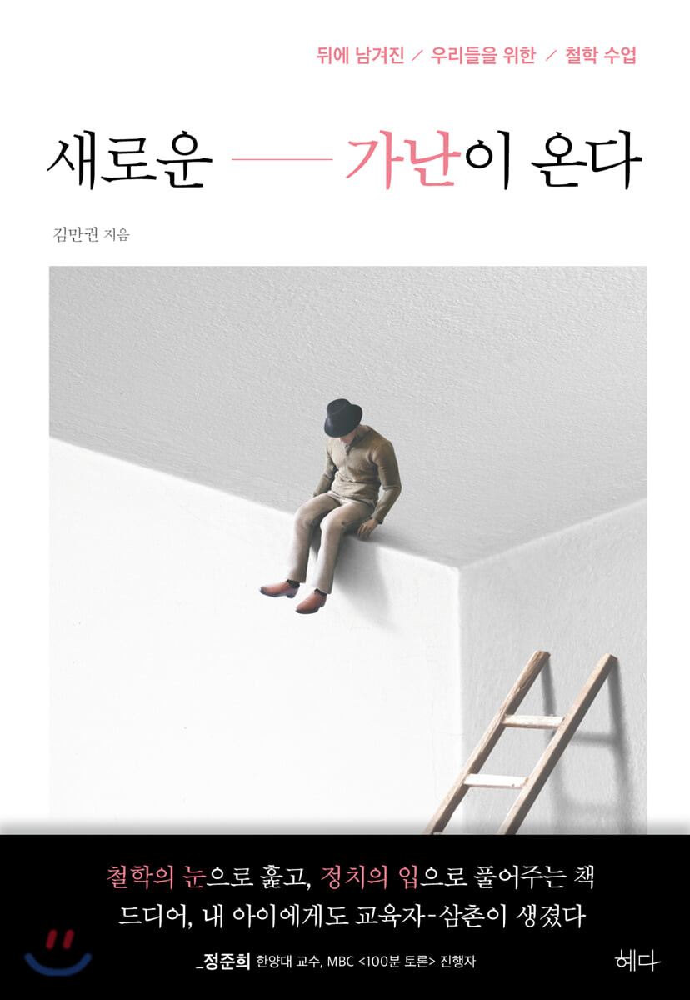
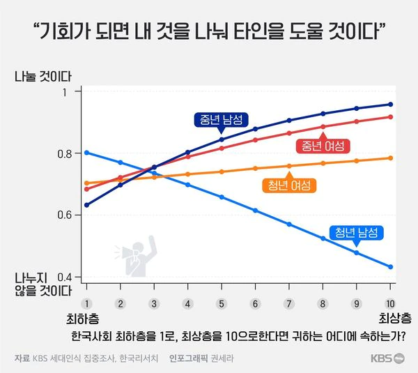

 

얼마전에 충격적인 통계자료를 보았다.
'기회가 되면 내 것을 나눠 타인을 도울 것인가?' 라는 물음에 단호한 태도를 보이는 청년 남성들의 대답이 유난히 돋보이는 [그래프][1]였다.
비교적 비슷한 환경을 겪고 자란 청년 여성들과 견주었을 때 비관적이고 극단적인 성향을 띠는 양상이 실망스러웠고,
'있는 사람이 더 한' 면모를 보이는 모습에 낙담했다.

[1]:https://news.kbs.co.kr/news/view.do?ncd=5218373 "KBS 세대인식 집중조사④ 세대가 아니라 세상이 문제다"

분배에 대해서는 각자가 다양한 생각을 갖고 있을 것이다.
만약 당신이 우하향을 그리는 이 그래프의 곡선이 좀 더 위쪽으로 쏠렸으면 좋겠다는 생각을 갖고 있다면 앞으로 소개할 책에 구미가 당길 것이다.
나 같은 경우에는 단순히 '재밌다'는 정도를 넘어 생각의 지평을 넓혀준, 꽁꽁 얼어붙은 머릿속 바다를 시원하게 깨뜨려버리는 도끼같은 책이었다.

다행히도 이 통계는 왜곡된 것이라는 
<a href="https://www.chosun.com/economy/economy_general/2021/06/29/45QGN6LND5FAZDCFSG6LDBHLGI/" title="KBS ‘나쁜 이대남’ 그래프에 학자들이 분노하는 이유">주장</a>
에 힘이 더 쏠리고 있다.

이 책은 코로나19라는 국가적 재난 상황으로 인해 우리 사회가 내포하고 있던 문제들이 부각되는 이 시점에서
'21세기 자본주의와 그 안에서 살아가야 하는 인간의 운명'을 고찰한다.
우리 사회는 어떤 문제에 처해 있는가?
디지털 기술의 발전으로 인공지능은 우리의 일자리를 위협하고 있고,
디지털 기술을 활용할 줄 아는 사람과 그렇지 못한 사람으로 나뉘어 소득과 부의 양극화가 심해지고 있다.
플랫폼 노동으로 대변되는 그나마 몇 없는 일자리는 삶을 고단하고 빈곤한게 한다.
게다가 신자유주의 이념을 등에 업은 21세기 자본주의는 복지를 걷어차 버리고 민주주의를 위협하며 불평등을 가중하고 있다.

저자는 이러한 문제들에 대한 해결책으로 노동 '밖'으로 나가야 한다고 말한다.
'노동은 신성한 것이고 게으름은 악이다'라는 생산력이 부족했던 과거에나 통용되는 노동윤리를 버리고,
인간이 노동을 통해서만 자신의 가치를 증명할 수 있다는 편견을 버리면,
인공지능에게 우리의 일자리를 흔쾌히 내줄 수 있게 된다.
'로봇세'와 '구글세'를 걷어서는 '기본소득'이나 '기초자본'과 같이 어떻게 하면 균등하게 배분할 수 있을지를 고민하면 된다.
노동을 버리고 불로소득을 취하는 동안 우리는 예술 활동이나 정치에 참여하며 자기 자신을 표현하고 노닐면 된다. 
경제가 돌아가게끔 적당히 소비도 해주면서 말이다.
본래 노동은 노예가 도맡았던 것이다.

한편으로는 '서로에게 다가가는 연대'가 필요하다고 말한다.
우리 사회를 지배하고 있는 자본주의와 노동윤리 그리고 능력주의는 
능력 없고 가난한 사람들에 대한 도덕적 비난을 수용할 뿐만 아니라 종용하기까지 한다.
소비사회에서 가난하고 능력 없는 사람들은 국가와 자본의 눈 밖에 난, 보이지 않는 사람이 되어 버린다.
설상가상으로 코로나 19는 이들의 고립을 강화한다.
이런 마당에, 저자는 '비상구를 찾아 나가는 길에 어떤 이유로든 뒤에 남겨진 자들은 더 이상 동료 시민들에 대한 믿음을 가질 수 없게 된다'면서
우리 모두가 합심해서 위기의 시대를 헤쳐 나가야 한다고 말한다.

> 위기에 뒤로 남겨지는 사람이 없도록 하라.

사실 이 책의 진가는 우리 사회가 안고 있는 문제점들에 대한 해결책을 제시하는 부분이 아닌, 
우리 사회가 형성된 과정과 우리 사회를 지배하는 이데올로기들에 대해 설명하는 부분이라고 생각한다.
신자유주의가 어떻게 복지국가를 무너뜨렸고,
대중들은 왜 복지국가가 무너지는 광경을 묵인했으며,
포스트민주주의가 어떻게 불평등을 용인하고 있는지를 설명하는 부분은 참으로 흥미롭다.
노동윤리가 가난한 자들을 우리 사회에서 배제하는 용도로 쓰이고 있다는 지그문트 바우만의 분석과
능력주의의 허점을 낱낱이 밝혀내는 마이클 영의 분석은 모피어스가 건네는 빨간 약에 비견할만한 충격과 깨달음을 안긴다.

진짜 재밌는 이 책의 내용들을 잘 정리해보고자 몇 번이고 썼다 지웠다를 반복했지만 만족할만한 결과가 나오지 않았다.
역량 부족이다. 다음번에 읽을 책은 잘 구상해서 정리해도록 하자.

<!-- ## 복지국가의 구축 : 브레튼우즈 체제와 세계(world) 시장

제1 기계 시대에 축적된 부는 대공황과 두 번의 세계 대전을 거쳐 국가에 종속된다.
즉, 사람들은 공평하게 가난해진 것이다.
국가는 건강한 노동력을 확보해서 국부를 축적하고자 한다.
케인스를 중심으로 '브레튼우즈 체제Bretton Woods System'라는, 제1 기계 시대의 복지를 상징하는 경제 체제가 세계적으로 구축된다.
'통제된 자본주의Controlle capitalism'로 불리는 이 체제는 국가가 자본의 흐름을 파악하고 통제할 수 있었다.
일부 학자들은 이 시기를 자본주의의 진정한 황금기로 보기도 하는데,
국적이라는 꼬리표를 단 자본이 이윤을 벌어들이면 그 혜택이 소속 국가의 노동자들에게 소득과 사회보험으로 돌아갔기 때문이다.

세계 시장의 중심은 민족국가national state라는 단위다.
명확하게 그어진 영토 내에 존재하는 사람들이 '민족'이라는 가치 아래 모인 것.

## 복지국가의 쇠퇴 1) 신자유주의와 지구적(global) 시장으로의 전환
1971년 미국이 금본위제를 폐지하자 많은 국가들이 통화를 발행하고 돈을 푸는 양적 완화 현상이 발생했다.
통화량 증가와 더불어 73년 오일 쇼크로 인한 원자재 가격 상승은 스태그플레이션을 낳는다.
게다가 경제 선진국들은 국내에서 소비하지 못하는 잉여 생산물들을 내다 팔 곳이 필요했다.
과거에는 국가 간의 경계가 자본도 이익을 볼 수 있는 안전망의 역할을 했다면 이제는 자본이 이윤을 극대화하는 데 방해 요소가 되어 버린 것이다.

1970년대부터 본격화되기 시작한 신자유주의라는 이데올로기는 이런 배경에서 등장했다.
신자유주의는 경제 영역에서 국가 간 장벽의 높이를 낮추어 자본이 활동할 수 있는 시장을 전 지구적 차원으로 넓혀야 한다는 발상을 담고 있다.
1980년대 영국 총리 대처와 미국 대통령 레이건은 모든 국가와 사람들에게 이익이 될 것이라 약속하며 신자유주의 질서를 널리 퍼뜨렸다.

지구적 시작은 전 지구적 자원의 상호의존적인 행위자들로 연결되어 있다.
지구적 시장에는 민족국가라는 행위자 외에도 외에도 국제기구, 초국접 기업이 있다.
국제기구는 국경을 넘어 적용될 수 있는 무역 및 금융 규칙들을 정해 실행에 옮기고 이를 위반하는 국가들을 규제하는 역할을 한다. 
초국적 기업은 국적이라는 꼬리표를 떼 버리고 국경을 넘나들며 활동하는 기업을 말한다.

국가가 자본에 대한 통제력을 잃게 된 것이다.

## 복지국가의 쇠퇴 2) 포스트산업사회(소비사회)
제조업, 즉 생산이 중심인 사회에서 서비스업, 즉 소비가 중심이 된 사회로의 이행은 엄청난 사회변동을 동반했다.
생산의 중심 역학을 하던 노동자 계급이 쇠퇴했다.
노동계급을 구성하는 숫자 자체가 줄어들었고, 이로 인해 노동자 계급의 정치적 영향력도 축소했다.
더 심각한 문제는 국가와 자본이 '복지'라는 대의 아래 협력할 수 있었던 중요 요소가 사라져버렸다는 점이다.
산업사회가 노동자를 필요로 했기 때문에 자본이 복지를 구성해야할 필요가 있었던 것인데,
지구적 시장 체제에서 운영되는 포스트산업사회에서는 국가의 경계 밖에 값싼 노동력이 늘 대기하고 있기 때문에 국내 노동자들을 보호할 필요가 없어졌다.
복지국가에서 보호하고자 했던 산업시대의 주요 노동력들은 소비사회의 자본에겐 더 이상 매력적이지 않은 자원으로 전락해 버렸다. 

## 복지국가의 쇠퇴 3) 중산층의 자신감
지구화 시대에 벌어진 복지국가의 쇠퇴가 국가와 자본의 결탁만으로 가능했던 일일까?
세계적으로 저명한 사회학자 지그문트 바우만은 '어떻게 복지국가의 쇠퇴를 주도하는 신자유주의적 논리들이 순식간에 커다란 저항 없이 사람들에게 받아들여질 수 있었는가?'라는 질문을 던진다.
어떻게 '복지국가에 반대하는 민주주의Democracy Against the Welfare State'라는 아이러니가 탄생할 수 있었을까?

복지국가의 수혜를 받고 자라난 세대, 특히 만족스러운 삶을 사는 다수 중산층의 자신감이 그 주요한 요인이라는 게 바우만의 분석이다.
바우만은 과거 산업사회에 살았던 복지국가 초기의 중산층들은 빈곤하지 않았음에도 국가가 사회적 약자들에게 안전망을 제공하는 데 동의했다는 사실에 주목한다.
과거 중산층들은 그럭저럭 자립을 유지했다 하더라도 그 행운이 영원히 지속되지 못할 수 있다는것을 알았다.
언제라도 황폐해질 수 있다는 걸 알았다.
안전함이란 개인의 성실한 노력이 부릴 수 있는 마법보다 더 강력하고 믿을 만한 토대를 필요로 하는 것 아닌가?
이는 매우 타당한 의문이었고 그 답은 오로지 복지, 하나였다.

하지만 복지국가의 혜택을 받고 자라난 새로운 세대들은 부모 세대들과 다르게 자신감이 넘쳤다.
풍요의 시대와 사회적 안전망을 경험한 적이 없던 부모 세대들은 자립을 했다고 해도 그 성공이 얼마나 지탱될 수 있을지에 대해 확신할 수 없었다.
반면 부모 세대가 어렵게 마련한 복지국가에서 '사회의 보호'를 받으며 자라나 늘 자기 확신에 차 있던 새로운 세대는 자신감이 넘쳤다.
이들은 자신들이 입었던 복지의 혜택 덕분에 오늘날 자신이 만들어졌다는 사실을 망각하기 시작했다.

바우만은 차별철폐조치Affirmative action을 통해 사회적 성공을 이룬 이들이 거꾸로 차별철폐조치의 철폐에 앞장서는 현상을 그 예로 든다.
워드 코넬리는 '역차별을 철폐하자'는 주장으로 미국 주의회에 당선된 최초의 민주당 의원이다.
그는 아프리카계 미국인인데, 차별철폐조치가 성공을 위해 노력한 많은 아프리카계 미국인들을 평가절하한다고 주장했다.
이런 주장에 아프리카계 미국인 중산계급이 동조한 것이다.
바우만은 '미국 로스쿨에 입학한 전체 흑인 학생 3,435명 중 시험 성적만으로 입학할 수 있었던 학생은 687명 뿐이었다'는 자료를 근거로 코넬리의 주장에 반박한다.

코넬리의 역차별을 철폐하자와 같은 현상은,
우리들 대다수가 자신이 이룬 성공을 오로지 자기 노력만으로 얻었다고 믿고 싶어 하기 때문에 발생한 일이다.
이런 생각을 바탕으로 결국 자신의 성공을 만들어 준 사다리를 다음 세대들이 쓸 수 없게 걷어차 버리는 역설적 현상이 나타나는 것이다.
바우만은 이처럼 복지국가가 만들어 낸, 자신감에 넘치는 세대가 복지의 힘을 평가절하하고 자신의 노력과 재능만으로,
국가의 도움 없이도 시장을 통해 충분히 자신을 보호할 수 있다고 믿는 일이 일어났다고 분석한다.
이런 바우만의 분석은 복지국가의 수혜자들이 스스로 복지의 축소에 동의하게 된 주요 원인을 잘 설명하고 있다.

## 복지국가의 쇠퇴 4) 신자유주의 윤리 : 네 삶은 네가 책임져야 한다!
제1 기계 시대의 사람들은 '삶에는 때로 자기 스스로 책임질 수 없는 순간이 온다'는 현실을 알고 있었기 때문에 복지 국가 조성에 힘을 썼다.
'네 삶은 네가 책임져야 한다'는 윤리가 지배하고 있는 제2 기계 시대에서는 찾아보기 힘든 광경이다.

일말의 과장도 없이, 신자유주의는 진정으로 복지국가가 모든 악의 근원이라고 말한다.

아무런 도움 없이 시장 안에서 살다 보면 능력 있는 자들은 더 부유해지고 그렇지 못한 자들은 더 가난해지는 게 당연한 순리다.
시장주의자들에게 불평등은 결코 중요한 문제가 아니다.
어떻게 가난에서 벗어날 수 있냐는 물음에 시장주의자들은 '열심히 일하라'고 답한다.
이게 바로 시장주의자들이 말하는 진취적 자립정신이다.

자기 인생은 자신이 책임지는 것이다는 윤리에 담긴 발상은,
삶이 위험에 처했을 때 국가에 요구하기보다는 스스로 그 위기를 넘어서라는 것이다.
결국 국가가 보호의 책임을 개인에게 떠넘기는 것이다.
실제로 이 윤리가 작동하면서 국가는 원래 맡고 있던 보호의 기능을 제공하지 않으면서 국가의 권리만을 주장하게 되었다.
또한 이 윤리와 함께 성장한 세대는 자신들의 삶이 대공황 이후 그 어느 세대보다 어려운 상황에 처했음에도 국가에 아무것도 요구하지 않는, 역사적으로는 거의 없었던 기이한 일이 일어난 것이다.
실제로 2019년 <월스트리트저널>은 미국에서 가장 많이 교육받은 밀레니얼 세대(1981~1996 출생자)가 아이러니하게도 대공황 이후 가장 가난한 세대가 되었다고 보도한다.
우리나라도 2016년부터 통계청 등에서 발표한 자료에 따르면 지금의 20~30대들이 부모보다 가난한 첫 세대가 될 것이라고 말하고 있다.

그런데 대다수의 개인들은 세상이 이렇게 변한 이유를 알지 못한 채, 자신의 삶은 자신이 책임지는 것이라는 윤리를 당연한 것으로 받아들이고 있다.
이제 개인의 실패는 사회구조적 문제라기보다 개인의 능력 탓이고, 더 이상 국가가 개입할 문제가 아니라 개인이 온전히 책임져야 할 일이 되어 버렸다.
개인들은 자기 책임의 윤리를 내면화한 채 아무런 보호 장비 없이 지구적 시장에 내던져지고 있는 것이다.

제4 장에서는 복지국가의 쇠퇴가 불평등의 세계로 귀결된 그 과정을 살펴본다.
또한 민주주의가 이 문제들을 해결할 수 있을지에 대해서도 살펴본다.

## 디지털 디바이드 : 기술의 혜택은 평등하게 분배되지 않는다
디지털 디바이드Digital divide라는 용어에는 디지털 기술을 쓸 수 있는 사람과 그렇지 못한 사람들이 분리되어 있다는 것 이상의 의미를 담고 있다.
디지털 기술의 발전은 사회계층 구조의 정점에 서 있는 사람들에게 더 많은 혜택을 주는 경향이 있다.

2019년 포브스에서 작성한 세계에서 가장 부유한 사람들의 명단을 살펴보면 디지털 기술 관련 종사자들이 대다수를 차지한다.
디지털 기업의 독점적 지위는 앞으로도 강화될 저남ㅇ이다.

## 민주주의는 왜 불평등을 용인하는가? : 포스트 민주주의
포스트민주주의라는 용어는 콜린 크라우치라는 정치사회학자가 2000년에 내놓은 책에서 나타났다.
포스트민주주의는 우리가 알고 있는 민주주의의 모든 특성을 다 갖추고 실제로 작동도 하는 사회를 말한다.
다만 민주주의와 다른 점은, 권력의 중심이 다수의 유권잦에서 특권을 추구하는 소규모 정치 엘리트와 부유한 집단으로 옮겨갔다는 점이다.
근대 민주주의가 권력을 소수의 왕과 영주들로부터 평범한 사람들에게 옮겨 놓았다면, 포스트민주주의에선 그 반대 현상이 일어나고 있다.

포스트민주주의 사회의 정당에선 핵심 동심원(3~4인의 소수 결정권자)이 국회 의원, 평당원 등을 생략하고 제일 바깥에 있는 일반 유권자와 바로 연결되는 일이 일어난다.
이들이 때로는 평범한 유권자가 아니라 사회에서 막강한 영향력을 행사하고 있는 소수의 부유한 사람들 혹은 강력한 초국적 기업의 CEO다.
정중앙의 소수 정치 엘리트와 동심원 밖의 경제 엘리트들이 직접적으로 연결되도록 다리를 놓아주는 사람들이 바로 로비스트다.

포스트민주주의 사회의 중요한 특징은, 정치 결정권자들이 부유한 이들의 이익을 합벅적인 절차를 밟아서 실현시켜 준다는 데 있다.
공공 부문의 민명화가 대표적인 사례다.
정당 지도부에 쉽사리 맞설 수 없는 일반 의원들은 이런 결정을 수동적으로 따를 수밖에 없고,
정당 지도부 자리를 노리는 의원들은 다음번 수혜를 받을 이가 자신이기에 굳이 반대할 이유가 없는 것이다.
정권 교체가 가능한 민주 사회이기에 다른 정당들 역시 자신들이 권력을 잡게 되면 그 수혜를 받게 될 테니 적극적으로 나서서 반대할 이유가 없다.

결론적으로 포스트민주주의 사회에서 제도권 정치인들은, 심지어 진보적 정치인들조차 슈퍼리치들의 이익을 견제하고 그들의 부패를 막는 일에 결코 적극적으로 나서지 않는다
실제로 2000년대 접어들며 세계 곳곳에서 많은 사람들이 자신의 목소리를 들어주지 않는 제도권 정치인들에게 좌절감을 느끼기 시작했다.
이런 좌절감이 브렉시트와 트럼프 열풍을 낳았고 결국 포퓰리즘의 폭발로 이어졌다.

## 포스트 민주주의 시대의 포퓰리즘
전통적으로 포퓰리즘이 작동하는 기본 원리는 '소수의 엘리트들이 평범한 사람들의 권력을 빼앗아 갔다. 그 권력을 다시 찾아 돌려주겠다.' 는 것이다. 
이 시대의 좌파 포퓰리즘은 이 원칙에 따라 충실히 움직여 왔다. 이들은 권력에서 배제되어 있는 자라면 누구나 연대해야 하는 존재로 여긴다. 
반면 우파 포퓰리즘은 '소수의 엘리트'와 '평범한 사람들' 사이에 제3의 집단을 설정한다. 여기엔 이민자, 외국인 노동자, 난민, 여성 등이 포함된다. 
쉽게 말해 사회의 최약층인 '더 배제된 자'를 이용해 평범한 이들로 구성된 '덜 배제된 자'들을 결집하는 방식이다. 
트럼프와 브렉시트가 우파 포퓰리즘의 작동 방식에 기댄 대표적 사례다.

트럼프가 힐러리를 물리칠 수 있었던 이유로 많은 전문가들이 꼽는 것은, 힐러리 역시 아무리 말해도 평범한 사람들의 요구를 들어주지 않는 기성 정치인으로 치부했다는 점이다. 
힐러리 역시 포스트 민주주의를 만든 소수 엘리트 정치인의 일부라는 것이다.
트럼프의 당선은 역사의 역설적인 한 장면이었다. 
슈퍼리치들과 그들과 결탁한 소수 정치 엘리트들에게 질려 버린 사람들이 그 문제를 해결하기 위해 슈퍼리치에게 권력을 맡긴 셈이기 때문이다.

## 노동과 빈곤 : 플랫폼 노동의 현실
플랫폼 노동은 공유 경제라는 명목아래 만들어진, 유휴 자산을 활용해 부업을 할 수 있게 해주는 노동 방식을 뜻한다.
스마트폰 앱같은 디지털 플랫폼을 통해서 필요에 따라 계약을 맺고 일하는 사람을 플랫폼 노동자라고 한다.
우리나라에선 퀵서비스, 화물운송기사, 택배기사 모두 플랫폼 노동으로 전환되었다.

플랫폼은 노동자들을 부업으로 일하는 독립 사업자로 여긴다.
플랫폼에게 '부업'과 '독립 사업자'는 마법의 단어다.
이를 통해 4대 보험으로 상징되는, 기업이 고용자들에게 제공해야 할 보호의 의무에서 간편하게 벗어날 수 있다.
플랫폼 노동자들은 일터에서 노동자로 일하지만 법적으로는 독립 사업자, 즉 사장님이다.
이 마법의 단어들은 단지 노동자들을 보호하던 전통적인 사회보장 혜택을 빼앗는 것에 그치지 않는다.
'노동자'라는 지위를 '사업자'라는 말 뒤에 교묘히 숨겨서, 이들이 노동조합 등을 만들어 행사할 수 있는 노동 3권까지 박탈해버린다.
보호가 필요한 곳에선 독립 사업자로, 작업이 필요한 곳에선 노동자로 남게 되는 것이다.

## 노동윤리가 형성된 배경
인류는 늘 결핍에 시달려왔다.
이 결핍에서 벗어나려면 생산력을 증대시켜야만 했고, 1차 산업혁명이 그 해결책으로 부상한다.
그런데 산업혁명을 진전시키는 데 큰 장애물이 있었다.
기계 앞에서 열심히 일할 노동자들이 필요했지만 사람들은 열심히 일하려 들지 않았다.
그러자 노동력이 필요했던 이들은 노동을 선악의 문제로 바꾸는 시도를 한다.
'열심히 일하는 것이 선이요, 게으른 것은 악'이라는 노동 윤리를 만들어 낸 것이다.
종래에는 막스 베버가 <프로테스탄트 윤리와 자본주의 정신>(1904)에서
'파이를 가져가려면 노동으로 증명하라'고 설파하기에 이른다.

## 존중하지도 않는 노동이 왜 인간의 자격이 될까?
제2 기계 시대가 만들어 낸 플랫폼 자본과 탈산업사회에서 만들어진 소비사회 모두 노동을 존중하지 않고 있다.
그런데 참 이상하게도, 노동을 존중하지도 않으면서 열심히 일하는 것이 선한 것이라는 노동 윤리는 그 어느 때보다도 강성한 시대다.
왜 우리는 여전히 과거의 노동 윤리를 지키고 있는가?
바우만은 이렇게 말한다. 
'소비사회에서 생산자들의 윤리인 노동 윤리가 필요한 이유는 가난한 자들을 사회에서 배제시키기 위해서다'
열심히 일하는 것은 선이고 그렇지 않은 것은 악이라는 노동 윤리를 따라가다 보면,
빈곤한 자는 노동하기를 거부하는 부도덕한 자이고 부도덕한 자는 도와줄 필요가 없다는 결론에 이르게 된다.
한마디로, 노동 윤리란 가난을 타락의 언어로 그려내는 효과적인 수단인 것이다.

궁핍을 타락의 언어로 그려 낼 때 생기는 두 가지 효과가 있다.
첫째, 이들을 우리 눈 밖으로, 보이지 않는 곳으로 몰아내도 비난받지 않는다.
둘째, 이들을 도와줘야 한다는 도덕적 의무감에서 벗어날 수 있따.

## 보이지 않는 사람들을 보이게 하라!
바우만은 제2 기계 시대가 만들어 낸 소비사회에서 노동 윤리의 압박을 받는 가난한 자들은 자신의 모습을 전혀 드러내지 않고 있다고 말한다.

이 사회에서 착한 빈민이란 아무리 힘들어도 사회에 아무것도 요구하지 않는 이들을 뜻한다.
마치 이 세상에 존재하지 않는 것처럼 살아가는 가난한 이들, 이들이 사회에 도움을 요구한다는 건 곧 노동 윤리를 갖추지 못한 사람 취급을 받고, 스스로 사람 구실을 못하는 쓸모없는 존재라는 걸 밝히는 것과 같다.
그래서 이들이 선택한 삶은 보이지 않는 삶, 아무것도 요구하지 않는 삶이다.
이런 이유로 오늘날 가난한 사람들은 자신의 실패를 홀로 견뎌 내야 하는 운명에 처해 있다.
빈곤이 만들어 낸 수치심이라는 이불을 덮고 내일에 대한 아무런 희망 없이, 그저 하루하루를 버티는 삶을 살아갈 수밖엔 없는 것이다.

수치심에 휩싸인 사람이 자신을 비하하고 경멸하지 않을 수 있을까?
스스로를 혐오하는 그 끔찍한 감정을 마음속 깊이 담아 두고 끝까지 억누를 수가 있을까?
그들도 그런 감정을 해소할 곳이 필요하지 않을까?

## 능력주의의 함정
최근 제2 기계 시대가 만들어 낸 새로운 불안과 불평등에 맞서는 우리들의 모습을 보면 안타까울 때가 있다. 
많은 사람들이 요구하는 공정성의 내용을 살펴보면, 그 핵심이 각자도생의 기회를 보장하라는 것, 그 이상도 이하도 아니다. 
우리가 알아서 살아남을 테니 국가는 그 기회를 공정하게 보장하라는 것이다. 
그 이면에는 능력주의가 자리 잡고 있다. 

능력주의는 2020년 우리 사회에서 가장 많이 회자된 말 중 하나다. 영어로는 메리토크라시meritocracy라 부른다. 
라틴어의 mertium에서 온 merit(훌륭함)라는 말과 그리스어의 kratia에서 유래한 cracy(통치)라는 말을 조합해 만든 단어로, 글자 그대로 옮기면 훌륭함이 통치하는 정치체제를 뜻한다. 
1958년에 발간된 마이클 영의 <능력주의의 부상>에서 이 표현이 처음 쓰였다.
영에 따르면 능력을 중시하는 발상은 산업혁명 이전에도 존재했다. 
그런데 왜 민주주의 시대에서 능력이 그 어느 때보다 중요해진 것일까?

민주적 사회에서 하층계급과 상층계급을 가르는 심연이 더욱 넓어졌는 데도 왜 사회는 이토록 안정을 유지하는가? 
영의 대답은 명확하다. 
지금의 이 불평등은 능력에 따라 계층이 갈리는 것이 당연하다는 공유된 가치 아래 만들어졌기 때문에 사회가 안정을 유지한다는 것이다. 

이런 상황에서 영은 다시 질문을 던진다. 
만약 우리가 민주주의 사회에 살고 있다면 '우리 사회의 구성원 중 누군가의 능력이 조금 떨어진다는 게 객관적으로 입증된다 하더라도, 왜 그것이 재화와 권력을 적게 할당받아야 하는 이유가 되는가?' 
영의 이러한 문제제기는 일리가 있다. 
역사적으로 보았을 때, 평범한 사람들이 엘리트보다 능력이 뛰어나서 민주주의가 정당성을 획득한 것은 아니기 때문이다. 
그런데 왜 민주주의 시대에 살고 있는 평범한 우리들조차 능력에 따라 자원과 권력을 할당받는 게 정당하다고 생각하는 걸까?

영은 이렇게 답한다. 
'능력주의란 평등을 받아들인 민주주의 사회에서 노골적으로 만들어지고 있는 불평등이란 모순을 비켜가기 위해 작동하는 일종의 이데올로기다' 평등을 추구하는 사회에서 '능력에 따른 불평등은 정당하다 혹은 제한되지 않는다'고 공개적으로 말함으로써 권력을 행사하는 자에게 마땅한 자격을, 
권력 행사의 대상이 되는 사람에겐 저항 없이 그들의 지배를 받아들이도록 만드는 역할을 한다는 것이다.

여기에 더해, 영은 이런 능력주으가 새로운 계층을 만들어 내고 새롭게 등장한 계층 사이에 높은 벽을 만들어 결국 계층 이동을 가로막는다고 주장한다.
능력주의가 사회적 계층 이동을 가능하게 아니라 오히려 가로막는다는 것을 인지하면 우리는 당황한다. 
수많은 사람들이 지금 이 순간에도 능력주의를 불평등의 해결책처럼 말하고 있기 때문이다.

대니얼 마코비츠 역시 <능력주의의 함정>(2019)에서 능력주의가 불평등의 해결책이 아니라 원인이라는 마이클 영과 똑같은 주장을 한다.
마코비츠는 1950~60년대 서구 사회에서 능력주의 혁명이 일어난 시기에 주목하며, 이때 일어난 가장 큰 변화 하나를 지적한다. 
바로 엘리트 계급이 자식에게 신분과 재산 대신 '능력을 만들어서' 물려주기 시작했다는 것이다.
결국 이런 현실 속에서 '능력'이란 것 또한 엘리트 부모로부터 자녀에게 세습되며 계층 이동을 가로막게 되는 것이다.

이런 식으로 능력주의가 퍼져 나갈 때 민주주의 사회는 두 가지 문제를 마주하게 된다.
첫째, 중산층이 무너진다.
둘째, 혐오와 차별이 퍼지며 구성원들 간의 연대가 가로막힌다.

민주주의의 기반은 중산층이라는 게 치명적이다. 
상위계층에게 민주주의란 자본주의에서 최대한 성과를 얻고자 하는 자신들을 제약하려 드는 귀찮은 것일 수 있고, 
하위계층은 먹고 살기 바빠 자유와 평등 같은 사회적 가치게 관심을 기울이기가 어렵다

더 큰 문제는 노력주의로 변신한 능력주의가 사회의 다수를 능력도 없고 충분히 노력하지 않는 자들로 만들어, 
사회로부터 혜택을 받을 자격이 없는 사람들로 전락시킨다는 점이다.
마이클 영은 능력주의가 '지능(I.Q) + 노력 = 능력' 이라는 등식 아래, 개인이 지닌 능력 외에는 그 어떤 것도 개인의 성취를 좌우하는 요소가 되어서는 안 된다는 발상이라고 말한다. 
언뜻 공정해 보이는 이 공식에는 결정적인 함정이 있다. 
지능이란 게 타고난 운에 좌우되는 유전적 요소와 관련 있기 때문이다. 
운에 좌우되는 능력주의는 이미 공정하지 못한 것이다. 
그래서일까? 능력주의에 대한 주장을 보면 대부분 자신의 의지로 어쩔 수 없는 지능이라는 유전적 요소는 은연중에 사라져 버리고 오로지노력만 남아 있는 걸 볼 수 있다.
 
능력주의는 진입 장벽을 넘지 못한 모든 사람들을 게으른 사람, 충분히 노력하지 않은 사람으로 취급한다. 
사회적 다수를 능력 없는 자들로 만들어 무기력에 빠뜨릴 뿐만 아니라, 게으른 자들로 취급하며 도덕적 수치심까지 안긴다.
바우만은 자기혐오를 두고 이렇게 말한다. 
누구도 자신에 대한 분노를 끝까지 자기 안에 담아 둘 수는 없다. 
그 분노는 바깥으로 분출되게 되어 있다. 
그 분노의 대상이 자신을 절망에 빠뜨린 바로 그 대상이 아닐 수도 있다는 점이다.
자기혐오와 타자혐오로 이어진다는 것이다. -->
