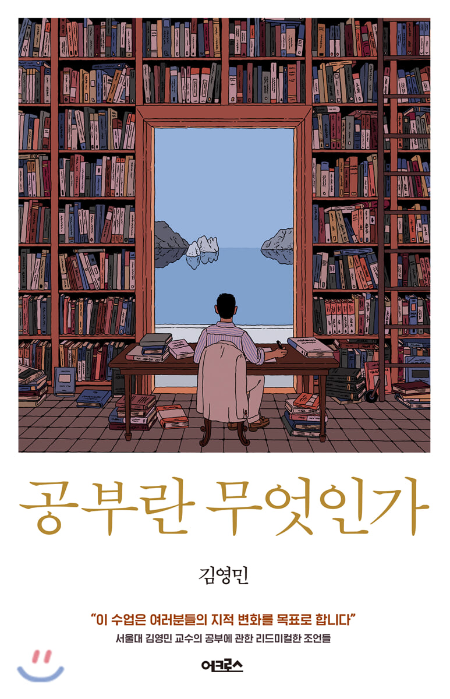

 

김영민 교수의 글을 좋아한다. 유시민 작가의 글에서 볼 수 있는 논리정연함과 뛰어난 통찰력이 마찬가지로 드러나고, 문유석 판사의 글처럼 유머러스하고 연륜이 묻어나며, 권석천 기자의 것처럼 사람 냄새가 풍기는 그런 글 말이다.
뉴스를 통해 각박한 현실의 안타까운 소식이 주로 들려오거나 인터넷 커뮤니티의 생각을 거치지 않고 뱉어낸 토사물과도 같은 말들에 진저리가 나곤 할 때 이런 글들을 찾아 읽는 편이다. 평정심을 부여잡고 인류애를 충전하는 한 가지 방법이다.

저자는 이 책을 통해 우리에게 입시와 취업만으로는 환원되지 않는, 어떤 탁월함을 목표로 한 공부의 필요성을 역설하고 있다. 젊은 날, 자신의 인생에서 가장 아름답고 찬란한 화양연화의 순간을 수능 시험과 이력서에 한 줄 채워넣기 위한 자격증 공부로 소진해버리고 마는 것은 얼마나 안타까운 일인가. 그보다 흥미로운 지적 체험을 할 수 있는 기회가 얼마든지 있다는 것이다. 생각할 수 있는 근력이 없을 때 마주하는 거품같은 공허함, 불안감을 타파하기 위해 지적 성숙의 과정을 겪을 필요가 있다고 말하는 것이다.

> 오스카 와일드는 "우리는 모두 시궁창에서 살아가고 있지만, 그 와중에도 몇몇은 별빛을 바라볼 줄 안다"고 말한 적이 있다. 우리 스스로가 별이 될 수는 없지만, 시선을 시궁창의 아래가 아니라 위에다 둘 수는 있다. 이 사회를 무의미한 진창으로부터 건져낼 청사진이 부재한 시기에, 어떤 공부도 오늘날 우리가 처한 지옥을 순식간에 천국으로 바꾸어주지는 않겠지만, 탁월함이라는 별빛을 바라볼 수 있게는 해줄 것이다.

책을 읽으면서 와닿았던 부분은 적합한 단어 사용의 중요성을 강조한 부분이었다. 하드웨어(hardware)라는 단어와 구조적(structural)이란 단어를 혼용해서 사용하는 사람이 있다고 가정해보자. 단순히 부품이 고장난 컴퓨터를 두고 "이 컴퓨터는 구조적인 문제가 있어"라고 한다면, 그것은 틀린 말이다. 단어를 부정확하게 사용한 것이다. 만약 그 사람이 하드웨어란 단어를 일관되게 구조적이란 단어로 치환해서 사용하고 그 반대의 경우도 마찬가지라면, 적어도 그 사람의 말을 이해할 수는 있을 것이다. 그러나 제멋대로 혼용해서 쓴다면?

최근 블로그를 하면서 다른 사람들의 글을 숱하게 읽으며 든 생각은, 어떤 개념을 온전히 이해하지 못한 채 게시한 글이 많구나라는 생각이었다. 이 사람은 잘 정리해둔 다른 블로그의 글을 거의 그대로 베끼다 싶이 했구나와 같은 것들. 그런 사람들을 비난하려는 것은 아니다. 나도 다른 블로그를 베꼈고, 관련 개념을 명확히 이해하지 못해서 마음 아프게도 뭉뚱그려 표현할 수밖에 없었던 상황이 여럿 있었다.

단지, 훌륭하게 정리된 다른 블로그의 게시글들을 보면서 복잡한 기술 용어와 그 내부 구조까지도 파악해서는 척하면 탁하고 정리 응용하여 실전에 써먹는 개발자가 되고 싶다는 바람이 생겼다는 말을 하고 싶었다.

<!-- > 모순이나 긴장 없는 삶이 가능할까? 그럴리가. (...) 이 세상 속에서 산다는 것은 이러한 모순, 긴장, 혹은 혼란 속에서 사는 것이다. (...) 공부하는 이가 할 일은, 이 모순된 현실을 모순이 없는 것처럼 단순화하는 것이 아니라 복잡한 모순을 직시하면서 모순 없는 문장을 구사하는 것이다. -->

> 공부를 통해 어제의 나보다 나아진 나를 체험할 것을 기대한다. 공부를 통해 무지했던 과거의 나로부터 도망치는 재미를 기대한다. 남보다 나아지는 것은 그다지 재미있지 않다. 어차피 남이 아닌가. 자기 갱신의 체험은 자기 스스로 자신의 삶을 돌보고 있다는 감각을 주고, 그 감각을 익힌 사람은 예속된 삶을 거부한다.

<!-- > <잃어버린 시간을 찾아서>를 쓴 마르셀 프루스트도, 경험에 합당한 언어를 부여하지 않으면 그 경험은 사라지게 된다는 취지의 말을 한 적이 있다. 자신의 독특한 경험에 맞는 섬세한 언어로 자신의 경험을 포착하지 않는 한, 그 경험은 사라지고 그만큼 자신의 삶도 망실된다. -->

<!-- > 자신의 의견을 적극적으로 개진하는 일을 몸에 익히지 않은 사람이 어느 날 갑자기 자기 의견을 잘 표현하게 되는 경우는 드물다. -->
