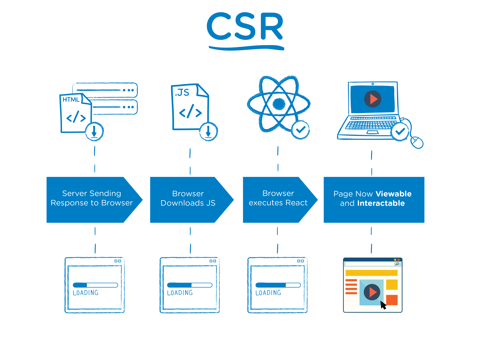

블로그를 만들면서 사용한 gatsby SSG가 무엇인지, SSG는 왜 생겨났는지 알아보도록 하자.

SSG를 이해하기 위해 MPA/SPA, SSR/CSR을 먼저 살펴볼 것이다.

# 1. MPA/SPA 웹 애플리케이션 구조

MPA(Multiple Page Applicaiton)는 다수의 페이지로 구성되어 요청이 들어올 때마다 정적 리소스를 반환해주는 방식의 웹 애플리케이션이다. 버튼 클릭과 같은 사소한 요청이 들어와도 페이지 전체를 리렌더링 해야하며, 이 과정에서 화면 깜빡임 현상이 발생한다.

SPA(Single Page Application)는 최초 요청시에 필요한 모든 정적 리소스를 한번에 다운 받고, 이후 요청이 들어오면 비동기 통신(AJAX)을 통해 페이지 전체를 리렌더링 하는 것이 아니라 필요한 부분만 갱신하는 방식이다.

MPA는 사전에 작성된 정적 페이지들을 서버가 갖고 있다가 (최초 요청 이후에) 요청이 들어올 때 그에 걸맞는 페이지를 반환하는 형식이다. 이는 서버측에서 렌더링이 완료되어 최종 문서를 반환하는 형태다. **즉, MPA는 SSR 방식으로 렌더링된다.**

SPA는 브라우저 안에서 동작하는 앱으로 최초 요청시 서버로부터 전달받은 HTML 문서를 바탕으로 클라이언트(브라우저) 단에서 렌더링을 진행한다. **즉, SPA는 CSR 방식으로 렌더링된다.** 최초 요청 이후 사용중에는 새로운 페이지를 요청하지 않는다. AJAX를 통해 서버와 데이터만 주고받을 뿐이다.

#### SPA의 장점
* 좋은 사용자 경험.
    - 화면 깜빡임(페이지 리로드)이 없다.
    - 속도가 빠르다. 최초 요청시 모든 정적 페이지를 다운받기 때문에 사용중에 응답을 기다리느라 시간을 낭비하는 경우가 없다.
* 개발자 친화적
    - 서버가 클라이언트 뷰(View)단에서 처리할 일을 더이상 신경쓰지 않아도 된다. 
* local storage를 효과적으로 cache할 수 있다. 
    - 처음에 모든 데이터를 받아서 저장하고 사용하는 방식이기 때문에 오프라인 상태에서도 작동한다.

#### SPA의 단점
* 초기 구동이 느리다. 최초 요청시 모든 정적 리소스를 한번에 받기 때문.
* SEO 관점에서 불리하다.
    - 최초 요청시 받아온 HTML 문서에는 import 구문으로 다른 JS 파일들을 불러올 뿐 사실상 내용은 전무해서 웹 크롤러에 의한 크롤링이 어렵기 떄문.
* 보안에 취약한 편(MPA와 비교했을 때)
    - clientside script를 통해서 Cross-Site Scripting(XSS) 공격을 당할 수 있다.
 
#### MPA의 장점
* SEO 관점에서 유리하다. 서버에서 이미 렌더링된 HTML 문서가 전달되므로.
* 초기 구동이 빠르다.
* 사용자 정보를 서버측 세션으로 관리하기에 보안에 유리한 편.

#### MPA의 단점
* 개발의 복잡성.
    - 프론트엔드/백엔드가 서로 밀접하게 연관되어 있다.
    - SPA보다 복잡한 규모.
* 화면 깜빡임.

# 2. SSR/CSR 렌더링 방식

SSR(Sever Side Rendering)

브라우저가 요청한 HTML 파일을 서버에서 렌더링을 마친 후 반환하기 때문에 로딩 시간이 짧다. 그럼에도 JS 파일을 다운받고 적용하는 동안 인터랙션 할 수 없다는 사실을 유의.

CSR(Client Side Rendering)

하나의 페이지에서 여러 페이지를 보여준다는 것은 자바스크립트를 이용해서 페이지의 일부 혹은 전체를 갈아치우는 것이다. 여러 개의 .js파일이 하나의 거대한 .js파일로 번들링되어 SPA를 이룬다고 보아도 무방하다.

렌더링 방식을 세분화하자면 위와 같은 것으로 보인다. 참고만 하도록 하자.

# 3. SSG (Static Stie Generator)
지금까지 살펴본 MPA(SSR), SPA(CSR)의 장점을 버무리고 싶다. SPA 구조로 제작하여 화면 깜빡임 없이 다양한 인터랙션을 빠르게 처리해내면서도, SSR 방식처럼 초기 로딩이 빠르고 SEO에도 무리가 없는 웹 사이트를 제작할 수 있다면 더할 나위가 없겠다.

이럴 때 React와 같은 CSR에 최적화된 라이브러리를 Gatsby 또는 Next.js 같은 SSG 프레임워크와 함께 사용하면 된다. Gatsby와 Next.js는 구체적인 작동 방식은 다르지만, pre-rendering 기법을 통해 정적으로 웹페이지를 미리 생성해두고 서버에 배포해두었다가 클라이언트의 요청에 응답하는 방식으로 초기 로딩을 단축하는 구조인 것으로 보인다. 즉, 최초 요청시 SSR 방식처럼 빌드 타임에 pre-render한 페이지를 클라이언트에게 전달하고, 이후에는 CSR 방식으로 동작한다.

gatsby 공식 홈페이지에서 정의한 SSG는, MarkDown을 비롯한 텍스트 파일 등을 source로 받아 HTML 페이지를 만들어내는 응용 프로그램이라고 한다. SSG는 앞서 언급한 pre-rendering 기능 이외에도 웹 페이지 개설, SEO 최적화, 보안 등 여러 역할을 수행하는 것 같다.

# 결론

전통적인 웹 사이트 구조 방식인 MPA, 현대적인 웹 사이트 구조 방식인 SPA의 장단점과 내부 작동 방식을 살펴보았다. MPA는 SSR 방식으로, SPA는 CSR 방식으로 렌더링한다는 점을 배웠다. 만약 당신이 React, Vue, Angular를 이용한 SPA 구조의 웹사이트를 제작한다면 CSR 렌더링 방식의 단점들과 마주할 것이다. 이때 gatsby, Next.js, Hugo, Jekyll 과 같은 SSG의 도움을 받아 제작하면 좀 더 짱짱한 웹 사이트를 만들 수 있을 것이다.

## References 

[CSR(Client-Side-Rendering) vs SSR(Server-Side-Rendering) (feat. React를 중점으로)](https://velog.io/@longroadhome/FE-CSRClient-Side-Rendering-vs-SSRServer-Side-Rendering-feat.-React%EB%A5%BC-%EC%A4%91%EC%A0%90%EC%9C%BC%EB%A1%9C)

[SSR(Server-Side-Rendering) 그리고 SSG(Static-Site-Generation) (feat. NEXT를 중심으로)](https://velog.io/@longroadhome/FE-SSRServer-Side-Rendering-%EA%B7%B8%EB%A6%AC%EA%B3%A0-SSGStatic-Site-Generation-feat.-NEXT%EB%A5%BC-%EC%A4%91%EC%8B%AC%EC%9C%BC%EB%A1%9C)

[SPA란?](https://yngmanie.space/posts/spa-mpa)

[JAMStack과 SSG (Definition of JAMStack and SSG)](https://ksrae.github.io/javascript/jamstackssg/)

[[개발상식]SSR vs CSR 당신의 선택은? (feat. 웹의 변천사)](https://velog.io/@kysung95/SSR-vs-CSR-%EB%8B%B9%EC%8B%A0%EC%9D%98-%EC%84%A0%ED%83%9D%EC%9D%80-feat.-ssg)

[웹 렌더링](https://developers.google.com/web/updates/2019/02/rendering-on-the-web?hl=ko)

