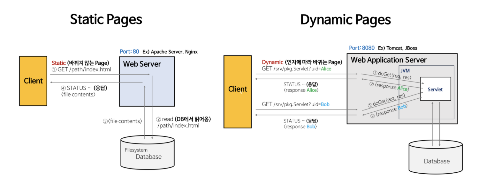
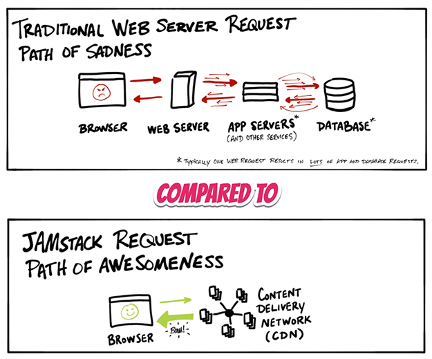

블로그를 만들면서 사용한 웹 호스팅 서비스 Netlify에 관해 알아보던 중 JAMstack이란 키워드가 눈에 들어왔다.

JAMstack과 이에 관련된 개념들을 정리해 보았다.

# 동적/ 웹과 정적 웹

동적 웹은 사용자(클라이언트) 요청에 따라 동적으로 다른 내용을 보여주는 웹 사이트를 말한다.
사용자가 URL을 통해 파라미터를 전달하면, 웹 서버를 거쳐 웹 앱 서버(WAS)까지 가닿아서 요청을 처리하고 즉석에서 HTML 파일을 생성해 반환하는 방식이다. 동적 페이지는 소셜 네트워크 댓글 창이나 쇼핑 검색 결과, 추천 상품처럼 시시각각으로 내용이 변할 수 있는 페이지에 주로 쓰인다.

정적 웹은 동적 웹에 대비되는 개념으로 사용자의 요청에 항상 같은 내용을 보여주는 웹 사이트를 말한다.
HTTP 주소를 통해 접근할 수 있는 웹 서버의 파일 시스템 어딘가에서 HTML 파일을 찾아 다운받고 해석해서 웹 페이지를 만드는 구조다. 사용자(브라우저)가 HTML 파일을 찾는 시점에 개발자가 작성해서 서버에 업로드한 HTML 파일이 이미 존재한다고 전제가 깔린 것이다. 정적 페이지는 회사 소개글이나, 블로그처럼 내용이 좀처럼 변하지 않는 사이트에 주로 쓰인다.

정적 사이트는 실행이 웹 서버 자체에서 일어나는 게 아니기 때문에 DB까지 갖춘 초고성능 웹 호스트가 필요 없다. 많은 정적 사이트는 CDN에 배포된다.

정적 페이지는 웹 서버만을 필요로 하지만, 동적 페이지는 웹 서버와 WAS까지 필요하다.

웹 서버는 클라이언트(브라우저)로부터 요청을 받아서 정적 페이지(html, jpeg, css, js등)를 반환하는 서버다. WAS는 HTML 만으로 처리할 수 없는 DB 조회나 다양한 로직처리를 제공하기 위해 만들어진 서버다.

# LAMP, MEAN 스택
잼스택 이전에 LAMP, MEAN 스택이 있었다.
LAMP 스택은 Linux 운영체제, Apache 웹 서버, MySQL, PHP/Python의 약자를 딴 조합이다. 오랫동안 공인된 전통적인 웹 구조라고 할 수 있다. 브라우저에서 LAMP 기반 웹사이트를 방문하면 웹 서버는 서버 측 코드를 실행하고, 이 코드가 필요에 따라 MySQL에서 데이터를 가져와 웹 페이지를 즉석에서 생성하는 구조다.
MEAN 스택은 MongoDB, ExpressJS, AngularJS, NodeJS라는 자바스크립트 프레임워크를 이용한 웹 구조를 뜻한다. Frontend/Backend 언어를 자바스크립트로 통일하여 편의성을 추구한 케이스다.

LAMP 스택과 MEAN 스택으로 이루어진 legacy web은 동적이고 인터랙티브한 웹사이트를 생성할 수 있지만 24시간 상주하는 웹 서버를 필요로 하며, 복잡한 구조 만큼이나 보안에 신경을 써야한다는 단점이 있다. 더욱이 동적 웹 페이지를 빌드하고 로드하는 데 오랜 시간이 걸릴 수 있다. 이같은 지연시간을 납득할 수 없는 사용자들이 많아짐에 따라 정적 페이지로 구성되는 웹 페이지가 많아지는 추세다. 그리고 이 추세와 더불어 JAMstack도 성행하고 있다. JAMstack은 정적 웹에 활용될 수 있기 때문이다.

# JAMstack

잼스택이란 Javascript, APIs, Markup의 약자로, 일종의 웹 사이트 구현 방법론이다.
클라이언트 관련 처리는 Javascript가 담당하고, DB나 서버 관련 기능은 API로 대체하고, SSG(Static Site Generator)로 Markup을 미리 만들어 두는 개념을 말한다.
잼스택은 2018년 클라우드 및 웹 호스팅 업체인 Netlify에서 `정적 웹` 추세에 맞춰 제안한 웹 개발 패러다임이다. ('정적 웹'이 가진 부정적인 어감을 피하기 위해 잼스택이라는 용어를 고안했다고 한다.)
잼스택은 빌드 시간 단축을 통한 웹 개발 프로세스의 속도 향상과 웹페이지 다운로드 시간 단축(사용자 관점에서)을 목표로 한다.
잼스택 기반의 웹 페이지는 표준 마크업 언어로 구성되므로 앱 서버나 서버 측 기술(Node.js 등)에 대한 종속성 없이 어디서나 빌드하고 테스트할 수 있다.

2010년대 중반 정적 웹 인기에 힘입어 제킬(Jeckyll), 휴고(Hugo), 개츠비(Gatsby), Next.js와 같은 정적 사이트 생성기(SSG)가 생겨나기 시작했다.
SSG의 부흥은 잼스택의 부흥과 같다. 잼스택 아키텍처는 동적 웹이 아닌 정적 웹에 적합한 구조이기 때문이다. 다양한 기능, 요구사항을 필요로 하는 동적 페이지 중심의 사이트와 백엔드 언어에 의존하는 앱은 잼스택 도입이 어렵다.

Gatsby SSG와 netlify 웹 호스팅 서비스를 이용하면 아주 쉽게 잼스택 구조를 구현해볼 수 있다.

# Netlify
netlify 서비스는 잼스택 철학을 기반으로 사이트를 구축하고자 하는 고객에게 최적화되어 있다.

서버 없이(정확히는 서버는 API랑 통신하고) 프론트엔드 스택으로만 구성된 정적 웹을 배포하는 용도로 최적화된 서비스다.

Github Repo와 연계하여 자동 배포가 가능하다.

# 결론
정적 웹 인기에 힘입어 정적 사이트 생성기 SSG가 생겨나기 시작하고, SSG의 인기가 JAMstack 개발론의 발전으로 이어졌다는 사실을 염두하자.

정적/동적 웹이 SPA/MPA, CSR/SSR라는 개념과 어떤 연관을 맺고 있는 건 아닌가 하는 의문을 해소하지 못했다.

Netlify와 JAMstack의 상세한 내부 구조를 정리하지 못한것도 아쉽다. CDN을 비롯한 개념들이 아직 어렵다.

# References
[오픈소스 블로그 기술의 새 바람! 정적 페이지란?](https://blog.lgcns.com/2336)

[잼스택, 웹 개발을 뒤집는 정적 웹사이트 혁명](https://www.itworld.co.kr/news/156752?page=0,1)

[정적 페이지와 동적 페이지](https://webhotpy.tistory.com/6)

[잼스택 소개: 안전한 고성능 사이트 만들기](https://blog.daum.net/followyourdream/10086854)

[JAM Stack 개념 정리하기](https://pks2974.medium.com/jam-stack-%EA%B0%9C%EB%85%90-%EC%A0%95%EB%A6%AC%ED%95%98%EA%B8%B0-17dd5c34edf7)

[Web Server와 WAS의 차이](https://has3ong.github.io/webwas/)

