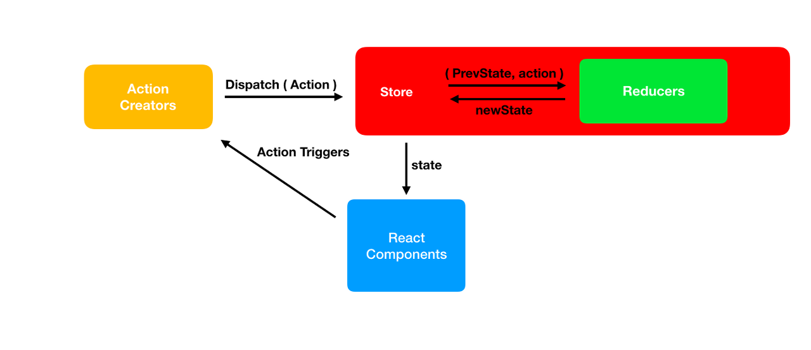
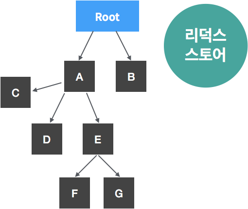

# 1. why Redux?
리덕스는 상태 관리 라이브러리다. 
기존 리액트 프로젝트에서 A 컴포넌트가 props를 통해 B,C,D,F 컴포넌트를 거쳐서 F 컴포넌트로 state를 전달하는 복잡한 구조를 지녔다면,
리덕스는 스토어(store)라는 상태 저장소를 컴포넌트 바깥(애플리케이션 상위)에 두어서, 프로젝트 전역에서 간단하게 상태를 관리할 수 있게 해준다.
따라서 리덕스 상태관리 라이브러리를 사용하는 리액트 프로젝트에서는 A -> 스토어 -> F와 같은 식으로, 간단하게 상태를 업데이트 할 수 있게 되는 것이다.


<p style="text-align:center; font-style:italic"> 
    사진 출처 : https://www.tekportal.net/redux/
</p>

전역 상태 관리는 context API로도 해결할 수 있다.
하지만 리덕스를 사용할 경우 코드의 유지보수적 측면과 작업의 효율적 측면에서 큰 이점을 누릴 수 있다고 한다.

# 2. 리덕스 개념
### 1) 액션(Action)
액션은 type 속성값을 가진 자바스크립트 객체다. 
```javascript
    {
        type: 'INCREASE'
    }
```

액션은 '상태를 ㅇㅇ하게 변화시켜라'라는 명령과도 같다. dispatch라는 일종의 트리거에 위 액션 객체를 담아서 스토어에 전달하는것은 상태를 INCREASE 하라고 명령하는 것과 같다.

```javascript
    {
        type: 'ADD_TODO',
        data: {
            id: 1,
            text: '리덕스 배우기'
        }
    }

    {
        type: 'INCREASE',
        diff: 2
    }
```
액션 객체에 type 필드는 필수적으로 입력해야 한다. type 이외의 필드를 입력해서 상태 변화시 참고할 값들을 지정해줄 수 있다. 예를 들어, INCREASE시 diff 값을 참고해서 2씩 INCREASE 한다든가.

### 2) 액션 생성자(Action Creator)
액션 생성자는 액션 객체를 만들어주는 함수다.
```javascript
    function addTodo(data){
        return {
            type: 'ADD_TODO',
            data
        };
    }

    // 화살표 함수 형태
    // export 키워드를 붙여서 다른 파일에서 액션 생성자를 불러와 사용할 수 있다.
    export const addTodo = data =>({
        type: 'ADD_TODO',
        data
    });
```

액션 객체는 가급적 액션 생성자로 만드는 것이 좋다. 추후에 액션 객체의 구조를 변경할 일이 생길 경우 등에 이점을 가져다주기 때문이다. 액션 생성자는 `redux-actions` 라이브러리의 `createAction` 함수를 사용하여 더욱 간편하게 만들 수 있다. (다음 게시글 참조)

### 3) 리듀서(Reducer)
리듀서는 상태를 어떻게 변화시킬지 정의하는 함수다. 리듀서는 현재 상태(state)와 액션을 파라미터로 전달받는다. 액션에 의거한 상태 변화 로직을 정의해두어서는, 전달받은 액션대로 상태를 업데이트하여 반환하는 함수다.

```javascript
const initialState = {
    counter:1
};

function reducer(state = initialState, action){
    switch(action.type){
        case INCREMENT:
            return{
                counter: state.counter +1
            };
        default:
            return state;
    }
}

```
리듀서는 마찬가지로 `redux-actions` 라이브러리의 `handleActions` 함수를 사용하여 더욱 간편하게 만들 수 있다. 

### 4) 스토어(store)
스토어는 컴포넌트 외부에 있는 상태 저장소다. 스토어 안에는 현재 애플리케이션 상태(state)와 리듀서가 들어가 있다. 스토어는 `dispatch`, `subscribe`, `getState`와 같은 내장함수를 갖는다.

### 5) 디스패치(dispatch)
디스패치는 스토어의 내장 함수 중 하나로, 액션을 발생시키는 트리거 역할을 맡는다. `dispatch(action)`과 같은 형태로 호출한다.

### 6) 구독(Subscribe)
구독은 스토어의 내장 함수 중 하나로, 스토어에 의한 상태 업데이트가 발생할 때마다 구독시 지정한 리스너 함수가 호출된다. 

```javascript
    const listener= () => {
        console.log('상태가 업데이트됨');
    }
    const unsubscribe = store.subscribe(listener);

    unsubscribe(); // 추후 구독을 비활성화할 때 함수를 호출
```


# 3. 리덕스 구조
앞서 배운 개념을 토대로 좀 더 상세한 리덕스 작동 구조를 알아보자.


1. 컴포넌트에 상태 변화가 필요해졌다. Dispatch(action)를 통해 스토어에 알리자.
2. 스토어는 가지고 있던 상태정보와, Dispatch를 통해 전달받은 액션을 리듀서에게 전달하며 호출한다.
3. 리듀서는 전달받은 액션대로 상태를 변화시켜 반환한다.
4. 변화된 상태는 스토어에 저장된다.




B 컴포넌트에서의 변화가 G 컴포넌트에 반영되는 경우를 생각해보자.

1. 리액트 프로젝트에 리덕스 라이브러리를 적용하면 Store가 생긴다.
G 컴포넌트는 Store에 Subscribe를 한다.
구독 과정에서 G는 스토어에 특정 함수를 전달하고 `subscribe(listener)`, 이후 스토어는 상태가 업데이트될 때마다 해당 함수를 호출해주는 구조다.

2. B 컴포넌트에 이벤트가 발생해서, 상태를 변화해야 하는 경우가 발생했다.
B는 Action을 dispatch 함수에 담아서 스토어에 전달한다.

3. 액션 객체를 전달받은 스토어는 리듀서 함수를 호출시킨다.
리듀서는 리듀서 함수에 정의된 로직대로 상태값을 변화시키고, 이를 반환한다.

4. 상태 변화가 생겼으므로, 스토어는 listener 함수를 통해 자신을 구독하고 있던 컴포넌트들(G)에게 알린다. 이를 통해 컴포넌트는 새로운 상태를 받게 되고, 리렌더링을 한다.


# 4. 리덕스 사용 원칙
### 1) 단일 스토어
하나의 애플리케이션에 하나의 스토어만. 애플리케이션 내 여러개의 스토어를 둘 수는 있지만 상태 관리가 복잡해질 수 있으므로 권장하지 않음. 

### 2) 상태는 읽기 전용 상태
리덕스 상태는 읽기 전용이다. 상탯값을 불변 객체로 관리해야 내부적으로 데이터가 변경되는 것을 감지할 수 있다.
### 3) 리듀서는 순수 함수
순수 함수는 부수 효과를 발생시키지 않아야 한다. 또한 같은 인수에 항상 같은 값을 반환해야 한다. 따라서 리듀서 내부에서 랜던 값 생성, Date 함수 사용, 네트워크 요청 등은 금지된다.

# 결론
리덕스 상태 관리 라이브러리를 개념 중심으로 살펴보았다.
다음 글에서는 코드를 중심으로 리덕스 활용 예시를 살펴보도록 하겠다.


## References 
[리덕스는 무엇이고, 왜 사용하는가?](https://velog.io/@youthfulhps/What-is-Redux-and-why-use-it)

[리덕스, 왜 쓸까? 쉽고 편하게 사용하기 위한 발악](https://velopert.com/3528)

<리액트를 다루는 기술>(김민준)


