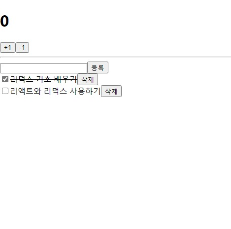
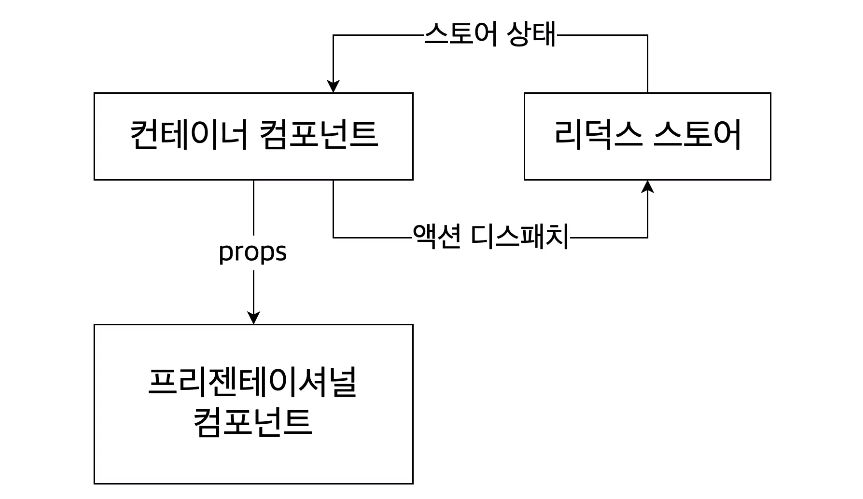
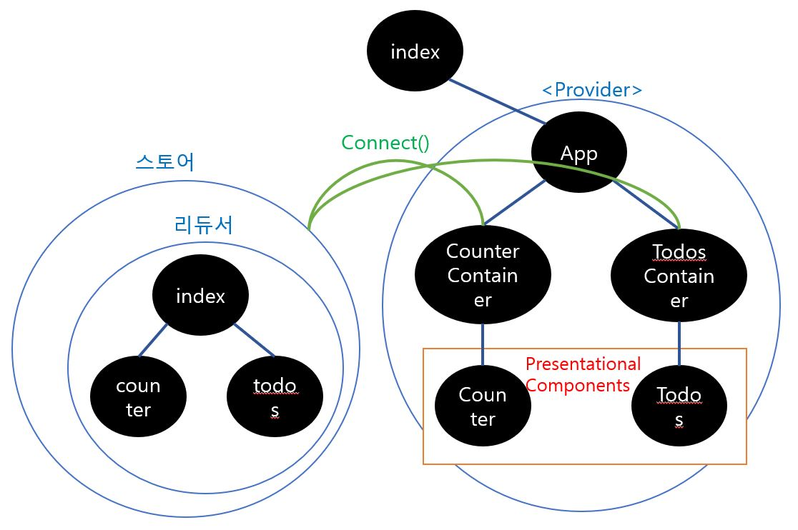
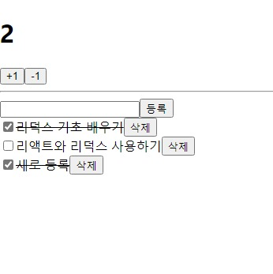

*본 게시글은 책 <리액트를 다루는 기술 개정판> 17장 '리덕스를 사용하여 리액트 애플리케이션 상태 관리하기'를 정리한 내용입니다*

# 1. 프로젝트 소개aaaaaaaaaaaaaaaaaaaaaaaaaaaa

간단한 프로젝트를 통해서 리덕스 사용법을 익혀보도록 하자. 숫자를 올리고 내릴수 있는 카운터 기능, 할 일 을 등록하고 체크하고 삭제할 수 있는 TodoList 기능을 react + redux 조합으로 구현한 프로젝트다. 완성된 모습은 아래와 같다.



## Presentational & Container 컴포넌트aaaaaaaaaaa
리액트-리덕스 프로젝트에서는 프레젠테이셔널 컴포넌트와 컨테이너 컴포넌트를 분리하는 패턴을 주로 사용한다고 한다. `프레젠테이셔널 컴포넌트`는 주로 상태 관리가 이루어지지 않고, 그저 props를 받아 와서 화면에 UI를 보여 주기만 하는 컴포넌트를 말한다. `컨테이너 컴포넌트`는 리덕스와 연동되어 리덕스로부터 상태를 받아오기도 하고 리덕스 스토어에 액션을 디스패치하기도 하는 컴포넌트를 말한다.


## Ducks 패턴
본 프로젝트의 파일 구조는 아래와 같다. `Ducks 패턴`으로 불리는 아래 파일 구조는, **액션 타입/액션 생성자/리듀서**를 `모듈`에 모아두는 방식이다.

```directory {4}
src/
|---App.js
|---index.js
|---components/ (Presentational Components)
|   |---Counter.js
|   |---Todos.js
|---containers/ (Container Components)
|   |---CounterContainer.js
|   |---TodosContainer.js
|---modules/
|   |---counter.js
|   |---index.js
|   |---todos.js
```
## 구조 도식화

본 프로젝트의 구조를 도식으로 표현해보자면 다음과 같다.




# 2. UI(Presentational 컴포넌트) 준비하기

CRA로 리액트 프로젝트를 생성한 뒤 `redux`, `react-redux` 라이브러리를 설치한다.
```bash
yarn create react-app react-redux-tutorial
cd react-redux-tutorial
yarn add redux react-redux
```

Todos.js 파일에 `<TodoItem>`, `<Todos>` 두 개 컴포넌트를 작성하였는데 취향에 따라 파일 두 개로 분리해도 좋다. `<Counter>`, `<Todos>` 컴포넌트를 작성한 후 `<App>` 컴포넌트에 렌더링한다. 이후 브라우저에 정상 출력된 것을 확인.

```jsx{3}
// components/Counter.js
import React from 'react';

const Counter = ({ number, onIncrease, onDecrease }) => {
    return (
        <div>
            <h1>{number}</h1>
            <div>
                <button onClick={onIncrease}>+1</button>
                <button onClick={onDecrease}>-1</button>
            </div>
        </div>
    );
};

export default Counter;
```

```jsx
// components/Todos.js
import React from 'react';

const TodoItem = ({ todo, onToggle, onRemove }) => {
    return (
        <div>
            <input type="checkbox"/>
            <span>예제 텍스트</span>
            <button>삭제</button>
        </div>
    );
};

const Todos = ({
    input,  // 인풋에 입력되는 텍스트
    todos,  // 할 일 목록이 들어있는 객체
    onChangeInput,
    onInsert,
    onToggle,
    onRemove,

}) => {
    const onSubmit = e => {
        e.preventDefault();
    };
    return(
        <div>
            <form onSubmit={onSubmit}>
                <input/>
                <button type="submit">등록</button>
            </form>
            <div>
                <TodoItem />
                <TodoItem />
                <TodoItem />
                <TodoItem />
                <TodoItem />
            </div>
        </div>
    );
};

export default Todos;
```

```jsx
// App.js
import React from 'react';
import Counter from './components/Counter';
import Todos from './components/Todos';

function App() {
  return (
  <div>
    <Counter number={0} />
    <hr />
    <Todos />
  </div>
  );
}

export default App;

```

# 3. 모듈 만들기

리덕스 관련 코드를 작성한다. 모듈에는 **액션 타입/액션 생성자/리듀서** 코드를 작성해야 한다.

## counter 모듈 만들기

### 1) 액션 타입 정의하기

```jsx
// modules/counter.js
const INCREASE = 'counter/INCREASE';
const DECREASE = 'counter/DECREASE';
```
액션 타입은 대문자로 정의하고, 액션 타입 이름의 충돌 방지를 위해 **'모듈 이름/액션 이름'** 형태로 정의한다.


### 2) 액션 생성자 만들기

```jsx {5,6}
// modules/counter.js
const INCREASE = 'counter/INCREASE';
const DECREASE = 'counter/DECREASE';

export const increase = () => ({ type: INCREASE });
export const decrease = () => ({ type: DECREASE });
```
액션 생성자에는 expxort 키워드를 붙여서 추후 다른 파일에서 불러올 수 있도록 한다.

### 3) 초기 상태 및 리듀서 함수 만들기

```jsx
// modules/counter.js
(...)

const initialState = {
    number: 0
};

function counter(state = initialState, action){
    switch(action.type){
        case INCREASE:
            return {
                number: state.number +1        
            };
        case DECREASE:
            return {
                number: state.number -1
            };
        case default:
            return state;
    }
}

export default counter;
```
리듀서 함수는 현재 상태를 참조해서 상태를 업데이트하고 새로운 객체를 생성해서 반환하게끔 구성한다.

## todos 모듈 만들기

### 1) 액션 타입 정의하기

```jsx
// modules/todos.js
const CHANGE_INPUT = 'todos/CHANGE_INPUT'; // 인풋 값을 변경
const INSERT = 'todos/INSERT'; // 새로운 todo를 등록
const TOGGLE = 'todos/TOGGLE'; // todo 체크를 토글
const REMOVE = 'todos/REMOVE'; // todo를 제거
```


### 2) 액션 생성자 만들기

```jsx
// modules/todos.js
(...)
export const changeInput = input => ({
    type: CHANGE_INPUT,
    input
});

let id = 3; // insert가 호출될 때마다 1씩 더해진다
export const insert = text => ({
    type: INSERT,
    todo: {
        id: id++,
        text,
        done: false
    }
});

export const toggle = id => ({
    type: TOGGLE,
    id
});

export const remove = id => ({
    type: REMOVE,
    id
});
```

### 3) 초기 상태 및 리듀서 함수 만들기

```jsx
// modules/todos.js
(...)
const initialState = {
    input: '',
    todos:[
        {
            id:1,
            text: '리덕스 기초 배우기',
            done: true
        },
        {
            id:2,
            text: '리액트와 리덕스 사용하기',
            done:false
        }
    ]
};

function todos(state = initialState, action){
    switch(action.type){
        case CHANGE_INPUT:
            return{
                ...state,
                input: action.input
            };
        case INSERT:
            return{
                ...state,
                todos: state.todos.concat(action.todo)
            };
        case TOGGLE:
            return{
                ...state,
                todos: state.todos.map(todo =>
                    todo.id === action.id ? {...todo, done: !todo.done}: todo
                )
            };
        case REMOVE:
            return {
                ...state,
                todos: state.todos.filter(todo => todo.id !== action.id)
            };
        default:
            return state;
    }
}

export default todos;
```

## 루트 리듀서 만들기

```jsx
// modules/index.js
import { combineReducers } from 'redux';
import counter from './counter';
import todos from './todos';

const rootReducer = combineReducers({
    counter, 
    todos,
});

export default rootReducer;
```
`redux`에서 제공하는 `combineReducers` 유틸 함수를 이용하여 루트 리듀서를 만든다.


# 4. 리액트 App에 Redux 적용하기

```jsx
// src/index.js
import React from 'react';
import ReactDOM from 'react-dom';
import { createStore } from 'redux';
import { Provider } from 'react-redux';
import { composeWithDevTools } from 'redux-devtools-extension';
import './index.css';
import App from './App';
import rootReducer from './modules';

const store = createStore(rootReducer, composeWithDevTools());

ReactDOM.render(
    <Provider store={store}>
        <App />
    </Provider>,
    document.getElementById('root'),
);
```

`react-redux`에서 제공하는 `<Provider>` 컴포넌트로 `<App>` 컴포넌트를 감싸준다. 이때 store를 파라미터로 전달하여, `<Provider>` 컴포넌트로 감싸진 모든 컴포넌트(App 컴포넌트)에서 `store`에 접근할 수 있게 된다. stroe에 접근할 수 있다는 것은 곧 리덕스 상태 관리가 가능하다는 것과 같고, 이는 **리액트 프로젝트에 리덕스를 적용**한 것이다.

> The `<Provider>` component makes the Redux store available to any nested components that need to access the Redux store.

또한 `Redux DevTools`를 적용하여 웹 브라우저상에서 디버깅(상태 관리)시 리덕스 개발자 도구를 활용할 수 있다. `redux-devtools-extension` 패키지 설치만으로 적용할 수 있는 것은 아니고, 웹 브라우저상에서 확장 프로그램 또한 설치해야 한다.


# 5. Container Components 만들기


## 1) CounterContainer 만들기

```jsx
// containers/CounterContainer.js
import React from 'react';
import { connect } from 'react-redux';
import Counter from '../components/Counter';
import { increase, decrease } from '../modules/counter';

const CounterContainer = ({ number, increase, decrease }) => {
    return (
        <Counter number={number} onIncrease={increase} onDecrease={decrease} />
    );
};

const mapStateToProps = state => ({
    number: state.counter.number,
});
const mapDispatchToProps = dispatch => ({
    increase: () => {
        dispatch(increase());
    },
    decrease: () => {
        dispatch(decrease());
    },
});
export default connect(
    mapStateToProps,
    mapDispatchToProps,
)(CounterContainer);
```
CounterContainer 컴포넌트는 `react-redux`에서 제공하는 `connect` 함수를 사용해서 리덕스와 연동한다. 앞서 `<Provider>` 컴포넌트로 감싸준 컴포넌트 안에서 connect 함수를 사용하여 실질적인 연결을 해주는 구조인 것으로 보인다. react-redux에서 제공하는 `Hooks`를 사용해서 connect 함수를 대체할 수 있다고 한다. 하지만 본 게시글에서는 connect만 다루도록 하겠다.

> The connect() function connects a React component to a Redux store.

`connect(mapStateToProps, mapDispatchToProps)(연동할 컴포넌트)`

`mapStateToProps`는 리덕스 스토어 안의 **상태**를 컴포넌트의 props로 넘겨주기 위해 설정하는 함수이고, `mapDispatchToProps`는 **액션 생성 함수**를 컴포넌트의 props로 넘겨주기 위해 사용하는 함수다. 

즉, '연동할 컴포넌트' 부분에 `<CounterContainer>` 컴포넌트를 넣으면 `스토어`의 **상태**와 **액션 생성 함수**가 props로 CounterContainer 컴포넌트에 전해지는 것이다. 위 예제에선 mapStateToProps에서 반환한 number, mapDispatchToProps에서 반환한 increase()와 decrease()가 CounterContainer의 props로 전해진다.

다른 컴포넌트에서 상태 변화가 발생해서 스토어가 업데이트 되었을 경우, 본 컴포넌트에서 정의한 mapStateToProps와 mapDispatchToProps가 호출되어 스토어의 최신 상태를 공유하는 구조를 갖는다. **이를 통해 프로젝트 전역에서 상태 관리가 가능하다.** mapStateToProps와 mapDispatchToProps의 기능은 이전 글에서 소개한 subsribe의 기능을 대체 혹은 포함하는 것으로 보인다.

> If a mapStateToProps function is specified, the new wrapper component will subscribe to Redux store updates. This means that any time the store is updated, mapStateToProps will be called.

mapStateToProps와 mapDispatchToProps를 정의할때 파라미터로 전달하는 state, dispatch는 각각 스토어가 지닌 상태와 스토어의 내장 함수(dispatch)를 의미한다.

이제 아래와 같이 CounterContainer 컴포넌트를 App에 넣어주자.

```jsx {4,9}
// App.js
import React from 'react';
import Todos from './components/Todos';
import CounterContainer from './containers/CounterContainer';

const App = () => {
    return (
        <div>
            <CounterContainer />
            <hr />
            <Todos />
        </div>
    );
};

export default App;
```

여기까지 코드를 작성했다면 카운터의 +1, -1버튼이 정상 작동하는 것을 확인할 수 있다. 버튼을 눌렀을 때의 작동 과정을 추론해보자면 다음과 같다. 

1. modules/counter.js에서 작성한 액션과 리듀서 함수는 modeuls/index.js의 루트 리듀서에 담겨진다. 이 루트 리듀서는 ./index.js에서 스토어를 생성할 때 스토어의 파라미터로 전달되고, 해당 스토어가 `<Provider>` 컴포넌트를 통해 `<App>` 컴포넌트의 상위에 위치하게 됨으로써(리액트 프로젝트에 리덕스를 연동), 그리고 `connect()`됨으로써 모든 컴포넌트에서 스토어를 참조할 수 있게 된다. 

2. components/Counter.js에 작성되어 있는 +1, -1 button을 누르면 버튼에 할당되어 있는 onincrease 함수를 통해서 스토어에 `dispatch(action)` 동작을 취한다.

3. 스토어의 리듀서가 상태 변화를 야기하여 스토어의 상태가 업데이트되면, 스토어와 `connect`되어 있는 `<CounterContainer>`가 mapStateToProps를 통해 전달받은 상태를 다시 modules/counter.js에 전달하고, 리렌더링 되어 화면에 출력되는 과정을 생각해볼 수 있다.

### connect 함수 간략화하기

위에서 작성한 `connect` 함수 코드는 아래와 같이 간략하게 작성할 수 있다. 기존에는 mapStateToProps와 mapDispatchToProps를 미리 선언해 놓고 불러다가 사용했다면, 아래는 connect 함수 내부에 **익명 함수 형태**로 선언하는 방식이다.

```jsx {7,8,9,10,11,12}
// containers/CounterContainer.js
(...)
export default connect(
    state => ({
        number: state.counter.number,
    }),
    distpatch => ({
        increase: () => dispatch(increase()),
        decrease: () => dispatch(decrease()),
    }),
)(CounterContainer);
```
각 액션 생성 함수를 호출하고 dispatch로 감싸는 작업이 조금 번거로울 수 있다. 특히 액션 생성 함수의 개수가 많아지면 더욱 번거롭다. 그럴 땐 `redux`에서 제공하는 `bindActionCreators` 유틸 함수를 사용해서 간략화할 수 있다.

```jsx {8,9,10,11,12,13,14,15,16}
// containers/CounterContainer.js
import { bindActionCreators }  from 'redux';
(...)
export default connect(
    state => ({
        number: state.counter.number,
    }),
    dispatch =>
        bindActionCreators(
            {
                increase,
                decrease,
            },
            dispatch,
        ),
)(CounterContainer);
```

아래와 같이 작성하면 connect 함수가 bindActionCreators 작업을 대신해주기 때문에 `bindActionCreators`를 생략할 수 있다. `mapDispatchToProps에` 해당하는 파라미터를 함수 형태가 아닌 **액션 생성 함수로 이루어진 객체** 형태로 넣어주는 방법이다.

```jsx {5,6,7,8,9}
export default connect(
    state => ({
        number: state.counter.number,
    }),
    {
        increase,
        decrease,
    },
)(CounterContainer);
```

## 2) TodosContainer 만들기

CounterContainer와 동일한 방식으로 TodosContainer를 작성한다. props가 조금 더 많아졌을 뿐이다.


```jsx
import React from 'react';
import { connect } from 'react-rdux';
import { changeInput, insert, toggle, remove } from '../modules/todos';
import Todos from '../components/Todos';

const TodosContainer = ({
    input,
    todos,
    changeInput,
    insert,
    toggle,
    remove,
}) =>{
    return (
        <Todos
            input={input}
            todos={todos}
            onChangeInput={changeInput}
            onInsert={insert}
            onToggle={toggle}
            onRemove={remove}
        />
    );
};

export default connect(
    // 비구조화 할당을 통해 todos를 분리하여 
    // state.todos.input 대신 todos.input을 사용
    ({ todos }) => ({
        input: todos.input,
        todos: todos.todos,
    }),
    {
        changeInput,
        insert,
        toggle,
        remove,
    },
)(TodosContainer);
```

마찬가지로 `<App>` 컴포넌트에서 기존 `<Todos>` 컴포넌트 출력하는 코드를 `<TodosContainer>` 컴포넌트를 출력하게끔 고친다.

```jsx {4,11}
// App.js
import React from 'react';
import CounterContainer from './containers/CounterContainer';
import TodosContainer  from './containers/TodosContainer';

const App = () => {
    return (
        <div>
            <CounterContainer />
            <hr />
            <TodosContainer />
        </div>
    );
};

export default App;
```

기존에 임의로 작성해두었던 `<TodoItem>`, `<Todos>` 컴포넌트의 코드를 수정한다.

```jsx {7,8,9,10,12,13,14,15,16,31,32,34,37,38,41,42,43,44,45,46}
// components/Todos.js
import React from 'react';

const TodoItem = ({ todo, onToggle, onRemove }) => {
    return (
        <div>
            <input
                type="checkbox"
                onClick={() => onToggle(todo.id)}
                checked={todo.done}
                readOnly={true}
            />
            <span style={{ textDecoration: todo.done ? 'line-through' : 'none' }}>
                {todo.text}
            </span>
            <button onClick={() => onRemove(todo.id)}>삭제</button>
        </div>
    );
};

const Todos = ({
    input,
    todos,
    onChangeInput,
    onInsert,
    onToggle,
    onRemove,
}) => {
    const onSubmit = e => {
        e.preventDefault();
        onInsert(input);
        onChangeInput(''); // 등록 후 인풋 초기화
    };
    const onChange = e => onChangeInput(e.target.value);
    return(
        <div>
            <form onSubmit={onSubmit}>
                <input value={input} onChange={onChange} />
                <button type="submit">등록</button>
            </form>
            <div>
            {todos.map(todo =>(
                <TodoItem
                    todo={todo}
                    key={todo.id}
                    onToggle={onToggle}
                    onRemove={onRemove}
                />
            ))}
            </div>
        </div>
    );
};

export default Todos;
```

아래와 같이 완성된 결과를 확인할 수 있다.



# 6. redux-actions 라이브러리 활용하기
`redux-actions` 라이브러리를 활용하면 `createAction` 함수를 통해 액션 생성 함수를 더 짧은 코드로 작성할 수 있다. 그리고 리듀서를 작성할 때도 switch/case 문이 아닌 `handleActions`라는 함수를 사용하여 각 액션마다 업데이트 함수를 설정하는 형식으로 작성할 수 있다.

```bash
yarn add redux-actions
```

## 1) counter 모듈에 적용하기
```jsx {9,10,11}
// modules/counter.js
const INCREASE = 'counter/INCREASE';
const DECREASE = 'counter/DECREASE';

// 기존 액션 생성자 작성 방식
export const increase = () => ({ type: INCREASE });
export const decrease = () => ({ type: DECREASE });

// createAction을 활용한 액션 생성자 작성 방식
export const increase = createAction(INCREASE);
export const decrease = createAction(DECREASE);
```
기존에 액션의 type을 일일이 지정해 주었던 방식에서 `createAction`을 활용하는 방식으로 변경했다.

```jsx {17,18,19,20,21,22,23,24,25}
// 기존 리듀서
function counter(state = initialState, action){
    switch(action.type){
        case INCREASE:
            return {
                number: state.number +1        
            };
        case DECREASE:
            return {
                number: state.number -1
            };
        case default:
            return state;
    }
}

// handleActions() 를 이용한 리듀서
const counter = handleActions(
    {
        [INCREASE]: (state, action) => ({ number: state.number +1 }),
        [DECREASE]: (state, action) => ({ number: state.number -1 }),
    },
    initialState,
);
```
`handleActions` 함수를 사용해서 리듀서 작성 방식을 개선했다. handleACtions 함수의 첫 번째 파라미터에는 각 액션에 대한 업데이트 함수를 넣어 주고, 두 번째 파라미터에는 초기 상태를 넣어준다.

## 2) todos 모듈에 적용하기

todos모듈도 counter 모듈과 마찬가지로 `createAction` 함수를 이용해서 액션 생성자 작성 방식을 간략화한다. 그런데 todos 모듈의 액션 생성자는 counter 모듈의 액션 생성자와는 달리 파라미터를 필요로 한다. 예를 들자면 아래와 같다.

```jsx
const MY_ACTION = 'sample/MY_ACTION';
const myAction = createAction(MY_ACTION, text => `${text}!!`);
const action = myAction('hello world');
/*
    결과:
    { type: MY_ACTION, payload: 'hello world!!'}
*/
```

`createAction` 함수의 첫 번째 파라미터로 들어가는 값은 Action 객체의 type 프로퍼티 키의 값이 된다. 두 번째 파라미터로 들어가는 값은 `payload` 프로퍼티 키의 값이 된다. 두 번째 파라미터에 값 대신 함수를 선언해서 payload 프로퍼티 키에 초기화될 값을 변형해줄 수 있다.


```jsx {31,32,33,34,35,36,37,38,39,40,41,42,43,44,45,46,47}
import { createAction } from 'redux-actions';

const CHANGE_INPUT = 'todos/CHANGE_INPUT';
const INSERT = 'todos/INSERT';
const TOGGLE = 'todos/TOGGLE';
const REMOVE = 'todos/REMOVE';

// 기존 액션 생성자 작성 방식
export const changeInput = input => ({
    type: CHANGE_INPUT,
    input
});
let id = 3; // insert가 호출될 때마다 1씩 더해진다
export const insert = text => ({
    type: INSERT,
    todo: {
        id: id++,
        text,
        done: false
    }
});
export const toggle = id => ({
    type: TOGGLE,
    id
});
export const remove = id => ({
    type: REMOVE,
    id
});

// createAction을 활용한 액션 생성자 작성 방식
export const changeInput = createAction(CHANGE_INPUT, input => input);

let id = 3;
export const insert = createAction(INSERT, text => ({
    id: id++,
    text,
    done: false,
}));

export const toggle = createAction(TOGGLE, id => id);
export const remove = createAction(REMOVE, id => id);
```

이제 `handleActions` 함수를 이용해서 리듀서를 만든다.
`createAction`으로 만든 액션 생성 함수는 파라미터로 받아 온 값을 Action 객체 안에 넣을 때 action.id, action.todo와 같이 원하는 이름으로 기재할 수 있는 게 아니라 action.payload 라는 공통 이름으로 넣을 수 밖에 없다. 따라서 리듀서 함수 내에서 조회할 때 `action.payload`와 같은 형태로 조회하도록 구현해야 한다.


```jsx {46,47,48,49,50,51,52,53,54,55,56,57,58,59,60,61,62,63,64,65,66,67}
const initialState = {
    input: '',
    todos:[
        {
            id:1,
            text: '리덕스 기초 배우기',
            done: true
        },
        {
            id:2,
            text: '리액트와 리덕스 사용하기',
            done:false
        }
    ]
};

// 기존 리듀서 작성 방식
function todos(state = initialState, action){
    switch(action.type){
        case CHANGE_INPUT:
            return{
                ...state,
                input: action.input
            };
        case INSERT:
            return{
                ...state,
                todos: state.todos.concat(action.todo)
            };
        case TOGGLE:
            return{
                ...state,
                todos: state.todos.map(todo =>
                    todo.id === action.id ? {...todo, done: !todo.done}: todo
                )
            };
        case REMOVE:
            return {
                ...state,
                todos: state.todos.filter(todo => todo.id !== action.id)
            };
        default:
            return state;
    }
}

// handleActions 함수를 이용한 리듀서 작성 방식
const todos = handleActions(
    {
        [CHANGE_INPUT]: (state, action) => ({ ...state, input: action.payload }),
        [INSERT]: (state, action) => ({
            ...state,
            todos: state.todos.concat(action.payload),
        }),
        [TOGGLE]: (state, action) => ({
            ...state,
            todos: state.todos.map(todo =>
                todo.id === action.payload ? {...todo, done: !todo.done } : todo,
            ),
        }),
        [REMOVE]: (state, action) => ({
            ...state,
            todos: state.todos.filter(todo => todo.id !== action.payload),
        }),
    },
    initialState,
);
```

모든 추가 데이터 값을 `action.payload` 형태로 조회하는 방식은 가독성에 좋지 않다. `객체 비구조화 할당` 문법으로 action 값의 payload 이름을 새로 설정해주면 action.payload가 어떤 값을 의미하는지 더 쉽게 파악할 수 있다.

```jsx {3,4,6,8,11,14,16}
const todos = handleActions(
    {
        [CHANGE_INPUT]: (state, { payload: input}) => ({ ...state, input}),
        [INSERT]: (state, {payload: todo}) => ({
            ...state,
            todos: state.todos.concat(todo),
        }),
        [TOGGLE]: (state, {payload:id}) => ({
            ...state,
            todos: state.todos.map(todo =>
                todo.id === id ? {...todo, done: !todo.done } : todo,
            ),
        }),
        [REMOVE]: (state, {payload:id}) => ({
            ...state,
            todos: state.todos.filter(todo => todo.id !== id),
        }),
    },
    initialState,
);
```

# 결론
react 프로젝트에 redux를 적용하여 상태 관리를 해보았다. redux에서 제공하는 `createStore` 함수의 사용법, react-redux에서 제공하는 `<Provider>` 컴포넌트와 `connect` 함수의 사용법 등을 숙지하도록 하자. redux-actions에서 제공하는 `createAction` 함수와 `handleActions` 함수도 코드 가독성을 높이기 위해 상황에 따라 응용하면 좋을것이다.

사실 이렇게 작은 규모의 프로젝트에서는 redux 본연의 파워를 체감할 수 없다고 한다. 좀 더 큰 규모의 프로젝트에서 리덕스를 활용하여 상태를 관리해보면 많은 공부가 될 것 같다.

