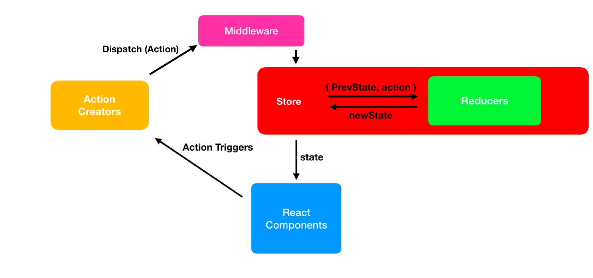
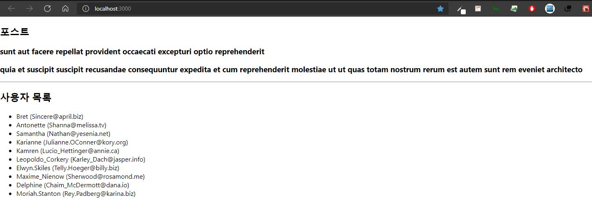

*본 게시글은 책 <리액트를 다루는 기술 개정판> 18장 '리덕스 미들웨어를 통한 비동기 작업 관리'를 정리한 내용입니다*

# 1. 미들웨어란?

미들웨어란 리듀서가 액션을 처리하기 전에 실행되는 함수다. 리덕스 사용 시 특별히 미들웨어를 설정하지 않았다면 dispatch된 액션은 곧바로 리듀서로 보내진다. 하지만 미들웨어를 설정한 경우 미들웨어는 액션과 리듀서 사이에서 중간자 역할을 한다. 미들웨어는 상탯값 변경 시 로그를 출력하는(redux-logger) 등 디버깅 목적으로 활용되거나, 비동기 작업을 처리하기 위해 사용된다.



미들웨어의 기본 구조는 다음과 같다.

```jsx
// 화살표 함수 작성시
const loggerMiddleware = store => next => action =>{

}

// 위와 동일한 함수 구조
const loggerMiddleware = function loggerMiddleware(store){
    return function(next){
        return function(action){
            // 미들웨어 기본 구조
        }
    }
}
```

미들웨어는 결국 **함수를 반환하는 함수를 반환하는 함수**다.
파라미터로 받아온 `store`는 리덕스 스토어 인스턴스를, `action`은 디스패치된 액션을 가리킨다.
`next` 파라미터는 dispatch와 비슷한 역할의 함수인데, `next(action)`을 호출하면 다음으로 처리해야 할 미들웨어에게 액션을 넘겨준다. 만약 그다음 미들웨어가 존재하지 않으면 최종적으로 리듀서에게 액션을 넘겨준다.

리덕스에 미들웨어를 적용하는 예시를 살펴보자.
```jsx
import { createStore, applayMiddleware } from 'redux';

// 미들웨어1 정의
const middleware1 = store => next => action => { // 1
    console.log('middleware1 start');
    const result = next(action);
    console.log('middleware1 end');
    return result;
};
// 미들웨어2 정의
const middleware2 = store => next => action => {
    console.log('middleware2 start');
    const result = next(action);
    console.log('middleware2 end');
    return result;
};
// 아무일도 하지 않는 리듀서 정의
const myReducer = (state, action) => {
    console.log('myReducer)';
    return state;
};

const store = createStore(myReducer, applyMiddleware(middleware1, middleware2));
store.dispatch({ type: 'someAction' });
```

스토어를 생성할 때 `applyMiddleware` 함수의 파라미터로 앞서 정의한 미들웨어들을 전달함으로써 리덕스에 미들웨어를 적용할 수 있다. `dispatch(action)` 명령어를 통한 실행 결과는 아래와 같다.

```console
middleware1 start
middleware2 start
myReducer
middleware2 end
middlware1 end
```

액션과 스토어 중간에 위치한 미들웨어가 dispatch된 액션을 캐치하였다. middleware1의 `next` 함수는 middleware2를 호출하고, middleware2의 next는 그 다음 호출할 미들웨어가 존재하지 않으므로 리듀서를 호출하게 된다. **이처럼 미들웨어는 리듀서 호출 전후에 필요한 작업을 정의할 수 있다.** 액션 정보를 가로채서 변경한 후 리듀서에게 전달하거나, 특정 조건의 액션을 무시하게 할 수도 있다.

미들웨어는 위와 같이 직접 정의해서 사용하는 방법과 널리 쓰이는 미들웨어 패키지를 가져와 사용하는 방법이 있다. redux-thunk와 redux-saga는 미들웨어 패키지 중 가장 많이 사용되는 패키지여서 공부해둘 필요가 있다.

| 패키지명 | 선택 기준 | 특징 |
| --- | --- | --- |
| `redxu-thunk` | 비동기 코드의 로직이 간단할 때. | 가장 많이 사용하는 미들웨어이고 간단하게 시작할 수 있다. |
| `redux-saga` | 복잡한 비동기 로직을 구현해야 할 때. | 제네레이터를 적극 활용한다. |

redux-saga는 다음 게시글에서 다뤄보도록 한다.

# 2. redux-thunk 사용해보기 (기본)

## 1) Thunk란?

Thunk는 **특정 작업을 나중에 할 수 있도록 미루기 위해 함수 형태로 감싼 것**을 의미한다.

> 컴퓨터 프로그래밍에서, 썽크(Thunk)는 기존의 서브루틴에 추가적인 연산을 삽입할 때 사용되는 서브루틴이다. 썽크는 주로 연산 결과가 필요할 때까지 연산을 지연시키는 용도로 사용되거나, 기존의 다른 서브루틴들의 시작과 끝 부분에 연산을 추가시키는 용도로 사용되는데...

> 썽크(Thunk)는 "고려하다"라는 영어 단어인 "Think"의 은어 격 과거분사인 "Thunk"에서 파생된 단어인데, 연산이 철저하게 "고려된 후", 즉 실행이 된 후에야 썽크의 값이 가용해지는 데서 유래된 것이라고 볼 수 있다. (위키백과)

예를 들어 주어진 파라미터에 1을 더하는 함수를 만들고 싶다면, 아래와 같이 작성할 것이다.

```jsx
const addOne = x => x + 1;
addOne(1); // 2
```

addOne을 호출했을 때 바로 1+1이 연산되는 것을 볼 수 있다. 그런데 이 연산 작업을 나중으로 미루고(thunk) 싶다면?

```jsx
const addOne = x => x + 1;
function addOneThunk(x) {
    const thunk = () => addOne(x);
    return thunk;
}

const fn = addOneThunk(1);
setTimeout(() => {
    const value = fn(); // fn이 실행되는 시점에 연산
    console.log(value);
}, 1000);
```

1초가 지나면 fn() -> addOneThunk(1)의 return값인 thunk -> addOne(x)가 호출되는 구조다.
이를 화살표 함수로만 작성한다면 아래와 같다.

```jsx
cont addOne = x => x + 1;
const addOneThunk = x => () => addOne(x);

const fn = addOneThunk(1);
setTimeout(() => {
    const value = fn(); // fn이 실행되는 시점에 연산
    console.log(value);
}, 1000);
```

`redux-thunk` 라이브러리를 사용하면 thunk 함수를 만들어서 디스패치할 수 있다. 그러면 리덕스 미들웨어가 그 함수를 전달받아 store의 dispatch와 getState를 파라미터로 넣어서 호출해준다.

다음은 redux-thunk에서 사용할 수 있는 예시 thunk 함수다.
```jsx
const sampleThunk = () => (dispatch, getState) => {
    // 현재 상태를 참조할 수 있고
    // 새 액션을 디스패치할 수도 있다.
}
```

## 2) 미들웨어 적용하기

[이전 글](https://lechuck.netlify.com/study/Redux2)에서 만든  `counter` 관련 코드에 미들웨어를 적용해보자.


```bash
yarn add redux-thunk
```

```jsx {11}
// index.js
import React from 'react';
import ReactDOM from 'react-dom';
import { createStore, applyMiddleware } from 'redux';
import { Provider } from 'react-redux';
import './index.css';
import App from './App';
import rootReducer from './modules';
import ReduxThunk from 'redux-thunk';

const store = createStore(rootReducer, applyMiddleware(logger, ReduxThunk));

ReactDOM.render(
    <Provider store ={store}>
        <App />
    </Provider>,
    document.getElementById('root')
);

```

앞서 잠깐 언급한대로 `createStore` 함수 안에 미들웨어를 파라미터로 전달받는 `applyMiddleware` 함수를 넣어준다. redux-thunk 미들웨어를 사용하기 때문에 `ReduxThunk`를 전달하였다.

## 3) Thunk 생성 함수 만들기

`redux-thunk`는 액션 생성 함수에서 일반 액션 객체를 반환하는 대신에 함수를 반환한다. 카운터 값을 비동기적으로 변경시키는 Thunk 생성 함수를 만들어보자.

```jsx {11,12,13,14,15,16,17,18,19,20,21}
// modules/counter.js

import { createAction, handleActions } from 'redux-actions';

const INCREASE = 'counter/INCREASE';
const DECREASE = 'counter/DECREASE';

export const increase = createAction(INCREASE);
export const decrease = createAction(DECREASE);

// 1초 뒤에 increase 혹은 decrease 함수를 디스패치함
export const increaseAsync = () => dispatch => {
    setTimeout(() => {
        dispatch(increase());
    }, 1000);
};
export const decreaseAsync = () => dispatch => {
    setTimeout(() => {
        dispatch(decrease());
    }, 1000);
};

const initialState = 0;

const counter = handleActions(
    {
        [INCREASE]: state => state +1,
        [DECREASE]: state => state -1
    },
    initialState
);

export default counter;
```

Thunk 생성 함수를 아래와 같이 CounterContainer 컴포넌트에 적용한다. 그러면 카운터의 +1, -1 버튼을 눌렀을 때 1초 뒤에 적용되는 것을 볼 수 있다.

```jsx
// container/CounterContainer.js
import React from 'react';
import { connect } from 'react-redux';
import { increaseAsync, decreaseAsync } from '../modules/counter';
import Counter from '../components/Counter';

const CounterContainer = ({ number, increaseAsync, decreaseAsync}) => {
    return (
        <div>
            <Counter number={number}
            onIncrease={increaseAsync} 
            onDecrease={decreaseAsync} />
        </div>
    );
};

export default connect(
    state => ({
        number: state.counter
    }),
    {
        increaseAsync,
        decreaseAsync
    }
)(CounterContainer);
```

# 3. redux-thunk 사용해보기 (응용)
## 1) API 호출 함수 작성하기
이번에는 thunk의 속성을 활용하여 웹 요청 비동기 작업을 처리해본다.
웹 요청 연습을 위해 JSONPlaceholder 에서 제공하는 가짜 API를 사용한다.

- 포스트 읽기( id는 1~100 사이 숫자)  
GET https://jsonplaceholder.typicode.com/posts/:id

- 모든 사용자 정보 불러오기  
GET https://jsonplaceholder.typicode.com/users

API 호출은 Promise 기반의 axios 라이브러리를 사용한다.

```bash
yarn add axios
```

가독성을 높이고 유지보수의 편의성 증진을 위하여 API 호출 함수를 따로 작성한다.
```jsx
// lib/api.js
import axios from 'axios';

export const getPost = id => 
    axios.get(`https://jsonplaceholder.typicode.com/posts/${id}`);

export const getUsers = id =>
    axios.get(`https://jsonplaceholder.typicode.com/users`);
```

## 2) 액션 타입, thunk 함수, 리듀서 만들기

이제 위 API를 사용하여 데이터를 받아와 상태를 관리할 sample이라는 리듀서를 생성해 보자.

```jsx
// modules/sample.js
import { handleActions } from 'redux-actions';
import * as api from '../lib/api';

// 액션 타입을 선언한다.
// 한 요청당 세 개의 액션 타입을 지닌다.

const GET_POST = 'sample/GET_POST';
const GET_POST_SUCCESS = 'sample/GET_POST_SUCCESS';
const GET_POST_FAILURE = 'sample/GET_POST_FAILURE';

const GET_USERS = 'sample/GET_USERS';
const GET_USERS_SUCCESSS = 'sample/GET__USERS_SUCCESS';
const GET_USERS_FAILURE = 'sample/GET_USERS_FAILURE';

// thunk 함수를 생성한다.
// thunk 함수 내부에서는 시작할 때, 성공했을 때, 실패했을 때 다른 액션을 디스패치한다.
// 파라미터 id는 Container Component 에서 getPost 호출 시 전해진 것.
export const getPost = id => async dispatch => {
    dispatch({ type: GET_POST }); // 요청을 시작한 것을 알림.
    try{
        const response = await api.getPost(id);
        dispatch({
            type: GET_POST_SUCCESS,
            payload: response.data
        }); // 요청 성공
    } catch(e){
        dispatch({
            type: GET_POST_FAILURE,
            payload:e,
            error: true
        }); // 에러 발생
        throw e; // 나중에 컴포넌트단에서 에러를 조회할 수 있게 해 줌
    }
};

export const getUsers = () => async dispatch => {
    dispatch({ type: GET_USERS }); // 요청을 시작한 것을 알림
    try{
        const response = await api.getUsers();
        dispatch({
            type: GET_USERS_SUCCESS,
            payload: response.data
        }); // 요청 성공
    } catch(e){
        dispatch({
            type: GET_USERS_FAILURE,
            payload:e,
            error: true
        }); // 에러 발생
        throw e;
    }
};

const initialState = {
    loading: {
        GET_POST: false,
        GET_USERS: false
    },
    post: null,
    users: null
};

const sample = handleActions(
    {
        [GET_POST]: state => ({
            ...state,
            loading: {
                ...state.loading,
                GET_POST:true // 요청 시작
            }
        }),
        [GET_POST_SUCCESS]: (state, action) => ({
            ...state,
            loading: {
                ...state.loading,
                GET_POST: false // 요청 완료
            },
            post: action.payload 
            // 상탯값 post에 GET_POST 요청으로 받아온 결과(payload)를 할당.
        }),
        [GET_POST_FAILURE]: (state, action) => ({
            ...state,
            loading: {
                ...state.loading,
                GET_POST: false // 요청 완료
            }
        }),
        [GET_USERS]: state => ({
            ...state,
            loading: {
                ...state.loading,
                GET_USERS: true // 요청 시작
            }
        }),
        [GET_USERS_SUCCESS]: (state, action) => ({
            ...state,
            loading: {
                ...state.loading,
                GET_USERS: false // 요청 완료
            },
            users:action.payload 
            // 상탯값 usesr에 GET_USERS 요청으로 받아온 결과(payload)를 할당.
        }),
        [GET_USERS_FAILURE]: (state, action) => ({
            ...state,
            loading: {
                ...state.loading,
                GET_USERS: false // 요청 완료
            }
        })
    },
    initialState
);
```

중복되는 로직은 나중에 리팩토링할 예정이다.
sample 리듀서를 루트 리듀서에 포함시킨다.

```jsx
// modules/index.js
import { combineReducers } from 'redux';
import counter from './counter';
import sample from './sample';

const rootReducer = combineReducers({
    counter, // 사용하지는 않음!
    sample
});

export default rootReducer;
```

## 3) UI (Presentational Componet) 만들기

이제 UI (Presentational Componet)와 Container Component를 만들어야 한다.
UI는 API를 통해 받아온 데이터가 출력되는 화면이므로, 받아올 데이터의 형식을 봐둘 필요가 있다.

```json {5,6,14,15}
// post
{
  "userId": 1,
  "id": 1,
  "title": "sunt aut facere repellat provident occaecati excepturi optio reprehenderit",
  "body": "quia et suscipit\nsuscipit recusandae consequuntur expedita et cum\nreprehenderit molestiae ut ut quas totam\nnostrum rerum est autem sunt rem eveniet architecto"
}

// users
[
  {
    "id": 1,
    "name": "Leanne Graham",
    "username": "Bret",
    "email": "Sincere@april.biz",
    "address": {
      "street": "Kulas Light",
      "suite": "Apt. 556",
      "city": "Gwenborough",
      "zipcode": "92998-3874",
      "geo": {
        "lat": "-37.3159",
        "lng": "81.1496"
      }
    },
    "phone": "1-770-736-8031 x56442",
    "website": "hildegard.org",
    "company": {
      "name": "Romaguera-Crona",
      "catchPhrase": "Multi-layered client-server neural-net",
      "bs": "harness real-time e-markets"
    }
  }, (...)
]
```

화면에 출력할 내용은 post의 경우 title,body이고 users의 경우 username과 email이다.

```jsx
// components/Sample.js
import React from 'react';

const Sample = ({ loadingPost, loadingUsers, post, users}) => {
    return (
        <div>
            <section>
                <h1>포스트</h1>
                {loadingPost && '로딩 중...'}
                {!loadingPost && post && (
                    <div>
                        <h3>{post.title}</h3>
                        <h3>{post.body}</h3>
                    </div>
                )}
            </section>
            <hr />
            <section>
                <h1>사용자 목록</h1>
                {loadingUsers && '로딩 중...'}
                {!loadingUsers && users && (
                    <ul>
                        {users.map(user => (
                            <li key={user.id}>
                                {user.username} ({user.email})
                            </li>
                        ))}
                    </ul>
                )}
            </section>
        </div>
    );
};

export default Sample;
```

데이터를 불러와서 렌더링해 줄 때는 **유효성 검사**를 해 주는 것이 중요하다.
axios에 성공해서 post가 true일 때(post &&) post.title과 post.body를 보여주겠다는 것처럼 말이다. 만약 데이터가 없는데도 불구하고 post.title을 조회하려고 하면 에러가 발생하니 반드시 유효성 검사를 해줘야 한다.

## 4) Container Component 만들기

```jsx
// containers/SampleContainer.js
import React, { useEffect } from 'react';
import {connect} from 'react-redux';
import Sample from '../components/Sample';
import { getPost, getUsers } from '../modules/sample';

const SampleContainer = ({
    getPost,
    getUsers,
    post,
    users,
    loadingPost,
    loadingUsers
}) => {
    useEffect(() => {
        getPost(1);
        getUsers();
    }, [getPost, getUsers]);

    return (
        <Sample
            post={post}
            users={users}
            loaidngPost={loadingPost}
            loadingUsers={loadingUsers}
        />
    );
};

export default connect(
    ({sample}) => ({
        post: sample.post,
        users: sample.users,
        loadingPost: sample.loading.GET_POST,
        loaidngUsers: sample.loading.GET_USERS
    }),
    {
        getPost,
        getUsers
    }
)(SampleContainer);
```

마지막으로 App 컴포넌트에서 SampleContainer 컴포넌트를 렌더링하게끔 해주면 완성이다.



동작 과정을 정리해보자면 다음과 같다.

1. Container Component에서 렌더링이 되자마자 useEffect에 의해 `getPost`, `getUsers` thunk 함수를 호출한다. (connect 함수로 store와 연결되어 있기 때문에 호출이 가능한 것.)

2. getPost 함수가 실행되면 API 요청이 시작했음을 알리는 `GET_POST` 액션을 먼저 dispatch한다.

3. 리듀서에 정의된 `GET_POST` 액션의 동작은 loading state를 true로 변경하는 것이다.

4. 이후 비동기 API 함수 처리 과정이 진행된다. 처리가 끝나면, 성공/실패 여부에 따라 `GET_POST_SUCCESS` 액션 혹은 `GET_POST_FAILURE` 액션을 dispatch한다. GET_POST와 마찬가지로 리듀서에 정의된대로 상태 변화를 수행.

5. `getUsers` thunk 함수 또한 이와 같은 방식으로, 거의 동시적으로 수행된다.

## 5) 리팩토링
thunk 함수의 코드가 너무 길고 로딩 상태를 리듀서에서 관리하는 작업은 귀찮다.
반복되는 로직을 따로 분리하여 코드를 줄여보도록 하자.

```jsx
// lib/createRequestThunk.js
export default function createRequestThunk(type, request){
    // 성공 및 실패 액션 타입을 정의
    const SUCCESS = `${type}_SUCCESS`;
    const FAILURE = `${type}_FAILURE`;
    
    // params는 SampleContainer에서 getPost()호출 시 파라미터로 전달한 값을 받는다.
    return params => async dispatch =>{
        dispatch({type}); // API 요청이 시작됨
        try{
            const response = await request(params);
            dispatch({
                type:SUCCESS,
                payload:response.data
            }); // API 요청에 성공
        } catch(e){
            dispatch({
                type: FAILURE,
                payload:e,
                error:true
            }); // API 요청 중 에러 발생
            throw e;
        }
    };
}

// 사용법: createRequestThunk('GET_USERS', api.getUsers);
```
유틸 함수 `createRequestThunk`는 API 요청을 해 주는 thunk 함수를 한 줄로 생성할 수 있게 해준다. 액션 타입과 API를 요청하는 함수를 파라미터로 넣어 주면 나머지 작업을 대신 처리한다. 이 함수를 사용하여 기존 thunk 함수의 코드를 대체해보자.

```jsx {4,14,15}
// modules/sample.js
import { handleActions } from 'redux-actions';
import * as api from '../lib/api';
import createRequestThunk from '../lib/createRequestThunk';

const GET_POST = 'sample/GET_POST';
const GET_POST_SUCCESS = 'sample/GET_POST_SUCCESS';
const GET_POST_FAILURE = 'sample/GET_POST_FAILURE';

const GET_USERS = 'sample/GET_USERS';
const GET_USERS_SUCCESSS = 'sample/GET__USERS_SUCCESS';
const GET_USERS_FAILURE = 'sample/GET_USERS_FAILURE';

export const getUsers = createRequestThunk(GET_USERS, api.getUsers);
export const getPost = createRequestThunk(GET_POST, api.getPost);
// export const getPost = id => async dispatch => {
//     dispatch({ type: GET_POST }); // 요청을 시작한 것을 알림.
//     try{
//         const response = await api.getPost(id);
//         dispatch({
//             type: GET_POST_SUCCESS,
//             payload: response.data
//         }); // 요청 성공
//     } catch(e){
//         dispatch({
//             type: GET_POST_FAILURE,
//             payload:e,
//             error: true
//         }); // 에러 발생
//         throw e; // 나중에 컴포넌트단에서 에러를 조회할 수 있게 해 줌
//     }
// };

const initialState = {
    (...)
};

const sample = handleActions(
    (...)
);
```

이번에는 요청의 로딩 상태 관리를 개선하자.
기존에는 리듀서 내부에서 각 요청에 관련된 액션이 디스패치될 때마다 로딩 상태를 변경해주었다.
이 작업을 로딩 상태만 관리하는 리덕스 모듈을 따로 생성하여 처리하자.

```jsx
// modules/loading.js
import { createAction, handleActions } from 'redux-actions';

const START_LOADING = 'loading/START_LOADING';
const FINISH_LOADING = 'loading/FINISH_LOADING';

// 요청을 위한 액션 타입을 payload로 설정한다. ex) sample/GET_POST
export const startLoading = createAction(
    START_LOADING,
    requestType => requestType
);

export const finishLoading = createAction(
    FINISH_LOADING,
    requestType => requestType
);

const initialState = {};

const loading = handleActions(
    {
        [START_LOADING]: (state, action) => ({
            ...state,
            [action.payload]: true
        }),
        [FINISH_LOADING]: (state, action) => ({
            ...state,
            [action.payload]: false
        })
    },
    initialState
);

export default loading;
```

로딩 상태 관리를 위한 액션 타입, 액션 생성자, 리듀서를 만들었다. loading 리듀서 또한 ./index.js에서 루트 리듀서에 포함시킨다.

loading 리덕스 모듈에서 만든 액션 생성 함수는 createRequestThunk에서 사용한다.


```jsx {2,12,19,26}
// lib/createRequestThunk.js
import { startLoading, finishLoading } from '../modules/loading';

export default function createRequestThunk(type, request){
    // 성공 및 실패 액션 타입을 정의
    const SUCCESS = `${type}_SUCCESS`;
    const FAILURE = `${type}_FAILURE`;
    
    // params는 SampleContainer에서 getPost()호출 시 파라미터로 전달한 값을 받는다.
    return params => async dispatch =>{
        dispatch({type}); // API 요청이 시작됨
        dispatch(startLoading(type)); // 로딩중으로 상태 변경
        try{
            const response = await request(params);
            dispatch({
                type:SUCCESS,
                payload:response.data
            }); // API 요청에 성공
            dispatch(finishLoading(type)); // 로딩 끝
        } catch(e){
            dispatch({
                type: FAILURE,
                payload:e,
                error:true
            }); // API 요청 중 에러 발생
            dispatch(startLoading(type));
            throw e;
        }
    };
}

// 사용법: createRequestThunk('GET_USERS', api.getUsers);
```

그러면 SampleContainer에서 로딩 상태를 다음과 같이 조회할 수 있다.
앞서 루트 리듀서에 포함시켜 store에 전해졌던 loading 모듈의 상태를 connect 함수를 통해 불러와 사용하는 것이다.

```jsx {31,34,35}
// containers/SampleContainer.js
import React, { useEffect } from 'react';
import {connect} from 'react-redux';
import Sample from '../components/Sample';
import { getPost, getUsers } from '../modules/sample';

const SampleContainer = ({
    getPost,
    getUsers,
    post,
    users,
    loadingPost,
    loadingUsers
}) => {
    useEffect(() => {
        getPost(1);
        getUsers();
    }, [getPost, getUsers]);

    return (
        <Sample
            post={post}
            users={users}
            loaidngPost={loadingPost}
            loadingUsers={loadingUsers}
        />
    );
};

export default connect(
    ({sample, loading}) => ({
        post: sample.post,
        users: sample.users,
        loadingPost: loading['sample/GET_POST'],
        loadingUsers: loading['sample/GET_USERS]'
        // loadingPost: sample.loading.GET_POST,
        // loaidngUsers: sample.loading.GET_USERS
    }),
    {
        getPost,
        getUsers
    }
)(SampleContainer);
```

이제 sample 리듀서에서 불필요한 코드를 지우면 된다.

```jsx
// modules/sample.js
import { handleActions } from 'redux-actions';
import * as api from '../lib/api';
import createRequestThunk from '../lib/createRequestThunk';

const GET_POST = 'sample/GET_POST';
const GET_POST_SUCCESS = 'sample/GET_POST_SUCCESS';
// const GET_POST_FAILURE = 'sample/GET_POST_FAILURE';

const GET_USERS = 'sample/GET_USERS';
const GET_USERS_SUCCESS = 'sample/GET_USERS_SUCCESS';
// const GET_USERS_FAILURE = 'sample/GET_USERS_FAILURE';

export const getPost = createRequestThunk(GET_POST, api.getPost);
export const getUsers = createRequestThunk(GET_USERS, api.getUsers);

const initialState = {
    // loading : {
    //     GET_POST: false,
    //     GET_USERS: false
    // },
    // post: null,
    // users: null
    post:null,
    users:null
};

const sample = handleActions(
    {
        [GET_POST_SUCCESS]: (state,action) => ({
            ...state,
            post: action.payload
        }),
        [GET_USERS_SUCCESS]: (state,action) => ({
            ...state,
            users: action.payload
        })
        // [GET_POST_SUCCESS]: (state, action) => ({
        //     ...state,
        //     loading: {
        //         ...state.loading,
        //         GET_POST: false // 요청 완료
        //     },
        //     post: action.payload // 상탯값 post에 GET_POST 요청으로 받아온 결과(payload)를 할당.
        // }),
    },
    initialState
);

export default sample;

```

동작 과정을 정리해보면 다음과 같다.

1. `SampleContainer`에서 useEffect에 의해 `getPost`, `getUsers` thunk 함수가 호출된다. 

2. modules/sample.js 에 정의된 getPost와 getUsers는 `createRequsetThunk` 함수를 가리킨다.

3. `createRequestThunk` 함수는 API 요청을 위한 dispatch를 수행하면서, 로딩 상태 관리를 위한 dispatch도 수행한다. 리듀서는 이 액션을 받아 상태를 변화한 후 스토어에 저장한다.

4. 스토어에 저장된 상태를 `SampleContainer`에서 connect 함수를 통해 갱신해온다. loadingPost와 loadingUsers는 로딩 상태를 관리하기 위한 type 외에도 payload라는 별도의 값을 가져서 어떤 API 요청에 관한 로딩 상태인지를 표시한다.

ex) {type: "loading/START_LOADING", payload: "sample/GET_POST"}

5. 상태를 UI에 출력한다.

# References

[리덕스 미들웨어는 무엇인가? (1)](https://velog.io/@youthfulhps/%EB%A6%AC%EB%8D%95%EC%8A%A4-%EB%AF%B8%EB%93%A4%EC%9B%A8%EC%96%B4%EB%8A%94-%EB%AC%B4%EC%97%87%EC%9D%B8%EA%B0%80)

<리액트를 다루는 기술 개정판>(김민준, 2019)

<리액트 실전 프로그래밍 개정판>(이재승, 2020)