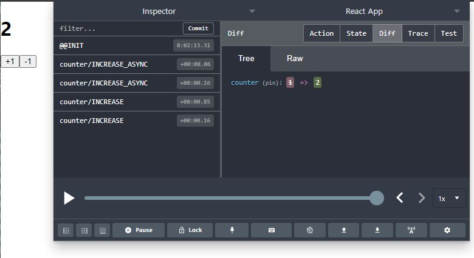
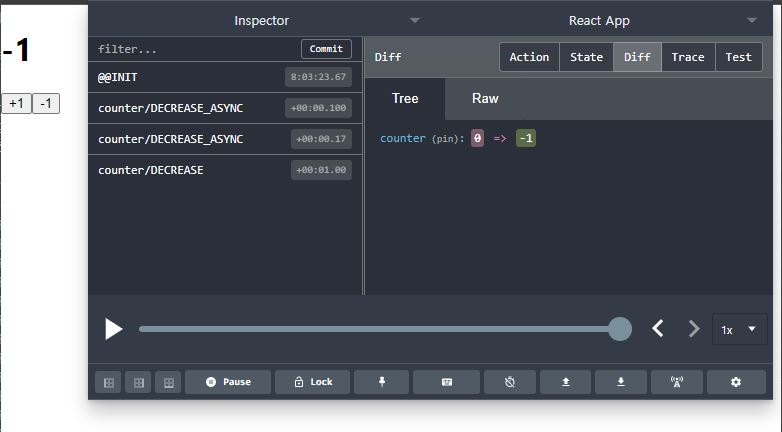

# thumbnail: 'https://gatsby-blog-images.s3.ap-northeast-2.amazonaws.com/thumb_redux.png'


*본 게시글은 책 <리액트를 다루는 기술 개정판> 18장 '리덕스 미들웨어를 통한 비동기 작업 관리'를 정리한 내용입니다*

# 1. Redux-saga란?

redux-saga는 redux-thunk에 이어 가장 많이 사용되는 비동기 작업 관련 미들웨어다. `redux-saga`는 redux-thunk보다 까다로운 상황에서 유용하다. 이를테면 다음과 같다.

- 기존 요청을 취소 처리해야 할 때(불필요한 중복 요청 방지)
- 특정 액션이 발생했을 때 다른 액션을 발생시키거나, API 요청 등 리덕스와 관계없는 코드를 실행할 때
- 웹소켓을 사용할 때
- API 요청 실패 시 재요청해야 할 때

## ES6 Generator 훑고가기

redux-saga는 ES6의 `제네레이터(generator)` 함수라는 문법을 사용한다. 따라서 제네레이터에 대해 알아 둘 필요가 있다.

제네레이터는 코드 블록의 실행을 일시 중지했다가 필요한 시점에 재개할 수 있는 특수한 함수다. 아래 코드를 통해 제네레이터 사용법을 알아보자.

```javascript
function* generatorFunction(){
    console.log('안녕하세요');
    yield 1;
    console.log('제네레이터 함수');
    yield 2;
    console.log('function*');
    yield 3;
    return 4;
}

const generator = generatorFunction();

generator.next();
// 안녕하세요
// {value: 1, done:false}
generator.next();
// 제네레이터 함수
// {value: 2, done:false}
generator.next();
// function*
// {value: 3, done:false}
generator.next();
// {value: 4, done:true}
generator.next();
// {value: undefined, done: true}
```

제네레이터 함수를 호출하면 **일반 함수처럼 함수 코드 블록을 실행하는 것이 아니라** 제네레이터 객체를 생성해 반환한다. 즉, 함수의 흐름이 멈춰 있는 상태다. 이후 제네레이터 객체에 next 메서드를 호출하면 yield 표현식까지 코드 블록을 실행하고, yield된 값을 value 프로퍼티 값으로, false를 done 프로퍼티 값으로 갖는 객체를 반환한다. return 문에 도달하면 done 프로퍼티의 값으로 true가 반환되는 식이다.

정리하자면 제네레이터는 `yield` 키워드를 통해 실행을 일시 중지하고, `next` 메서드를 통해 다시 재개하는 것이다.

```javascript
function* watchGenerator(){
    console.log('모니터링 중...');
    let prevAction = null;
    while(true){
        const action = yield;
        console.log('이전 액션: ' ,prevAction);
        prevAction = action;
        if (action.type === 'HELLO')
            console.log('안녕하세요!');
    }
}

const watch = watchGenerator();

watch.next();
// 모니터링 중...
// { value: undefined, done:false }
watch.next( {type: 'TEST' });
// 이전 액션: null
// { value: undefined, done: false }
watch.next( {type: 'HELLO' });
// 이전 액션: {type: TEST}
// 안녕하세요!
// { value: unedfined, done: false} 
```

redux-saga는 위 코드와 비슷한 원리로 작동한다. redux-saga는 우리가 디스패치하는 액션을 모니터링해서 그에 따라 필요한 작업을 따로 수행할 수 있는 미들웨어다.

# 2. redux-saga 사용해보기 (기본)

기존에 thunk 함수로 구현했던 비동기 카운터를 이번에는 redux-saga를 이용해서 구현해보자. 이전 글에서 만든 프로젝트를 그대로 가져다 쓰도록 한다. 

## 1) 제네레이터 함수(saga) 만들기

```bash
yarn add redux-saga
```

우선 redux-saga 라이브러리를 설치한다. 이후 counter 모듈을 열어서 기존 thunk 함수를 제거하고, `INCREASE_ASYNC`, `DECREASE_ASYNC` 액션 타입을 선언한다. 해당 액션에 대한 액션 생성 함수도 만들고, 제네레이터 함수도 만든다. 이 제네레이터 함수를 사가(saga)라고 부른다. 리듀서는 기존에 만든 것 그대로 유지한다.

```jsx {3,7,8,12,15,16,17,18,19,20,21,22,23,24,25,26,27,28,29,30,31,32,33}
// modules/counter.js
import { createAction, handleActions } from 'redux-actions';
import { delay, put, takeEvery, takeLatest } from 'redux-saga/effects';

const INCREASE = 'counter/INCREASE';
const DECREASE = 'counter/DECREASE';
const INCREASE_ASYNC = 'counter/INCREASE_ASYNC';
const DECREASE_ASYNC = 'counter/DECREASE_ASYNC';

export const increase = createAction(INCREASE);
export const decrease = createAction(DECREASE);

// 마우스 클릭 이벤트가 payload 안에 들어가지 않도록
// () => undefined를 두 번째 파라미터로 넣어 준다
export const increaseAsync = createAction(INCREASE_ASYNC, () => undefined);
export const decreaseAsync = createAction(DECREASE_ASYNC, () => undefined);

function* increaseSaga(){
    yield delay(1000); // 1초를 기다린다
    yield put(increase()); // 특정 액션을 디스패치한다
}
function* decreaseSaga(){
    yield delay(1000);
    yield put(decrease());
}

export function* counterSaga(){
    // takeEvery는 들어오는 모든 액션에 대해 특정 작업을 처리한다
    yield takeEvery(INCREASE_ASYNC, increaseSaga);
    // yakeLatest는 기존에 진행 중이던 작업이 있다면 취소 처리하고
    // 가장 마지막으로 실행된 작업만 수행한다
    yield takeLatest(DECREASE_ASYNC, decreaseSaga);
}

const initialState = 0;

const counter = handleActions(
    {
        [INCREASE]: state => state +1,
        [DECREASE]: state => state -1,
    },
    initialState
);

export default counter;
```

## 2) redux-saga 미들웨어 적용하기

루트 사가를 만들어서 위에서 정의한 `counterSaga`를 넣어 준다.

```jsx {3,14,15,16,17}
// modules/index.js
import { combineReducers } from 'redux';
import counter, { counterSaga } from './counter';
import sample from './sample';
import loading from './loading';
import { all } from 'redux-saga/effects';

const rootReducer = combineReducers({
    counter,
    sample,
    loading
});

export function* rootSaga(){
    // all 함수는 여러 사가를 합쳐 준다.
    yield all([counterSaga()]);
}

export default rootReducer;
```

이제 스토어에 redux-saga 미들웨어를 적용해 준다.
액션 디스패치 과정을 더 편하게 확인하기 위해 리덕스 개발자 도구(devtools)를 함께 적용한다.

```jsx {9,12,13,16,19,21}
// ./index.js
import React from 'react';
import ReactDOM from 'react-dom';
import './index.css';
import App from './App';
import reportWebVitals from './reportWebVitals';
import {applyMiddleware, createStore} from 'redux';
import {Provider} from 'react-redux';
import rootReducer, {rootSaga} from './modules';
import {createLogger} from 'redux-logger';
import ReduxThunk from 'redux-thunk';
import createSagaMiddleware from 'redux-saga';
import { composeWithDevTools } from 'redux-devtools-extension';

const logger = createLogger();
const sagaMiddleware = createSagaMiddleware();
const store = createStore(
  rootReducer, 
  composeWithDevTools(applyMiddleware(logger, ReduxThunk, sagaMiddleware))
);
sagaMiddleware.run(rootSaga);

ReactDOM.render(
  <Provider store={store}>
    <React.StrictMode>
    <App />
    </React.StrictMode>
  </Provider>,
  document.getElementById('root')
);
```

App 컴포넌트에서 CounterContainer를 렌더링 하게끔 지정해주고 결과를 확인해보자. counter 리덕스 모듈을 변경하기는 했지만 CounterContainer에서 수정할 것은 없다. 기존에 사용 중이던 thunk 함수와 똑같은 이름으로 액션 생성 함수를 만들었기 때문이다.


위 사진은 +1 버튼을 두 번 눌렀을 때의 상황이다. `INCREASE_ASYNC` 액션이 두 번 디스패치되고 이에 따라 INCREASE 액션도 두 번 디스패치되는 것을 볼 수 있다. `takeEvery`를 사용하여 increaseSaga를 등록했으므로 디스패치되는 모든 `INCREASE_ASYNC `액션에 대해 1초 후 INCREASE 액션을 발생시키는 것이다.



반면 -1 버튼을 똑같이 두 번 눌렀을 때는 DECREASE 액션이 한 번만 디스패치되고 있다. 이는 decreaseSaga를 등록할 때 `takeLatest`를 사용했기 때문이다. takeLatest는 여러 액션이 중첩되어 디스패치될 때 기존의 것들은 무시하고 가장 마지막 액션만 제대로 처리한다.

동작 과정을 정리해보면 다음과 같다.

1. +1 버튼이 눌리면 components/Counter의 onIncrease 함수가 호출된다.

2. onIncrease 함수는 /containers/CounterContainer에서 전달받은 것이다. CounterContainer는 connect 함수를 통해 store로부터 상태와 디스패치를 실시간으로 받고 있었고, onIncrease 함수는 스토어에서 전달받은 `increaseAsync` 액션 생성 함수다. (매개변수로 전달된 이름만 다른것)

3. increaseAsync 액션 생성 함수는 ./modules/counter에서 정의되었다. 루트 사가에 담겨서 스토어에 포함되었기 때문에 CounterContainer에서도 호출할수가 있었던 것이다.
increaseAsync 액션 생성 함수가 생성한 `INCREASE_ASYNC`
 액션 객체에 의해서 `counterSaga` 제네레이터 함수가 호출된다. `takeEverey`에 의해서 `INCREASE_ASYNC` 액션이 들어오면 
`increaseSaga` 함수를 호출하고, 이는 1초 딜레이 후에 다시 `INCREASE` 액션을 디스패치하게 되어, 최종적으로 상태에 +1을 해준다.


# 3. redux-saga 사용해보기 (응용)

## 1) 제네레이터 함수(saga) 만들기

이번에는 redux-saga를 이용해서 비동기 API 요청을 해보자. 기존에 thunk로 관리하던 액션 생성 함수를 없애고, 사가를 사용해서 처리하자. sample 리덕스 모듈을 다음과 같이 수정하면 된다.

```jsx {4,15,16,18,19,20,21,22,23,24,25,26,27,28,29,30,31,32,33,34,35,36,37,39,40,41,42,43,44,45,46,47,48,49,50,51,52,53,54,55,57,58,59,60}
// modules/sample.js
import { createAction,handleActions } from 'redux-actions';
import * as api from '../lib/api';
import { call, put, takeLatest } from 'redux-saga/effects';
import { startLoading, finishLoading } from './loading';

const GET_POST = 'sample/GET_POST';
const GET_POST_SUCCESS = 'sample/GET_POST_SUCCESS';
const GET_POST_FAILURE = 'sample/GET_POST_FAILURE';

const GET_USERS = 'sample/GET_USERS';
const GET_USERS_SUCCESS = 'sample/GET_USERS_SUCCESS';
const GET_USERS_FAILURE = 'sample/GET_USERS_FAILURE';

export const getPost = createAction(GET_POST, id => id);
export const getUsers = createAction(GET_USERS);

function* getPostSaga(action){
    yield put(startLoading(GET_POST)); // 로딩 시작. put = dispatch
    // 파라미터로 action을 받아 오면 액션의 정보를 조회할 수 있다.
    try{
        // call을 사용하면 Promise를 반환하는 함수를 호출하고, 기다릴 수 있다.
        // 첫 번째 파라미터는 함수, 나머지 파라미터는 해당 함수에 넣을 인수다.
        const post = yield call(api.getPost, action.payload); // API 호출
        yield put({
            type: GET_POST_SUCCESS,
            payload: post.data
        });
    } catch(e){
        yield put({
            type: GET_POST_FAILURE,
            payload: e,
            error : true
        });
    }
    yield put(finishLoading(GET_POST)); // 로딩 완료
}

function* getUsersSaga(){
    yield put(startLoading(GET_USERS));
    try{
        const users = yield call(api.getUsers);
        yield put({
            type: GET_USERS_SUCCESS,
            payload: users.data
        });
    } catch(e){
        yield put({
            type: GET_USERS_FAILURE,
            payload: e,
            error: true
        });
    }
    yield put(finishLoading(GET_USERS));
}

export function* sampleSaga(){
    yield takeLatest(GET_POST, getPostSaga);
    yield takeLatest(GET_USERS, getUsersSaga);
}

const initialState = {
    post:null,
    users:null
};

const sample = handleActions(
    {
        [GET_POST_SUCCESS]: (state,action) => ({
            ...state,
            post: action.payload
        }),
        [GET_USERS_SUCCESS]: (state,action) => ({
            ...state,
            users: action.payload
        })
    },
    initialState
);

export default sample;

```

이후 modules/index.js에서 sampleSaga를 루트 사가에 등록하고,
App 컴포넌트에서 SampleContainer를 렌더링하게끔 변경해주면 완성이다.


## 2) 리팩토링
Redux-thunk 때와 마찬가지로 중복된 코드를 제거하여 리팩토링 해보자. 방식은 비슷하다.

```jsx
// lib/createReqeustSaga.js
import { call, put } from 'redux-saga/effects';
import { startLoading, finishLoading } from '../modules/loading';

export default function createReqeustSaga(type, request){
    const SUCCESS = `${type}_SUCCESS`;
    const FAILURE = `${type}_FAILURE`;

    return function*(action){
        yield put(startLoading(type)); // 로딩 시작
        try{
            const response = yield call(request, action.payload);
            yield put({
                type: SUCCESS,
                payload: response.data
            });
        } catch(e){
            yield put({
                type: FAILURE,
                payload: e,
                error: true
            });
        }
        yield put(finishLoading(type)); // 로딩 끝
    };
}
```

```jsx {16,17}
// modules/sample.js
import { createAction,handleActions } from 'redux-actions';
import * as api from '../lib/api';
import { takeLatest } from 'redux-saga/effects';
import createReqeustSaga from '../lib/createRequestSaga';

const GET_POST = 'sample/GET_POST';
const GET_POST_SUCCESS = 'sample/GET_POST_SUCCESS';

const GET_USERS = 'sample/GET_USERS';
const GET_USERS_SUCCESS = 'sample/GET_USERS_SUCCESS';

export const getPost = createAction(GET_POST, id => id);
export const getUsers = createAction(GET_USERS);

const getPostSaga = createReqeustSaga(GET_POST, api.getPost);
const getUsersSaga = createReqeustSaga(GET_USERS, api.getUsers);

export function* sampleSaga(){
    yield takeLatest(GET_POST, getPostSaga);
    yield takeLatest(GET_USERS, getUsersSaga);
}

const initialState = {
    post:null,
    users:null
};

const sample = handleActions(
    {
        [GET_POST_SUCCESS]: (state,action) => ({
            ...state,
            post: action.payload
        }),
        [GET_USERS_SUCCESS]: (state,action) => ({
            ...state,
            users: action.payload
        })
    },
    initialState
);

export default sample;

```


# References

<리액트를 다루는 기술 개정판>(김민준, 2019)

<리액트 실전 프로그래밍 개정판>(이재승, 2020)

<모던 자바스크립트 Deep Dive>(이웅모, 2020)