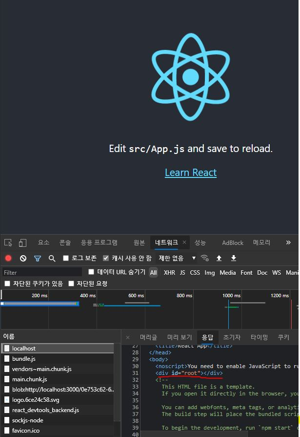
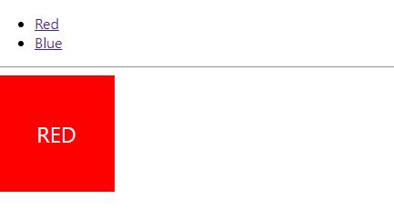
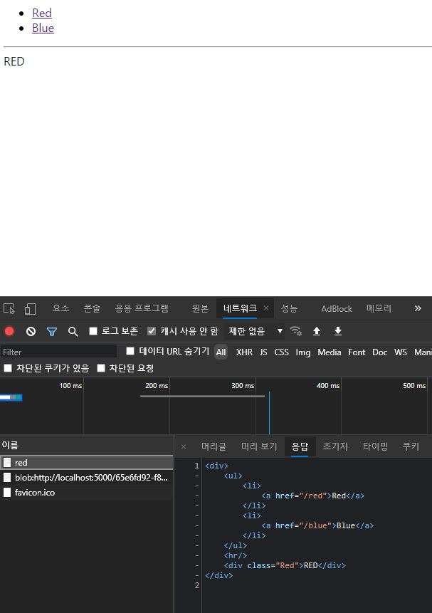
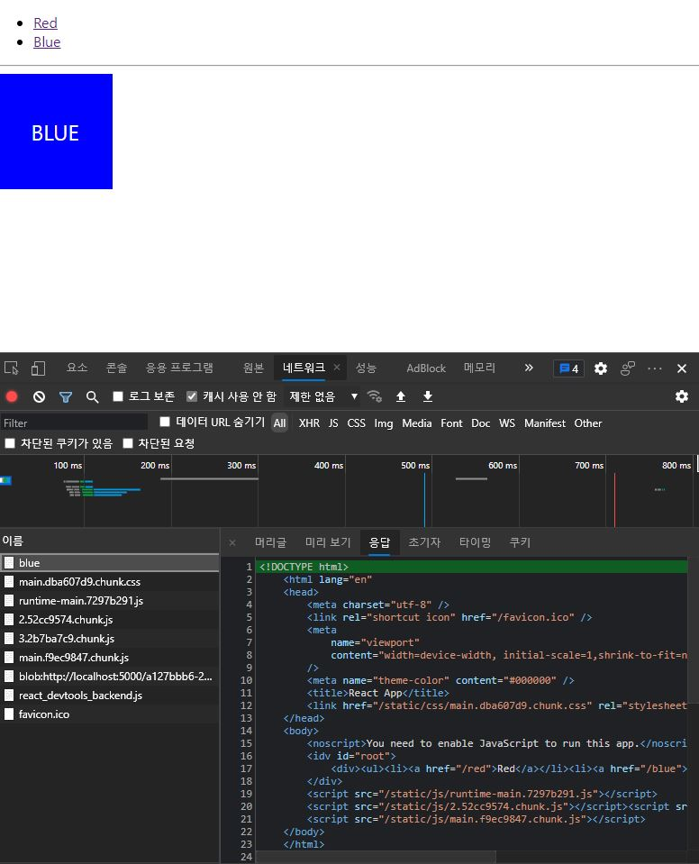
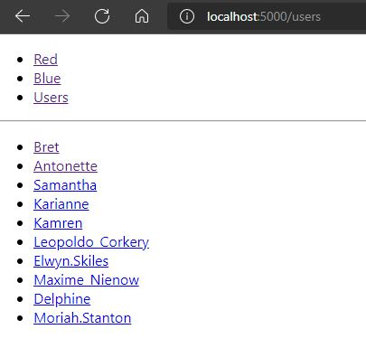
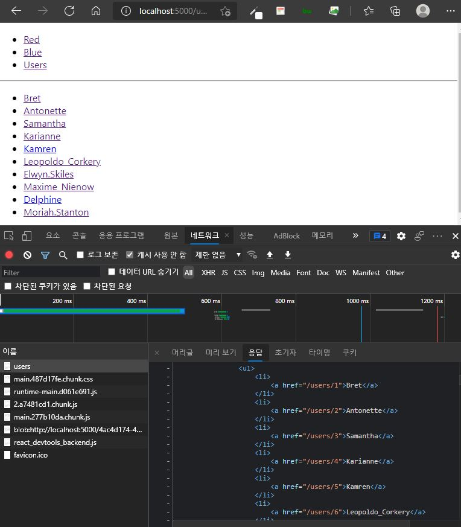

*본 게시글은 책 <리액트를 다루는 기술 개정판> 20장 '서버 사이드 렌더링'를 정리한 내용입니다*

# 서버 사이드 렌더링(SSR)

SSR과 CSR에 대한 설명은 [이전 글](https://lechuck.netlify.app/study/CSRSSG)을 참고하도록 하고,
여기서는 리액트 프로젝트에 SSR을 적용하는 방법에 집중해보자.



위 화면은 `Create-React-App(CRA)`로 만든 프로젝트의 실행 화면이다.
`CRA` 키워드를 이용해서 만든 프로젝트는 root 엘리먼트가 비어 있는 것을 볼 수 있다.
이는 해당 페이지가 처음엔 빈 페이지라는 뜻이고,
이후에 클라이언트(브라우저) 측에서 자바스크립트가 실행되고 리액트 컴포넌트가 렌더링되면서 사용자가 UI를 접하는 구조다.
이처럼 클라이언트 측에서 렌더링되는 방식은 `CSR`의 특징이다.

CRA로 만든 리액트 프로젝트에 `SSR`을 구현해보자.

## 1) 프로젝트 준비하기

```bash
yarn create react-app ssr-recipe
cd ssr-recipe
yarn add react-router-dom
```

SSR을 구현하기 전에 `리액트 라우터`를 사용하여 라우팅할 수 있는 간단한 프로젝트를 만들어보자.

### - UI 컴포넌트 만들기
```jsx
// src/components/Red.js
import React from 'react';
import './Red.css';

const Red = () => {
    return <div className="Red">RED</div>
};

export default Red;
```

```jsx
// src/components/Blue.js
import React from 'react';
import './Blue.css';

const Blue = () => {
    return <div className="Blue">BLUE</div>
};

export default Blue;
```

```css
/* src/components/Blue.css */
.Blue{
    background: blue;
    font-size:1.5rem;
    color:white;
    width: 128px;
    height: 128px;
    display: flex;
    align-items: center;
    justify-content: center;
}
```

```css
/* src/components/Red.css */
.Red{
    background: red;
    font-size:1.5rem;
    color:white;
    width: 128px;
    height: 128px;
    display: flex;
    align-items: center;
    justify-content: center;
}
```

```jsx
// src/components/Menu.js
import React from 'react';
import { Link } from 'react-router-dom';
const Menu = () => {
    return (
        <ul>
            <li>
                <Link to="/red">Red</Link>
            </li>
            <li>
                <Link to="/blue">Blue</Link>
            </li>
        </ul>
    );
};

export default Menu;
```

빨간색과 파란색 박스를 보여주는 간단한 Red/Blue 컴포넌트와 각 링크로 이동할 수 있게 해주는 Menu 컴포넌트를 만든다.

### - 페이지 컴포넌트 만들기

```jsx
// src/pages/RedPage.js
import React from 'react';
import Red from '../components/Red';

const RedPage = () =>{
    return <Red />;
};

export default RedPage;
```

```jsx
// src/pages/BluePage.js
import React from 'react';
import Blue from '../components/Blue';

const BluePage = () =>{
    return <Blue />;
};

export default BluePage;
```

```jsx
// App.js
// App 컴포넌트에서 라우트 설정하기
import './App.css';
import { Route } from 'react-router-dom';
import Menu from './components/Menu';
import RedPage from './pages/RedPage';
import BluePage from './pages/BluePage';

function App() {
  return (
    <div>
      <Menu />
      <hr />
      <Route path="/red" component={RedPage} />
      <Route path="/blue" component={BluePage} />
    </div>
  );
}

export default App;
```

```jsx
// index.js
// 프로젝트에 리액트 라우터 적용하기
import React from 'react';
import ReactDOM from 'react-dom';
import './index.css';
import App from './App';
import reportWebVitals from './reportWebVitals';
import { BrowserRouter } from 'react-router-dom';

ReactDOM.render(
  <BrowserRouter>
    <React.StrictMode>
    <App />
    </React.StrictMode>
  </BrowserRouter>,
  document.getElementById('root')
);
```
`리액트 라우터`를 이용하여 빨간색, 파란색 컴포넌트를 토글할 수 있는 페이지를 만들었다.



## 2) SSR 구현하기

### - SSR용 entry 만들기
`엔트리(entry)`는 웹팩에서 프로젝트를 불러올 때 가장 먼저 불러오는 파일이다.
예를 들어 CRA로 생성된 리액트 프로젝트에서는 index.js 파일을 엔트리로 사용한다.
SSR을 할 때는 `서버를 위한 엔트리 파일`을 따로 생성해야 한다.
index.server.js라는 이름으로 테스트용 엔트리 파일을 만들어보자.

```jsx
// src/index.server.js
import React from 'react';
import ReactDOMServer from 'react-dom/server';

const html = ReactDOMServer.renderToString(
    <div>Hello Server Side Rendering!</div>
);

console.log(html);
```

**서버에서 리액트 컴포넌트를 렌더링**할 때는 `ReactDOMServer`의 `renderToString`이라는 함수를 사용한다.
ReactDOMServer 객체는 컴포넌트를 정적 마크업으로 렌더링할 때 주로 쓰인다.
renderToString은 매개변수로 전달된 JSX 기반의 컴포넌트를 HTML 문자열로 반환하는 함수다. 


### - SSR전용 웹팩 환경 설정하기

SSR 구현을 위해서 `웹팩` 설정을 커스터마이징 한다.
CRA로 만든 프로젝트에서는 웹팩 관련 설정이 숨겨져 있으니 `yarn eject` 명령을 통해 꺼내주어야 한다.
```bash
git add .
git commit -m "Commit before eject'
yarn eject
```

위에서 작성한 엔트리 파일을 `웹팩`으로 불러와서 빌드하려면 **서버 전용 환경 설정**을 만들어 주어야 한다.
그전에 먼저 config 폴더 내 기존 paths.js 파일을 수정한다.

```jsx {5,6}
//config/paths.js
(...)
  appNodeModules: resolveApp('node_modules'),
  swSrc: resolveModule(resolveApp, 'src/service-worker'),
  ssrIndexJs: resolveApp('src/index.server.js'), // 서버 사이드 렌더링 엔트리
  ssrBuild: resolveApp('dist'), // 웹팩 처리 후 저장 경로
  publicUrlOrPath,
};
```

`ssrIndexJs`는 불러올 파일의 경로이고,
`ssrBuild`는 웹팩으로 처리한 뒤 결과물을 저장할 경로다.
다음으로 `웹팩 환경 설정` 파일을 작성한다.
config 폴더에 webpack.config.server.js 파일을 생성한다.

```jsx
// config/webpack.config.server.js
const paths = require('./paths');

module.exports = {
    mode: 'production', // 프로덕션 모드로 설정하여 최적화 옵션들을 활성화
    entry: paths.ssrIndexJs, // 엔트리 경로
    target: 'node', // node 환경에서 실행될 것이라는 점을 명시
    output: {
        path: paths.ssrBuild, // 빌드 경로
        filename: 'server.js', // 파일 이름
        chunkFilename: 'js/[name].chunk.js', // 청크 파일 이름
        publicPath: paths.publicUrlOrPath, // 정적 파일이 제공될 경로
    }
};
```

다음으로 `로더`를 설정한다.
**웹팩의 로더는 파일을 불러올 때 확장자에 맞게 필요한 처리**를 해 준다.
예를 들어 자바스크립트는 babel을 사용하여 트랜스파일링을 해 주고,
CSS는 모든 CSS 코드를 결합해 주고,
이미지 파일은 다른 경로에 따로 저장하고 그 파일에 대한 경로를 자바스크립트에서 참조할 수 있게 해준다.

```jsx
// config/webpack.config.server.js
const nodeExternals = require('webpack-node-externals');
const paths = require('./paths');
const getCSSModuleLocalIdent = require('react-dev-utils/getCSSModuleLocalIdent');
const webpack = require('webpack');
const getClientEnvironment = require('./env');

const cssRegex = /\.css$/;
const cssModuleRegex = /\.module\.css$/;
const sassRegex = /\.(scss|sass)$/;
const sassModuleRegex = /\.module\.(scss|sass)$/;

const env = getClientEnvironment(paths.publicUrlOrPath.slice(0, -1)); // 환경변수 주입 (3)

module.exports = {
    mode: 'production', // 프로덕션 모드로 설정하여 최적화 옵션들을 활성화
    entry: paths.ssrIndexJs, // 엔트리 경로
    target: 'node', // node 환경에서 실행될 것이라는 점을 명시
    output: {
        path: paths.ssrBuild, // 빌드 경로
        filename: 'server.js', // 파일 이름
        chunkFilename: 'js/[name].chunk.js', // 청크 파일 이름
        publicPath: paths.publicUrlOrPath, // 정적 파일이 제공될 경로
    },
    module:{
        rules:[
            {
                oneOf:[
                    // 자바스크립트를 위한 처리
                    // 기존 webpack.config.js를 참고하여 작성
                    {
                        test:/\.(js|mjs|jsx|ts|tsx)$/,
                        include: paths.appSrc,
                        loader:require.resolve('babel-loader'),
                        options:{
                            customize: require.resolve(
                                'babel-preset-react-app/webpack-overrides'
                            ),
                            presets:[
                                [
                                    require.resolve('babel-preset-react-app'),
                                    {
                                        runtime: 'automatic',
                                    },
                                ],
                            ],
                            plugins:[
                                [
                                    require.resolve('babel-plugin-named-asset-import'),
                                    {
                                        loaderMap:{
                                            svg:{
                                                ReactComponent:
                                                '@svgr/webpack?-svgo, +titleProp, +ref![path]',
                                            },
                                        },
                                    },
                                ],
                            ],
                            cacheDirectory:true,
                            cacheCompression:false,
                            compact: false,
                        },
                    },
                    // CSS를 위한 처리
                    {
                        test:cssRegex,
                        exclude: cssModuleRegex,
                        // exportOnlyLocals: true 옵션을 설정해야 실제 css 파일을 생성하지 않는다
                        loader: require.resolve('css-loader'),
                        options:{
                            importLoaders: 1,
                            modules:{
                                exportOnlyLocals: true,
                            },
                        },
                    },
                    // CSS Module을 위한 처리
                    {
                        test: cssModuleRegex,
                        loader: require.resolve('css-loader'),
                        options:{
                            importLoaders:1,
                            modules:{
                                exportOnlyLocals:true,
                                getLocalIdent: getCSSModuleLocalIdent,
                            },
                        },
                    },
                    // Sass를 위한 처리
                    {
                        test:sassRegex,
                        exclude: sassModuleRegex,
                        use: [
                            {
                                loader: require.resolve('css-loader'),
                                options:{
                                    importLoaders:3,
                                    modules:{
                                        exportOnlyLocals:true,
                                    },
                                },
                            },
                            require.resolve('sass-loader'),
                        ],
                    },
                    // Sass + CSS Module을 위한 처리
                    {
                        test: sassRegex,
                        exclude: sassModuleRegex,
                        use:[
                            {
                                loader: require.resolve('css-loader'),
                                options:{
                                    importLoaders: 3,
                                    modules: {
                                        exportOnlyLocals: true,
                                        getLocalIdent: getCSSModuleLocalIdent,
                                    },
                                },
                            },
                            require.resolve('sass-loader'),
                        ],
                    },
                    // url-loader를 위한 설정
                    {
                        test: [/\.bmp$/, /\.gif$/, /\.jpe?g$/, /\.png$/],
                        loader: require.resolve('url-loader'),
                        options:{
                            emitFile: false, // 파일을 따로 저장하지 않는 옵션
                            limit: 10000, // 원래는 9.76KB가 넘어가면 파일로 저장하는데
                            // emitFile 값이 false 일땐 경로만 준비하고 파일은 저장하지 않는다
                            name: 'static/media/[name].[hash:8].[ext]',
                        },
                    },
                    // 위에서 설정된 확장자를 제외한 파일들은
                    // file-loader를 사용한다.
                    {
                        loader: require.resolve('file-loader'),
                        exclude: [/\.(js|mjs|jsx|ts|tsx)$/, /\.html$/, /\.json$/],
                        options:{
                            emitFile: false, // 파일을 따로 저장하지 않는 옵션
                            name: 'static/media/[name].[hash:8].[ext]',
                        },
                    },
                ],
            },
        ],
    },
    resolve: { // node_modules 내부의 라이브러리를 불러올 수 있게 설정 (1)
        modules: ['node_modules']
    },
    externals: [ // webpack-node-exteranls 라이브러리 적용하기 (2)
        nodeExternals({
            allowlist: [/@babel/],
        }),
    ],
};
```

(1)을 통해 react, react-dom/server 같은 라이브러리를 import 구문으로 불러오면 node_modules에서 찾아 사용할 수 있도록 설정한다.
라이브러리를 불러오면 빌드할 때 결과물 파일 안에 해당 라이브러리 관련 코드가 함께 번들링된다.

`브라우저`에서 사용할 때는 결과물 파일에 앱 관련 코드 외에도 리액트 라이브러리 코드가 포함되어야 한다.
하지만 `서버`에서는 node_modules에서 바로 불러와 사용할 수 있기 때문에 그럴 필요가 없다.

따라서 서버를 위해 번들링할 때는 node_modules에서 불러오는 것을 제외하고 번들링하는것이 좋다.
이를 위해 `webpack-node-externals` 라이브러리를 사용한다. 
`yarn add webpack-node-externals` 명령어를 통해 설치 후, (2)와 같이 적용한다.

코드 상단 env (3)와 같이 `환경변수`를 주입하면, 프로젝트 내에서 process.env.NODE_ENV 값을 참조하여 현재 개발 환경인지 아닌지를 참조할 수 있다. ????

### - 빌드 스크립트 작성하기

방금 만든 `웹팩 환경 설정`을 사용하여 프로젝트를 `빌드`하는 스크립트를 작성해보자.
scripts 폴더를 열어 보면 `build.js`라는 파일이 있다.
이 스크립트는 클라이언트에서 사용할 빌드 파일을 만드는 작업을 한다.
이 스크립트와 비슷한 형식으로 서버에서 사용할 빌드 파일을 만드는 `build.server.js` 스크립트를 작성해보자.

```jsx
// scripts/build.server.js
process.env.BABEL_ENV = 'production';
process.env.NODE_ENV = 'production';

process.on('unhandledRejection', err=>{
    throw err;
});

require('../config/env');
const fs = require('fs-extra');
const webpack = require('webpack');
const config = require('../config/webpack.config.server');
const paths = require('../config/paths');

function build(){
    console.log('Creating server build...');
    fs.emptyDirSync(paths.ssrBuild);
    let compiler = webpack(config);
    return new Promise((resolve, reject) => {
        compiler.run((err, stats) => {
            if(err){
                console.log(err);
                return;
            }
            console.log(stats.toString());
        });
    });
}

build();
```

코드를 다 작성한 후 `node scripts/build.server.js` 명령어를 입력해서 `빌드`가 잘되는지 확인.
이후 `node dist/server.js` 명령어를 입력해서 결과를 확인한다. 
`entry(index.server.js)` 내용이 아래와 같이 출력될 것이다.

```console
<div data-reactroot="">Hello Server Side Rendering!</div>
```

빌드하고 실행할 때마다 긴 커맨드를 입력하는 게 불편하다.
아래와 같이 설정하여 더 편하게 사용할 수 있다.
`yarn build:server`, 
`yarn start:server`


```json
// package.json
"scripts": {
    (...)
    "start:server": "node dist/server.js",
    "build:server": "node scripts/build.server.js"
  },
```

### - 서버 코드 작성하기
**SSR을 처리할** 서버를 작성해야 한다.
Express, Koa, Hapi Node.js 웹 프레임워크 중에서 `Express`를 사용해보겠다.
Express 프레임워크는 사용률이 가장 높고, 추후 정적 파일들을 호스팅할 때도 쉽게 구현할 수 있다.

`yarn add express`

다음으로 기존에 test 용으로 작성해 두었던 `엔트리 파일`을 수정한다.

```jsx
// src/index.server.js
import React from 'react';
import ReactDOMServer from 'react-dom/server';
import express from 'express';
import { StaticRouter } from 'react-router-dom';
import App from './App';

const app = express();

// SSR을 처리할 핸들러 함수
const serverRender = (req, res, next) => {
    // 이 함수는 404이 떠야 하는 상황에 404를 띄우지 않고 SSR을 해 준다.
    const context = {};
    const jsx = (
        <StaticRouter location={req.url} context={context}>
            <App />
        </StaticRouter>
    );
    const root = ReactDOMServer.renderToString(jsx); // 렌더링을 하고
    res.send(root); // 클라이언트에게 결과물을 응답한다.
};

app.use(serverRender);

app.listen(5000, () => {
    console.log('Running on http://localhost:5000');
});

// 기존 코드
// const html = ReactDOMServer.renderToString(
//     <div>Hello Server Side Rendering!</div>
// );
```

리액트 라우터 라이브러리의 `<StaticRouter>`가 사용된 것을 볼 수 있다.
이 라우터 컴포넌트는 주로 SSR 용도로 사용되는 라우터다.
props로 넣어 주는 location 값에 따라 라우팅해준다.
지금은 req.url을 넣어 주고 있는데, req 객체는 요청에 대한 정보를 지닌다.

`<StaticRouter>`의 context 값을 이용해서 나중에 렌더링한 컴포넌트에 따라 HTTP 상태 코드를 설정해 줄 수 있다.

JS 파일과 CSS 파일을 웹 페이지에 불러오는 일은 잠시 미뤄두고, 
SSR을 통해 만들어진 결과만 보여 주도록 처리했다. 
서버를 다시 빌드하고 실행해 보자.

```bash
yarn build:server
yarn start:server
```

CSS가 적용되지 않은 결과 화면을 볼 수 있다.
그리고 개발자 도구를 열어서 CSR이 아닌 SSR이 적용된 것을 확인한다.




### - 정적 파일 제공하기

Express에서 이미지, CSS 파일 및 JS 파일과 같은 `정적 파일`을 제공하기 위해서는 `static 미들웨어 함수`를 사용해야 한다. 
`express.static()` 함수의 매개변수로 정적 파일이 포함된 폴더명을 전달하면 해당 폴더명에 포함되어 있는 정적 파일들에 접근할 수 있다.
예를 들어, public 폴더의 정적 파일에 접근할 필요가 있는 경우엔 다음과 같이 작성한다. 

```jsx
app.use(express.static('public'));
```

public 폴더에 포함된 정적 파일을 아래와 같이 로드할 수 있게된다.

```
http://localhost:3000/images/kitten.jpg
http://localhost:3000/css/style.css
http://localhost:3000/js/app.js
http://localhost:3000/images/bg.png
http://localhost:3000/hello.html
```

우리 프로젝트는 build 폴더의 JS, CSS 파일들에 접근하게끔 설정해주어야 한다. 

```jsx {7,24,25,26,28}
// index.server.js
import React from 'react';
import ReactDOMServer from 'react-dom/server';
import express from 'express';
import { StaticRouter } from 'react-router-dom';
import App from './App';
import path from 'path';

const app = express();

// SSR을 처리할 핸들러 함수
const serverRender = (req, res, next) => {
    // 이 함수는 404이 떠야 하는 상황에 404를 띄우지 않고 SSR을 해 준다.
    const context = {};
    const jsx = (
        <StaticRouter location={req.url} context={context}>
            <App />
        </StaticRouter>
    );
    const root = ReactDOMServer.renderToString(jsx); // 렌더링을 하고
    res.send(root); // 클라이언트에게 결과물을 응답한다.
};

const serve = express.static(path.resolve('./build'),{
    index: false // "/" 경로에서 index.html을 보여 주지 않도록 설정
});

app.use(serve); // 순서가 중요하다 . serverRender 전에 위치해야 한다. 
app.use(serverRender);

app.listen(5000, () => {
    console.log('Running on http://localhost:5000');
});
```

그다음에는 JS와 CSS 파일을 불러오도록 html에 코드를 삽입해 주어야 한다.
불러와야 하는 **파일 이름은 매번 빌드할 때마다 바뀌기 때문**에 빌드하고 나서 만들어지는 build 폴더 내의 `asset-manifest.json` 파일을 참고하여 불러오도록 작성한다.

```bash
yarn build
```

```json {4,5,7,9}
// build/asset-manifest.json
{
  "files": {
    "main.css": "/static/css/main.dba607d9.chunk.css",
    "main.js": "/static/js/main.f9ec9847.chunk.js",
    "main.js.map": "/static/js/main.f9ec9847.chunk.js.map",
    "runtime-main.js": "/static/js/runtime-main.7297b291.js",
    "runtime-main.js.map": "/static/js/runtime-main.7297b291.js.map",
    "static/js/2.52cc9574.chunk.js": "/static/js/2.52cc9574.chunk.js",
    "static/js/2.52cc9574.chunk.js.map": "/static/js/2.52cc9574.chunk.js.map",
    "static/js/3.2b7ba7c9.chunk.js": "/static/js/3.2b7ba7c9.chunk.js",
    "static/js/3.2b7ba7c9.chunk.js.map": "/static/js/3.2b7ba7c9.chunk.js.map",
    "index.html": "/index.html",
    "static/css/main.dba607d9.chunk.css.map": "/static/css/main.dba607d9.chunk.css.map",
    "static/js/2.52cc9574.chunk.js.LICENSE.txt": "/static/js/2.52cc9574.chunk.js.LICENSE.txt"
  },
  "entrypoints": [
    "static/js/runtime-main.7297b291.js",
    "static/js/2.52cc9574.chunk.js",
    "static/css/main.dba607d9.chunk.css",
    "static/js/main.f9ec9847.chunk.js"
  ]
}
```

위 코드에서 하이라이팅된 파일들을 html 내부에 삽입해 주어야 한다.
서버 코드를 아래와 같이 수정해보자.


```jsx
// src/index.server.js
import React from 'react';
import ReactDOMServer from 'react-dom/server';
import express from 'express';
import { StaticRouter } from 'react-router-dom';
import App from './App';
import path from 'path';
import fs from 'fs';

// asset-manifest.json에서 파일 경로들을 조회한다
const manifest = JSON.parse(
    fs.readFileSync(path.resolve('./build/asset-manifest.json'), 'utf8')
);

const chunks = Object.keys(manifest.files)
    .filter(key => /chunk\.js$/.exec(key)) // chunk.js로 끝나는 키를 찾아서
    .map(key => `<script src="${manifest.files[key]}"></script>`) // 스크립트 태그로 변환하고
    .join(''); // 합침

function createPage(root){
    return `<!DOCTYPE html>
    <html lang="en"
    <head>
        <meta charset="utf-8" />
        <link rel="shortcut icon" href="/favicon.ico" />
        <meta
            name="viewport"
            content="width=device-width, initial-scale=1,shrink-to-fit=no"
        />
        <meta name="theme-color" content="#000000" />
        <title>React App</title>
        <link href="${manifest.files['main.css']}" rel="stylesheet" />
    </head>
    <body>
        <noscript>You need to enable JavaScript to run this app.</noscript>
        <div id="root">
            ${root}
        </div>
        <script src="${manifest.files['runtime-main.js']}"></script>
        ${chunks}
        <script src="${manifest.files['main.js']}"></script>
    </body>
    </html>
    `;
}
const app = express();

// SSR을 처리할 핸들러 함수
const serverRender = (req, res, next) => {
    // 이 함수는 404이 떠야 하는 상황에 404를 띄우지 않고 SSR을 해 준다.
    const context = {};
    const jsx = (
        <StaticRouter location={req.url} context={context}>
            <App />
        </StaticRouter>
    );
    const root = ReactDOMServer.renderToString(jsx); // 렌더링을 하고
    res.send(createPage(root)); // 클라이언트에게 결과물을 응답한다.
};

const serve = express.static(path.resolve('./build'),{
    index: false // "/" 경로에서 index.html을 보여 주지 않도록 설정
});

app.use(serve); // 순서가 중요하다 . serverRender 전에 위치해야 한다. 
app.use(serverRender);

app.listen(5000, () => {
    console.log('Running on http://localhost:5000');
});
```

```bash
yarn build
yarn build:server
yarn start:server
```




SSR이 적용된 프로젝트는 위와 같이 HTML 구조를 확인할 수 있어야 한다.

이와 같이 SSR을 구현하면 첫 번째 렌더링(페이지 로딩)이 서버측에서 이루어지며 로딩 속도가 단축되는 이점을 갖는다.
그러면서도 첫 번째 렌더링 이후의 처리는 브라우저에서 담당하여 페이지 이동시 발생했던 화면 깜빡임 문제를 해결할 수 있게 된다.
즉, 첫 번째 렌더링에는 `SSR`이 적용되고 이후에는 `CSR`이 적용되는 것이다.
실제로 Red나 Blue같은 링크를 클릭하여 이동할 때 CSR이 적용되는 모습을 볼 수 있다.(화면이 깜빡이지 않음) 이는 네트워크 요청을 발생시키지 않는다.


이로써 기본적인 SSR은 완성했다.

## 3) 데이터 로딩

데이터 로딩은 SSR 구현 시 까다로운 걸림돌이 된다.
데이터 로딩을 한다는 것은 `API 요청`을 의미한다.
일반적인 브라우저 환경에서는 API를 요청하고 응답을 받아와서 리액트 state 혹은 리덕스 store에 넣으면 자동으로 리렌더링이 되어서 큰 걱정이 없다.
하지만 서버의 경우 `문자열 형태`로 렌더링하는 것이므로 state나 store의 상태가 바뀐다고 해서 자동으로 리렌더링되지 않는다.
그 대신 우리가 `renderToString` 함수를 한 번 더 호출해 주어야 한다. 
(entry에서 renderToStaticMarkup을 사용한 뒤 renderToString을 다시 한 번 호출하는 식으로 작성할 예정)

<!-- ???? -->
SSR 시 데이터 로딩을 해결하는 방법은 여러가지가 있다.
그 중에서도 깔끔하고 편한 방법을 사용해보겠다.

**redux-thunk, redux-saga 미들웨어를 사용하여 API를 호출하는 환경에서 SSR을 적용하는 방법**을 알아보자.

### - redux-thunk 코드 준비하기

우선 redux-thunk를 사용하여 API 호출 후 데이터를 가져오는 코드를 작성해보자.

```bash
yarn add redux react-redux redux-thunk axios
```

```jsx
// src/modeuls/users.js
import axios from 'axios';

const GET_USERS_PENDING = 'users/GET_USERS_PENDING';
const GET_USERS_SUCCESS = 'users/GET_USERS_SUCCESS';
const GET_USERS_FAILURE = 'users/GET_USERS_FAILURE';

const getUsersPending = () => ({ type: GET_USERS_PENDING });
const getUsersSuccess = payload => ({ type: GET_USERS_SUCCESS, payload});
const getUsersFailure = payload => ({
    type: GET_USERS_FAILURE,
    error: true,
    payload
});

export const getUsers = () => async dispatch =>{
    try{
        dispatch(getUsersPending()); 
        const response = await axios.get(
            'https://jsonplaceholder.typicode.com/users'
        );
        dispatch(getUsersSuccess(response));
    } catch (e){
        dispatch(getUsersFailure(e));
        throw e;
    }
};

const initialState = {
    users: null,
    user: null,
    loading: {
        users: false,
        user: false,
    },
    error: {
        users: null,
        user: null
    }
};

function users(state = initialState, action){
    switch(action.type){
        case GET_USERS_PENDING:
            return { ...state, loading: {...state.loading, users: true}};
        case GET_USERS_SUCCESS:
            return{
                ...state,
                loading: {...state.loading, users: false},
                users: action.payload.data
            };
        case GET_USERS_FAILURE:
            return{
                ...state,
                loading: {...state.loading, users: false},
                error: {...state.error, users:action.payload }
            };
        default:
            return state;
    }
}

export default users;
```

위 모듈에서 요청하는 API 데이터는 아래와 같다. 


```json
[
  {
    "id": 1,
    "name": "Leanne Graham",
    "username": "Bret",
    "email": "Sincere@april.biz",
    "address": {
      "street": "Kulas Light",
      "suite": "Apt. 556",
      "city": "Gwenborough",
      "zipcode": "92998-3874",
      "geo": {
        "lat": "-37.3159",
        "lng": "81.1496"
      }
    },
    "phone": "1-770-736-8031 x56442",
    "website": "hildegard.org",
    "company": {
      "name": "Romaguera-Crona",
      "catchPhrase": "Multi-layered client-server neural-net",
      "bs": "harness real-time e-markets"
    }
  },
  (...)
}
```

모듈을 다 작성한 뒤 루트 리듀서를 만들고, Provider 컴포넌트를 사용하여 프로젝트에 리덕스를 적용하자.

```jsx
// src/modules/index.js
import { combineReducers } from 'redux';
import users from './users';

const rootReducer = combineReducers({ users });
export default rootReducer;
```

```jsx
// src/index.js
import React from 'react';
import ReactDOM from 'react-dom';
import './index.css';
import App from './App';
import { BrowserRouter } from 'react-router-dom';
import { createStore, applyMiddleware } from 'redux';
import { Provider } from 'react-redux   ';
import thunk from 'redux-thunk';
import rootReducer from './modules';

const store = createStore(rootReducer, applyMiddleware(thunk));

ReactDOM.render(
  <Provider store={store}>
    <BrowserRouter>
      <React.StrictMode>
      <App />
      </React.StrictMode>
    </BrowserRouter>
  </Provider>,
  document.getElementById('root')
);
```

### - Users, UserContainer 컴포넌트 준비하기

이제 사용자에 대한 정보를 보여 줄 컴포넌트를 만들어보자.

```jsx
// src/components/Users.js
import React from 'react';
import { Link } from 'react-router-dom';

const Users = ({ users }) => { // users는 API로 받아온 데이터(JSON)를 의미.
    if(!users) return null; // users가 유효하지 않다면 아무것도 보여주지 않음
    return (
        <div>
            <ul>
                {users.map(user => (
                    <li key={user.id}>
                        <Link to={`/users/${user.id}`}>{user.username}</Link>
                    </li>
                ))}
            </ul>
        </div>
    );
};

export default Users;
```

```jsx
// src/containers/UsersContainer.js
import React, {useEffect} from 'react';
import Users from '../components/Users'
import { connect } from 'react-redux';
import { getUsers } from '../modules/users';

const UsersContainer = ({ users, getUsers }) => {
    // 컴포넌트가 마운트되고 나서 호출
    useEffect(() => {
        if(users)
            return; // users가 이미 유효하다면 요청하지 않음
        getUsers(); // API 호출
    }, [getUsers, users]);

    return <Users users={users} />;
};

export default connect(
    state => ({
        users: state.users.users
    }),
    {
        getUsers
    }
)(UsersContainer);
```

SSR 적용시에는 **이미 있는 정보를 재요청하지 않게 처리하는 작업**이 중요하다.
위 코드에서는 `useEffect` 안의 if문이 그 역할을 맡고 있다.
SSR 후 브라우저에서 페이지를 확인할 때 이미 데이터를 가지고 있음에도 불필요한 API를 호출하는 경우를 방지하기 위해서다.

컨테이너 컴포넌트를 모두 작성했으면 이 컴포넌트를 보여줄 페이지 컴포넌트를 만들고, 라우트 설정을 해 주자.

```jsx
// src/pages/UsersPage.js
import React from 'react';
import UsersContainer from '../containers/UsersContainer';

const UsersPage = () => {
    return <UsersContainer />
};

export default UsersPage;
```

```jsx {7,16}
// App.js
import './App.css';
import { Route } from 'react-router-dom';
import Menu from './components/Menu';
import RedPage from './pages/RedPage';
import BluePage from './pages/BluePage';
import UsersPage from './pages/UsersPage';

function App() {
  return (
    <div>
      <Menu />
      <hr />
      <Route path="/red" component={RedPage} />
      <Route path="/blue" component={BluePage} />
      <Route path="/users" component={UsersPage} />
    </div>
  );
}

export default App;
```

브라우저에서 클릭을 통해 /users 경로로 이동할 수 있도록 Menu 컴포넌트를 수정하자.

```jsx {13,14,15}
// src/components/Menu.js
import React from 'react';
import { Link } from 'react-router-dom';
const Menu = () => {
    return (
        <ul>
            <li>
                <Link to="/red">Red</Link>
            </li>
            <li>
                <Link to="/blue">Blue</Link>
            </li>
            <li>
                <Link to="/users">Users</Link>
            </li>
        </ul>
    );
};

export default Menu;
```

users 버튼을 눌렀을 때 아래와 같은 화면이 나온다.



### - PreloadContext 만들기

현재 `getUsers` 함수는 UsersContainer.js의 `useEffect` 부분에서 호출되고 있다.
만약 클래스형으로 작성했다면 componentDidMount 부분에서 호출했을 것이다.
**하지만 SSR 시에는 useEffect나 componentDidMount에서 설정한 작업이 호출되지 않는다.**

`렌더링하기 전에 API를 요청한 뒤 스토어에 담아야 하는데`,
서버 환경에서 이러한 작업을 하려면 클래스형 컴포넌트가 지니고 있는 constructor 메서드를 사용하거나 render 함수 자체에서 처리해야 한다.
그리고 요청이 끝날 때까지 대기했다가 다시 렌더링해야 한다.

우리는 이 작업을 PreloadContext를 만들고, 이를 사용하는 Preloader 컴포넌트를 만들어서 처리해보자.

```jsx
// src/lib/PreloadContext.js
import { createContext, useContext } from 'react';

// 클라이언트 환경: null
// 서버 환경: { done: false, promise: [] }
const PreloadContext = createContext(null);
export default PreloadContext;

// resolve는 함수 타입이다
export const Preloader = ({ resolve }) => {
    const preloadContext = useContext(PreloadContext);
    if (!preloadContext) return null; // context 값이 유효하지 않다면 아무것도 하지 않음
    if (preloadContext.done) return null; // 이미 작업이 끝났다면 아무것도 하지 않음

    // promise 배열에 프로미스 등록
    // 설령 resolve 함수가 프로미스를 반환하지 않더라고, 프로미스 취급을 하기 위해
    // Promise.resolve 함수 사용
    preloadContext.promise.push(Promise.resolve(resolve()));
    return null;
};
```
<!-- ???? -->
`PreloadContext`는 SSR 과정에서 처리해야 할 작업들을 실행하고,
만약 기다려야 하는 Promise가 있다면 Promise를 수집한다.
모든 Promise를 수집한 뒤, 
수집한 Promise들이 끝날 때까지 기다렸다가 그다음에 다시 렌더링하여 데이터가 채워진 상태로 컴포넌트들이 나타나게 된다.


`Preloader` 컴포넌트는 resolve라는 함수를 props로 받아 오며,
컴포넌트가 렌더링될 때 서버 환경에서만 resolve 함수를 호출해 준다.
이 resolve에는 아래에서 확인해볼 수 있듯이 API를 호출하는 `getUsers` 함수가 담긴다.

<!-- 아래 코드에서 preloader는 무슨 역할??? -->

```jsx {6,18}
// src/containers/UserContainer.js
import React, {useEffect} from 'react';
import Users from '../components/Users'
import { connect } from 'react-redux';
import { getUsers } from '../modules/users';
import { Preloader } from '../lib/PreloadContext';

const UsersContainer = ({ users, getUsers }) => {
    // 컴포넌트가 마운트되고 나서 호출
    useEffect(() => {
        if(users)
            return; // Users가 이미 유효하다면 요청하지 않음
        getUsers(); // API 호출
    }, [getUsers, users]);
    return(
        <>
            <Users users={users}/>
            <Preloader resolve={getUsers} />
        </>
    )
};

export default connect(
    state => ({
        users: state.users.users
    }),
    {
        getUsers
    }
)(UsersContainer);
```

### - 서버에서 리덕스 설정 및 PreloadContext 사용하기

서버에서 리덕스를 설정하는 방법은 브라우저에서 할 때와 큰 차이가 없다.

```jsx {9,10,11,12,21,23}
// ./index.server.js
import React from 'react';
import ReactDOMServer from 'react-dom/server';
import express from 'express';
import { StaticRouter } from 'react-router-dom';
import App from './App';
import path from 'path';
import fs from 'fs';
import { createStore, applyMiddleware } from 'redux';
import { Provider } from 'react-redux';
import thunk from 'redux-thunk';
import rootReducer from './modules';

(...)
const app = express();

// SSR을 처리할 핸들러 함수
const serverRender = (req, res, next) => {
    // 이 함수는 404이 떠야 하는 상황에 404를 띄우지 않고 SSR을 해 준다.
    const context = {};
    const store = createStore(rootReducer, applyMiddleware(thunk));
    const jsx = (
        <Provider store={store}>
            <StaticRouter location={req.url} context={context}>
                <App />
            </StaticRouter>
        </Provider>
    );
    const root = ReactDOMServer.renderToString(jsx); // 렌더링을 하고
    res.send(createPage(root)); // 클라이언트에게 결과물을 응답한다.
};

const serve = express.static(path.resolve('./build'),{
    index: false // "/" 경로에서 index.html을 보여 주지 않도록 설정
});

app.use(serve); // 순서가 중요하다 . serverRender 전에 위치해야 한다. 
app.use(serverRender);

app.listen(5000, () => {
    console.log('Running on http://localhost:5000');
});
```

여기서 주의할 점은 서버가 실행될 때 스토어를 한 번만 만드는 것이 아니라, **요청이 들어올 때마다 새로운 스토어를 만든다**는 것이다.

이제 `PreloadContext`를 사용하여 **프로미스들을 수집하고 기다렸다가 다시 렌더링**하는 작업을 수행해보자.

```jsx {3,7,12,13,14,15,18,27,28,29,30,31,32,33}
// ./index.server.js
(...)
import PreloadContext from './lib/PreloadContext';

(...)
// SSR을 처리할 핸들러 함수
const serverRender = async (req, res, next) => {
    // 이 함수는 404이 떠야 하는 상황에 404를 띄우지 않고 SSR을 해 준다.
    const context = {};
    const store = createStore(rootReducer, applyMiddleware(thunk));

    const preloadContext = {
        done: false,
        promise: []
    };
    // .Provider는 Context의 value를 변경할 때 쓰인다.
    const jsx = (
        <PreloadContext.Provider value={preloadContext}> 
            <Provider store={store}>
                <StaticRouter location={req.url} context={context}>
                    <App />
                </StaticRouter>
            </Provider>
        </PreloadContext.Provider>
    );

    ReactDOMServer.renderToStaticMarkup(jsx); // renderToStaticMarkup으로 한번 렌더링한다
    try{
        await Promise.all(preloadContext.promise); // 모든 프로미스를 기다린다
    } catch (e){
        return res.status(500);
    }
    preloadContext.done = true;
    const root = ReactDOMServer.renderToString(jsx); // 렌더링을 하고
    res.send(createPage(root)); // 클라이언트에게 결과물을 응답한다.
};

const serve = express.static(path.resolve('./build'),{
    index: false // "/" 경로에서 index.html을 보여 주지 않도록 설정
});

app.use(serve); // 순서가 중요하다 . serverRender 전에 위치해야 한다. 
app.use(serverRender);

app.listen(5000, () => {
    console.log('Running on http://localhost:5000');
});
```

첫 번째로 렌더링을 할 때는 `renderToString` 대신 `renderToStaticMarkup` 이라는 함수를 사용했다.
renderToStaticMarkup은 리액트를 사용하여 정적인 페이지를 만들 때 사용한다.
이 함수로 만든 리액트 렌더링 결과물은 클라이언트 쪽에서 HTML DOM 인터랙션을 지원하기 힘들다.

지금 단계에서 renderToString 대신 renderToStaticMarkup 함수를 사용한 이유는 그저 Preloader로 넣어 주었던 함수를 호출하기 위해서다.
또 이 함수의 처리 속도가 renderToString보다 좀 더 빠르기 때문이다.
renderToStaticMarkup은 renderToString과 유사하지만 좀 더 축약된 함수로 보여진다.

### - 스크립트로 스토어 초기 상태 주입하기

지금까지 작성한 코드는 API를 통해 받아 온 데이터를 렌더링하지만,
렌더링하는 과정에서 만들어진 스토어의 상태를 부라우저에서 재사용하지 못하는 상황이다.
`서버에서 만들어 준 상태를 브라우저에서 재사용하려면`,
현재 `스토어 상태를 문자열로 변환`한 뒤 스크립트로 주입해 주어야 한다.

```jsx {2,21,37,38,39,40}
// ./index.server.js
function createPage(root, stateScript){
    return `<!DOCTYPE html>
    <html lang="en"
    <head>
        <meta charset="utf-8" />
        <link rel="shortcut icon" href="/favicon.ico" />
        <meta
            name="viewport"
            content="width=device-width, initial-scale=1,shrink-to-fit=no"
        />
        <meta name="theme-color" content="#000000" />
        <title>React App</title>
        <link href="${manifest.files['main.css']}" rel="stylesheet" />
    </head>
    <body>
        <noscript>You need to enable JavaScript to run this app.</noscript>
        <idv id="root">
            ${root}
        </div>
        ${stateScript}
        <script src="${manifest.files['runtime-main.js']}"></script>
        ${chunks}
        <script src="${manifest.files['main.js']}"></script>
    </body>
    </html>
    `;
}
const app = express();

// SSR을 처리할 핸들러 함수
const serverRender = async (req, res, next) => {
    (...)
    const root = ReactDOMServer.renderToString(jsx); // 렌더링을 하고
    // JSON 문자열로 변환하고 악성 스크립트가 실행되는 것을 방지하기 위해 <를 치환 처리
    // https://redux.js.org/recipes/server-rendering#security-considerations
    const stateString = JSON.stringify(store.getState()).replace(/</g, '\\u003c');
    // 리덕스 초기 상태를 스크립트로 주입한다
    const stateScript = `<script>__PRELOADED_STATE__ = ${stateString}</script>`; 
    res.send(createPage(root, stateScript)); // 클라이언트에게 결과물을 응답한다.
};

(...)
```

브라우저에서 상태를 재사용할 때는 아래와 같이 스토어 생성 과정에서 window.__PRELOAD_STATE__를 초깃값으로 사용하면 된다.

```jsx {6}
// ./index.js
(...)

const store = createStore(
  rootReducer,
  window.__PRELOADED_STATE__, // 이 값을 초기 상태로 사용함
  applyMiddleware(thunk)
);

(...)
```

```bash
yarn build
yarn build:server
yarn start:server
```

아래와 같은 결과를 확인할 수 있다.



<!-- ### - redux-saga 코드 준비하기

```bash
yarn add redux-saga
```

위 명령어로 redux-saga를 설치한 후, 
users 리덕스 모듈에서 redux-saga를 사용하여 특정 사용자의 정보를 가져오는 작업을 관리해보자.

```jsx {3,9,10,11,12,22,23,24,25,26,27,28,29,44,45,46,48,49,50,51,52,53,54,55,56,57,58,60,61,62,63,94,95,96,97,98,99,100,101,102,103,104,105,106,107,108,109,110,111,112}
// modules/users.js
import axios from 'axios';
import { call, put, takeEvery } from 'redux-saga/effects';

const GET_USERS_PENDING = 'users/GET_USERS_PENDING';
const GET_USERS_SUCCESS = 'users/GET_USERS_SUCCESS';
const GET_USERS_FAILURE = 'users/GET_USERS_FAILURE';

// 새로운 액션 타입 생성
const GET_USER = 'users/GET_USER'
const GET_USER_SUCCESS = 'users/GET_USER_SUCCESS';
const GET_USER_FAILURE = 'users/GET_USER_FAILURE';

const getUsersPending = () => ({ type: GET_USERS_PENDING });
const getUsersSuccess = payload => ({ type: GET_USERS_SUCCESS, payload});
const getUsersFailure = payload => ({
    type: GET_USERS_FAILURE,
    error: true,
    payload
});

// 새로운 액션 생성자
export const getUser = id => ({ type: GET_USER, payload: id });
const getUserSuccess = data => ({type: GET_USER_SUCCESS, payload: data});
const getUserFailure = error => ({
    type: GET_USER_FAILURE,
    payload: error,
    error: true
});

export const getUsers = () => async dispatch =>{
    try{
        dispatch(getUsersPending()); 
        const response = await axios.get(
            'https://jsonplaceholder.typicode.com/users'
        );
        dispatch(getUsersSuccess(response));
    } catch (e){
        dispatch(getUsersFailure(e));
        throw e;
    }
};

// 특정 사용자의 정보를 가져오는 비동기 작업
const getUserById = id =>
    axios.get(`https://jsonplaceholder.typicode.com/users/${id}`);

// 제네레이터 함수(saga)
function* getUserSaga(action){
    try{
        // call을 사용하여 Promise를 반환하는 함수 getUserById를 호출한다. 이때 action.payload를 파라미터로 전달한다.
        // put을 통해 액션을 디스패치한다.
        const response = yield call(getUserById, action.payload);
        yield put(getUserSuccess(response.data));
    } catch(e){
        yield put(getUserFailure(e));
    }
}

export function* usersSaga(){
    // takeEvery는 들어오는 모든 GET_USER 액션에 대해 getUserSaga 함수를 실행하도록 처리한다.
    yield takeEvery(GET_USER, getUserSaga);
}

const initialState = {
    users: null,
    user: null,
    loading: {
        users: false,
        user: false,
    },
    error: {
        users: null,
        user: null
    }
};

function users(state = initialState, action){
    switch(action.type){
        case GET_USERS_PENDING:
            return { ...state, loading: {...state.loading, users: true}};
        case GET_USERS_SUCCESS:
            return{
                ...state,
                loading: {...state.loading, users: false},
                users: action.payload.data
            };
        case GET_USERS_FAILURE:
            return{
                ...state,
                loading: {...state.loading, users: false},
                error: {...state.error, users:action.payload }
            };
        // 기존 리듀서에 GET_USER, GET_USER_SUCCESS, GET_USER_FAILURE 추가
        case GET_USER:
            return{
                ...state,
                loading: { ...state.loading, user:true},
                error: {...state.error, user:null}
            };
        case GET_USER_SUCCESS:
            return {
                ...state,
                loading: {...state.loading, user: false},
                user: action.payload
            };
        case GET_USER_FAILURE:
            return{
                ...state,
                loading: { ...state.loading, user: false},
                error: { ...state.error, user: action.payload }
            };
        default:
            return state;
    }
}

export default users;
```

모듈 수정이 끝났으면 루트 사가를 만들자.

```jsx {4,6,7,8,9,10}
// modules/index.js
import { combineReducers } from 'redux';
import users, {usersSaga} from './users';
import { all } from 'redux-saga/effects';

export function* rootSaga(){
    // all 함수를 실행하여 여러 사가를 합친다.
    // 제네레이터 함수를 배열의 형태로 넣어주어 제네레이터 함수들이 병행적으로 동시에 실행되고, 전부 resolve될 때까지 기다리는 것.
    yield all([usersSaga()]);
}

const rootReducer = combineReducers({ users });
export default rootReducer;
```

리덕스 스토어를 생성할 때 redux-saga 미들웨어를 적용하자.

```jsx {10,11,13,18,21}
// src/index.js
import React from 'react';
import ReactDOM from 'react-dom';
import './index.css';
import App from './App';
import { BrowserRouter } from 'react-router-dom';
import { createStore, applyMiddleware } from 'redux';
import { Provider } from 'react-redux';
import thunk from 'redux-thunk';
import rootReducer, { rootSaga } from './modules';
import createSagaMiddleware from 'redux-saga';

const sagaMiddleware = createSagaMiddleware();

const store = createStore(
  rootReducer,
  window.__PRELOADED_STATE__, // 이 값을 초기 상태로 사용함
  applyMiddleware(thunk, sagaMiddleware)
);

sagaMiddleware.run(rootSaga);

ReactDOM.render(
  <Provider store={store}>
    <BrowserRouter>
      <App />
    </BrowserRouter>
  </Provider>,
  document.getElementById('root')
);
```

### - User, UserContainer 컴포넌트 준비하기

이제 특정 사용자의 정보를 보여 줄 User 컴포넌트를 만들자.

```jsx
// components/User.js
import React from 'react';

const User = ({ user }) => {
    const { email, name, username } = user;
    return (
        <div>
            <h1>
                {username} ({name})
            </h1>
            <p>
                <b>e-mail:</b> {email}
            </p>
        </div>
    );
};

export default User;
```

user 값이 null인지 객체인지 확인하는 유효성 검사 관련 코드를 추가해야 한다.
유효성 검사는 컨테이너 컴포넌트에서 수행한다.

### - redux-saga를 위한 SSR 작업 -->

<br>
<br>

---

PreloadContext, renderToString 등에 대해 잘 이해하지 못했다.
부족한 부분은 나중에 꼭 보강하기로 하자.


<!-- ### - redux-saga 코드 준비하기

### - User, UserContaienr 컴포넌트 준비하기

### - redux-saga를 위한 SSR 작업 -->

<!-- ### - usePreloader Hook 만들어서 사용하기 -->

# References

[ReactDOMServer 문서](https://ko.reactjs.org/docs/react-dom-server.html)

[Express 정적 파일 문서](https://expressjs.com/ko/starter/static-files.html)

