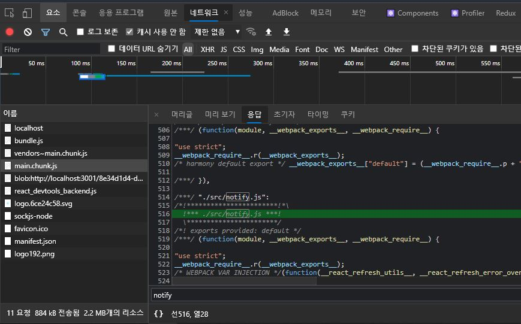
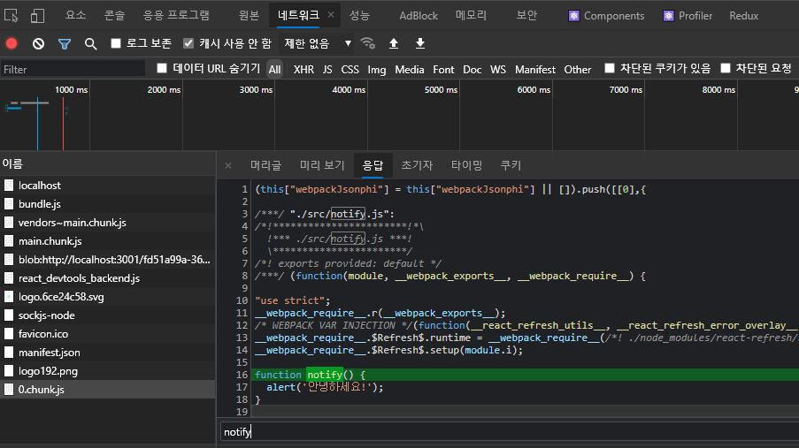
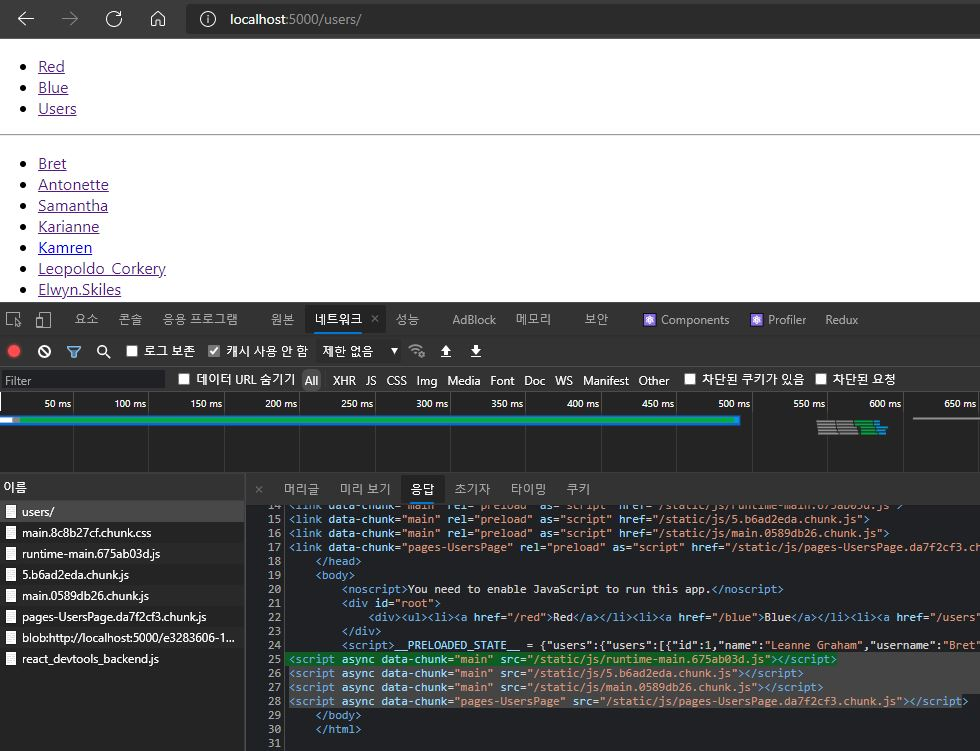

# 코드 스플리팅

대부분의 React 앱은 `Webpack`, `Rollup` 또는 `Browserify` 같은 툴을 사용하여 
여러 파일을 하나로 병합한 `번들 된` 파일을 웹 페이지에 포함하여 한 번에 전체 앱을 로드하는 방식이다.
CRA, Next.js 혹은 Gatsby 같은 도구를 사용하는 프로젝트라면 Webpack이 설치되어 여러 파일을 하나의 파일로 `번들링` 하고 있을 것이다.

A, B, C 페이지로 구성된 SPA를 개발한다고 가정하자.
사용자가 A 페이지에 방문했다면 B 페이지와 C 페이지에서 사용하는 컴포넌트 정보는 필요하지 않다.
사용자가 B 혹은 C 페이지로 이동하려고 할 때만 필요하다.

하지만 리액트 프로젝트에 별도로 설정하지 않으면 A,B,C 컴포넌트에 대한 코드가 모두 한 파일에 저장(번들)되어 버린다.
만약 앱의 규모가 크다면 지금 당장 필요하지 않은 컴포넌트 정보도 모두 불러오면서 **파일 크기가 매우 커진다.**
그러면 로딩도 오래 걸리고 사용자 경험도 안 좋아지고 트래픽도 많이 나오게 된다.

번들이 비대해지는 것을 방지하는 좋은 방법은 `번들을 나누는` 것이다.
`코드 스플리팅`은 ***런타임에 여러 번들을 동적으로 만들고 불러오는 것***으로 Webpack, Rollup, Browserify같은 `번들러`가 지원하는 기능이다.
코드 스플리팅을 통해 우리 앱을 `지연 로딩`하고 앱 사용자에게 획기적인 성능 향상을 안겨줄 수 있다.
앱의 코드 양을 줄이지 않고도 **사용자가 필요하지 않은 코드를 불러오지 않게 하며 앱의 초기화 로딩에 필요한 비용을 줄여준다.**

<br>

---
**지연 로딩(lazy loadig)**이란 초기 페이지 로딩 시점이 아닌, 화면에 보여질 때 로딩을 시작하게끔 해주는 기법이다.
주로 페이지 초기 로딩 성능에 많은 악영향을 끼치는 이미지에 지연 로딩을 적용한다.
---

<br>


앱에 코드 스플리팅을 도입하는 방법은 크게 세 가지로 분류할 수 있다.

<!-- lazy Loading -> 번들 파일의 크기가 큰 경우에는 응답 속도가 느리다.
동적 임포트 + prefect, preload를 이용해서 lazy Loading의 단점을 보완.
prefetch는 가까운 미래에 필요한 파일이라고 브라우저에게 알려주는 것. (브라우저가 바쁘지 않을 때 미리 다운로드된다.) -> lazy Loading의 느린 응답 속도를 보완
preload는 지금 당장 필요한 파일이라고 브라우저에게 알리는 것. (첫 페이지 로딩 시 즉시 다운된다.) -> preload 남발 시 첫 페이지 로딩이 느려질 수 있다. -->
## 1) 동적 import를 통한 코드 분할
본격적인 리액트 컴포넌트 코드 스플리팅에 앞서 일반 자바스크립트 함수를 스플리팅해보자.

```javascript
// src/notify.js
export default function notify(){
    alert('안녕하세요!');
}
```

```jsx
// src/App.js
import React from 'react';
import logo from './logo.svg';
import './App.css';
import notify from './notify';

function App(){
    const onClick = () => {
        notify();
    };
    return(
        <div className="App">
            <header className="App-header">
                
                <p onClick={onClick}>Hello React!</p>
            </header>
        </div>
    );
}

export default App;
```



Hello React! 문구를 클릭하면 notify 함수가 실행되어 alert을 출력하는 간단한 구조다.
이렇게 코드를 작성하고 빌드하면 notify.js의 코드 또한 하나의 번들 파일(main.chunk.js)에 포함된다.

하지만 아래와 같이 코드 상단에서 import를 정적인 형태로 선언하지 않고, import() 함수 형태로 메서드 안에서 사용하면 파일을 따로 분리시켜서 저장한다.
그리고 실제 함수가 필요한 지점에 파일을 불러와서 함수를 사용할 수 있다.
이를 `동적 import`라 한다.


```jsx {8}
// src/App.js
import React from 'react';
import logo from './logo.svg';
import './App.css';

function App(){
    const onClick = () => {
        import('./notify').then(result => result.default());
    };
    return(
        <div className="App">
            <header className="App-header">
                
                <p onClick={onClick}>Hello React!</p>
            </header>
        </div>
    );
}

export default App;
```



import를 함수 형태로 사용하면 Promise를 반환한다.
이 함수를 통해서 모듈을 불러올 때 notify.js와 같이 default로 내보낸 모듈은 result.default()와 같이 참조해서 사용한다.

동적 import를 적용했기 때문에 Hello React!라는 문구를 클릭하면 그제서야 notify.js를 import하기 시작한다.
이는 번들링 이후에 행해지는 동작이기 때문에 notify 관련 코드는 번들 파일에 포함되지 않고 0.chunk라는 새로운 자바스크립트 파일에 포함된 것을 확인할 수 있다.


## 2) React.lazy와 Suspense를 통한 코드 분할

리액트 내장 유틸 함수인 `React.lazy`와 컴포넌트인 `Suspense`으로 코드 스플리팅을 할 수 있다.
이는 리액트 16.6 버전에서 도입된 기능으로, 이전에는 import 함수를 통해 불러온 다음 컴포넌트 자체를 state에 넣는 방식으로 구현해야 했었다.

```jsx
// SplitMe
import React from 'react';

const SplitMe = () => {
    return <div>SplitMe</div>;
};

export default SplitMe;
```

```jsx {5,17,18,19}
// App.js
import React, {useState, Suspense} from 'react';
import logo from './logo.svg';
import './App.css';
const SplitMe = React.lazy(() => import('./SplitMe.js'));

function App(){
    const [visible, setVisible] = useState(false);
    const onClick = () => {
      setVisible(true);
    };
    return(
        <div className="App">
            <header className="App-header">
                
                <p onClick={onClick}>Hello React!</p>
                <Suspense fallback={<div>loading...</div>}>
                  {visible && <SplitMe />}
                </Suspense>
            </header>
        </div>
    );
}

export default App;
```

Hello React! 문구를 클릭하면 visible 상태가 true가 되어 `<SplitMe>` lazy 컴포넌트를 렌더링하는 구조다.

`React.lazy`는 `동적 import()`를 호출하는 함수를 인자로 갖는다.
이 함수는 React 컴포넌트를 포함하며 default export를 가진 모듈로 결정되는 Promise로 반환해야 한다.
동적 import는 Promise를 반환하기 때문에 React.lazy 함수의 인자로 전달될 수 있는 것이다.

`lazy 컴포넌트`인 SpliteMe는 `<Suspense>` 컴포넌트 하위에서 렌더링되어야 한다.
`<Suspense>`는 리액트 내장 컴포넌트로서 코드 스플리팅된 컴포넌트를 로딩하도록 발동시킬 수 있고,
`fallback props`를 통해 lazy 컴포넌트가 로드되길 기다리는 동안(로딩 중에) 보여줄 UI를 설정할 수 있다.

위 코드를 실행해보면 동적 import 때와 마찬가지로 onClick 이벤트가 발생했을 때 chunk 파일이 생겨나고,
그 chunk 파일에 SplitMe 코드가 분할되어 있는 것을 확인할 수 있다.
또한 개발자 도구에서 네트워크 속도를 아주 느리게 지정한 뒤 onClick 이벤트를 발생시키면 loading...이란 문구가 잠시 출력되는것을 볼 수 있다.

## 3) Loadable Components를 통한 코드 분할
`Loadable Components`는 코드 스플리팅을 편하게 하도록 도와주는 서드파티 라이브러리다.
`React.lazy`와 `Suspense`는 SSR을 지원하지 않지만 이 라이브러리는 `SSR`을 지원한다.
또한 렌더링하기 전에 필요할 때 스플리팅된 파일을 미리 불러올 수 있는 기능도 있다.

```bash
yarn add @loadable/component
```

```jsx {5,6,19}
// app.js
import React, {useState} from 'react';
import logo from './logo.svg';
import './App.css';
import loadable from '@loadable/component';
const SplitMe = loadable(() => import('./SplitMe'));
// const SplitMe = React.lazy(() => import('./SplitMe.js'));

function App(){
    const [visible, setVisible] = useState(false);
    const onClick = () => {
      setVisible(true);
    };
    return(
        <div className="App">
            <header className="App-header">
                
                <p onClick={onClick}>Hello React!</p>
                {visible && <SplitMe />}
            </header>
        </div>
    );
}

export default App;
```

사용법은 React.lazy와 유사하다.
Suspense를 사용하지 않기 때문에 더 간결해졌다.
Suspense의 fallback 기능을 사용하여 로딩 중에 다른 UI를 출력하고 싶다면 아래와 같이 작성하면 된다.

```jsx
const SplitMe = loadable(() => import('./SplitMe'), {
    fallback: <div>loading...</div>
});
```

loadable component를 이용하면 컴포넌트를 미리 불러올(preload)수도 있다.

```jsx {16,17,18,23}
// app.js
import React, {useState} from 'react';
import logo from './logo.svg';
import './App.css';
import loadable from '@loadable/component';

const SplitMe = loadable(() => import('./SplitMe'), {
  fallback: <div>loading...</div>
});

function App(){
    const [visible, setVisible] = useState(false);
    const onClick = () => {
      setVisible(true);
    };
    const onMouseOver = () => {
      SplitMe.preload();
    }
    return(
        <div className="App">
            <header className="App-header">
                
                <p onClick={onClick} onMouseOver={onMouseOver}>Hello React!</p>
                {visible && <SplitMe />}
            </header>
        </div>
    );
}

export default App;
```

Hello React! 문구 위에 마우스 커서를 올리기만 해도 로딩이 시작된다. (chunk 파일이 생긴다)
그리고 클릭하면 렌더링된다.

## 4) SSR + 코드 스플리팅 시 나타나는 충돌
SSR과 코드 스플리팅을 함께 적용하는 게 쉽지 않다.
별도의 호환 작업 없이 두 기술을 함께 적용하면 다음과 같은 흐름으로 작동하면서 페이지에 깜박임이 발생한다.

1. 서버 사이드 렌더링된 결과물이 브라우저에 나타남 
2. 자바스크립트 파일 로딩 시작
3. 자바스크립트가 실행되면서 아직 불러오지 않은 컴포넌트를 null로 렌더링함
4. 페이지에서 코드 스플리팅된 컴포넌트들이 사라짐.
5. 코드 스플리팅된 컴포넌트들이 로딩된 이후 제대로 나타남

위와 같은 문제 해결을 위해서는 라우트 경로마다 **코드 스플리팅된 파일 중에서 필요한 모든 파일을** 브라우저에서 렌더링하기 전에 미리 불러와야 한다.
여기서는 `Loadable Components` 라이브러리에서 제공하는 기능(웹팩 + babel 플러그인)을 써서 SSR 후 필요한 파일의 경로를 추출하여 렌더링 결과에 `스크립트/스타일 태그`를 삽입하는 방법으로 문제를 해결할 것이다.

# SSR과 코드 스플리팅
앞서 말했듯 리액트 내장 코드 스플리팅 기능인 `React.lazy`와 `Suspense`는 SSR을 지원하지 않는다.
따라서 `Loadable Components` 라이브러리를 사용한다.

Loadable Components에서 SSR을 활용하기 위해 필요한 서버 유틸 함수, 웹팩 플러그인, babel 플러그인을 설치한다.
[이전 글][1]에서 사용했던 CRA + SSR 프로젝트를 가져와 사용한다.

```bash
yarn add @loadable/component @loadable/server @loadable/webpack-plugin @loadable/babel-plugin 
```

## 1) 라우트 컴포넌트 스플리팅하기

현재 프로젝트에서 라우트를 위해 사용하고 있는 BluePage, RedPage, UserPage를 아래와 같이 스플리팅하자.

```jsx {}
// App.js
import './App.css';
import { Route } from 'react-router-dom';
import Menu from './components/Menu';
import loadable from '@loadable/component';
const RedPage = loadable(() => import('./pages/RedPage'));
const BluePage = loadable(() => import('./pages/BluePage'));
const UsersPage = loadable(() => import('./pages/UsersPage'));
// import RedPage from './pages/RedPage';
// import BluePage from './pages/BluePage';
// import UsersPage from './pages/UsersPage';

function App() {
  return (
    <div>
      <Menu />
      <hr />
      <Route path="/red" component={RedPage} />
      <Route path="/blue" component={BluePage} />
      <Route path="/users" component={UsersPage} />
    </div>
  );
}

export default App;
```

이후 프로젝트를 빌드하고 SSR 서버도 재시작한다.
그리고 개발자 도구의 Network 탭에서 인터넷 속도를 Slow 3G로 선택한 후 새로고침했을 때 어떤 현상이 일어나는지를 지켜보자.
처음에 페이지가 나타났다가 이내 사자리고, 또 다시 나타나는 것을 볼 수 있다.
이것이 앞서 언급했던 SSR에 코드 스플리팅을 적용했을 때 발생하는 문제다.

## 2) 웹팩과 babel 플러그인 적용
Loadable Components에서 제공하는 `웹팩`과 `babel 플러그인`을 적용하면 ***깜빡임 현상***을 해결할 수 있다.

먼저 babel 플러그인을 적용해보자.
paackage.json은 열어서 babel 부분을 찾은 뒤 다음과 같이 수정한다.

```json
// package.json
(...)
"babel": {
    "presets": [
      "react-app"
    ],
    "plugins":[
      "@loadable/babel-plugin"
    ]
  }
```

이후 webpack.config.js를 열어서 상단에서 LoadablePlugin을 불러오고 하단에서는 plugins를 찾아서 해당 플러그인을 적용한다.

```jsx {2}
// webpack.config.js
const LoadablePlugin = require('@loadable/webpack-plugin');
(...)
    plugins: [
        new LoadablePlugin(),
        // Generates an 'index.html' file with the <script> injectd.
        new HTMLWebpackPlugin(),
        (...)
    ].filter(Boolean),
    (...)
```

이후 yarn build를 실행하고 build 디렉토리에 `loadable-stats.json`이라는 파일이 생겼는지를 확인한다.
이 파일은 각 컴포넌트의 코드가 어떤 청크(chunk) 파일에 들어가 있는지에 대한 정보를 갖고 있다.
SSR을 할 때 이 파일을 참고하여 어떤 컴포넌트가 렌더링되었는지에 따라 ***어떤 파일들을 사전에 불러와야 할지*** 설정할 수 있다. 


## 3) 필요한 청크 파일 경로 추출하기
SSR 후 브라우저에서 어떤 파일을 사전에 불러와야 할지 알아내고 해당 파일들의 경로를 추출하기 위해 
`Loadable Componenets`에서 제공하는 `ChunkExtractor`와 `ChunkExtractorManage`를 사용한다.

서버 엔트리 코드를 아래와 같이 수정하자.

```jsx
// index.server.js
(...)
import { ChunkExtractor, ChunkExtractorManager } from '@loadable/server';

const statsFile = path.resolve('./build/loadable-stats.json');

// asset-manifest.json에서 파일 경로들을 조회한다
const manifest = JSON.parse(
    fs.readFileSync(path.resolve('./build/asset-manifest.json'), 'utf8')
);

const chunks = Object.keys(manifest.files)
    .filter(key => /chunk\.js$/.exec(key)) // chunk.js로 끝나는 키를 찾아서
    .map(key => `<script src="${manifest.files[key]}"></script>`) // 스크립트 태그로 변환하고
    .join(''); // 합침

function createPage(root, tags){
    return `<!DOCTYPE html>
    <html lang="en"
    <head>
        <meta charset="utf-8" />
        <link rel="shortcut icon" href="/favicon.ico" />
        <meta
            name="viewport"
            content="width=device-width, initial-scale=1,shrink-to-fit=no"
        />
        <meta name="theme-color" content="#000000" />
        <title>React App</title>
        ${tags.styles}
        ${tags.links}
    </head>
    <body>
        <noscript>You need to enable JavaScript to run this app.</noscript>
        <div id="root">
            ${root}
        </div>
        ${tags.scripts}
    </body>
    </html>
    `;
}
const app = express();

// SSR을 처리할 핸들러 함수
const serverRender = async (req, res, next) => {
    // 이 함수는 404이 떠야 하는 상황에 404를 띄우지 않고 SSR을 해 준다.
    const context = {};
    const sagaMiddleware = createSagaMiddleware();

    const store = createStore(
        rootReducer,
        applyMiddleware(thunk, sagaMiddleware)
    );

    const sagaPromise = sagaMiddleware.run(rootSaga).toPromise();

    const preloadContext = {
        done: false,
        promise: []
    };

    // 필요한 파일을 추출하기 위한 ChunkExtractor
    const extractor = new ChunkExtractor({ statsFile });

    const jsx = (
        <ChunkExtractorManager extractor={extractor}>
            <PreloadContext.Provider value={preloadContext}>
                <Provider store={store}>
                    <StaticRouter location={req.url} context={context}>
                        <App />
                    </StaticRouter>
                </Provider>
            </PreloadContext.Provider>
        </ChunkExtractorManager>
    );

    ReactDOMServer.renderToStaticMarkup(jsx); // renderToStaticMarkup으로 한번 렌더링한다
    store.dispatch(END); // redux-saga의 END 액션을 발생시키면 액션을 모니터링하는 사가들이 모두 종료된다.
    try{
        await sagaPromise; // 기존에 진행 중이던 사가들이 모두 끝날 때까지 기다린다.
        await Promise.all(preloadContext.promise); // 모든 프로미스를 기다린다.
    } catch (e){
        return res.status(500);
    }
    preloadContext.done = true;
    const root = ReactDOMServer.renderToString(jsx); // 렌더링을 하고
    // JSON 문자열로 변환하고 악성 스크립트가 실행되는 것을 방지하기 위해 <를 치환 처리
    // https://redux.js.org/recipes/server-rendering#security-considerations
    const stateString = JSON.stringify(store.getState()).replace(/</g, '\\u003c');
    // 리덕스 초기 상태를 스크립트로 주입한다
    const stateScript = `<script>__PRELOADED_STATE__ = ${stateString}</script>`; 
    
    // 미리 불러와야 하는 스타일/스크립트를 추출하고
    const tags={
        scripts: stateScript + extractor.getScriptTags(), // 스크립트 앞부분에 리덕스 상태 넣기
        links: extractor.getLinkTags(),
        styles: extractor.getStyleTags()
    };

    res.send(createPage(root, tags)); // 클라이언트에게 결과물을 응답한다.
};

const serve = express.static(path.resolve('./build'),{
    index: false // "/" 경로에서 index.html을 보여 주지 않도록 설정
});

app.use(serve); // 순서가 중요하다 . serverRender 전에 위치해야 한다. 
app.use(serverRender);

app.listen(5000, () => {
    console.log('Running on http://localhost:5000');
});
```


## 4) loadableReady와 hydrate

```jsx
// index.js
(...)
import { loadableReady } from '@loadable/component';

const sagaMiddleware = createSagaMiddleware();

const store = createStore(
  rootReducer,
  window.__PRELOADED_STATE__, // 이 값을 초기 상태로 사용함
  composeWithDevTools(applyMiddleware(thunk, sagaMiddleware))
);

sagaMiddleware.run(rootSaga);

// 같은 내용을 쉽게 재사용할 수 있도록 렌더링할 내용을 하나의 컴포넌트로 묶음
const Root = () => {
  return (
    <Provider store={store}>
      <BrowserRouter>
        <App />
      </BrowserRouter>
    </Provider>
  );
};

const root = document.getElementById('root');

// 프로덕션 환경에서는 loadableReady와 hydrate를 사용하고
// 개발 환경에서는 기존 방식으로 처리
if(process.env.NODE_ENV === 'production'){
  loadableReady(() => {
    ReactDOM.hydrate(<Root />,root);
  });
} else {
  ReactDOM.render(<Root />, root);
}
```

아래와 같이 렌더링 결과물에 청크 파일이 주입된 것을 볼 수 있다.




# References

[React 공식 페이지 : 코드 분할](https://ko.reactjs.org/docs/code-splitting.html)

[webpack 공식 페이지 : 코드 스플리팅](https://webpack.kr/guides/code-splitting/)

[웹 성능 최적화를 위한 Image Lazy Loading 기법](https://helloinyong.tistory.com/297)

[1]:https://lechuck.netlify.app/study/reactSSR1
